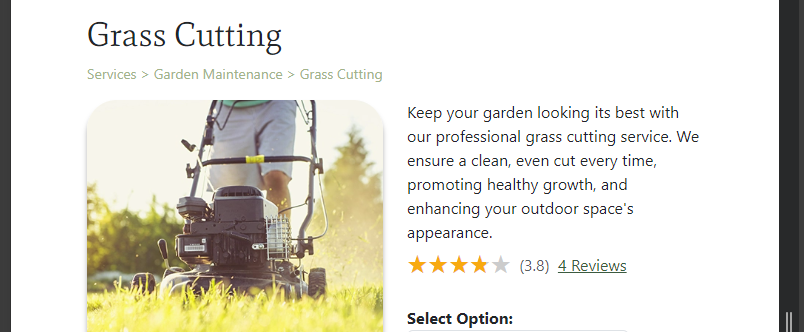
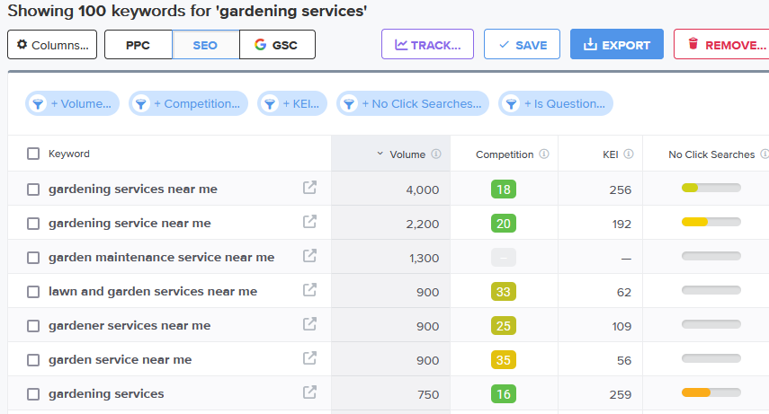
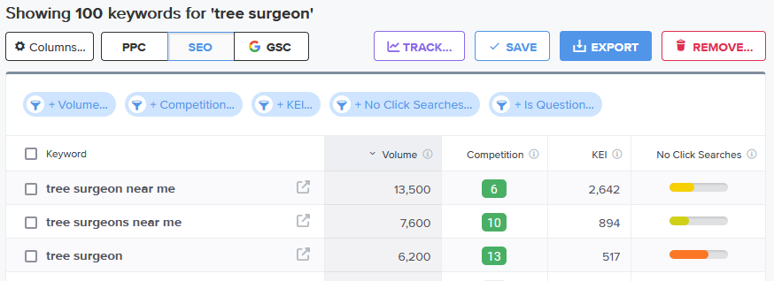
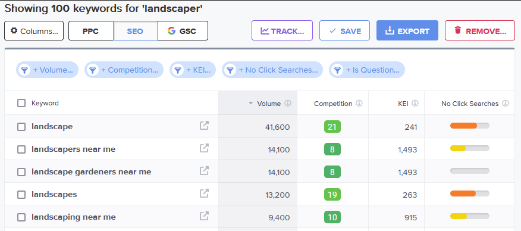
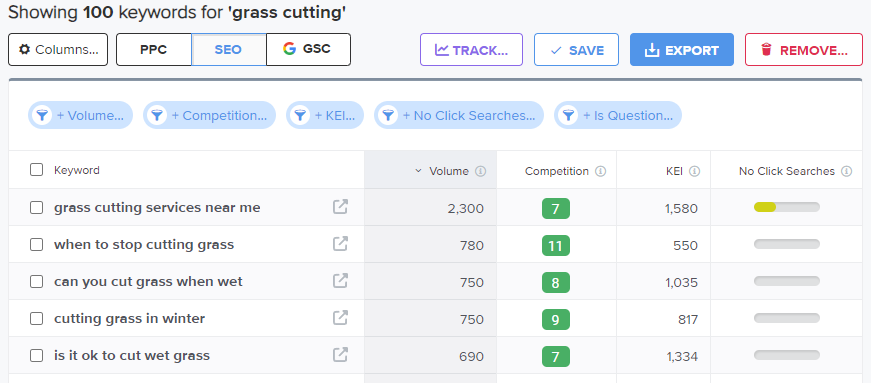
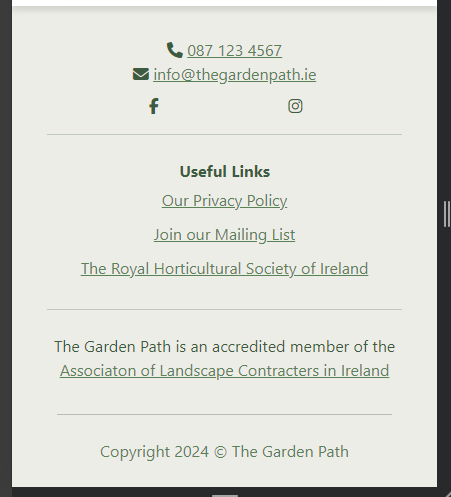

# The Garden Path - Marketing Strategies

Deployed program on Heroku: [The Garden Path](https://gardening-services-e596b6371c3f.herokuapp.com/)

## Contents
- [Strategy Planning](#strategy-planning)
- [Business Research](#business-research)
- [Content Marketing](#content-marketing)
- [Email Marketing](#email-marketing)
- [Social Media Marketing](#social-media-marketing)
- [Search Engine Optimisation](#search-engine-optimisation)
    - [Keywords](#keywords)
    - [Sitemap and Robots file](#sitemap-and-robotstxt)

## Strategy Planning
In order to assess the best type of marketing strategies to use for this business, the below questions were considered:

### Who are our users?
Homeowners and business owners with gardens of all shaped and sizes.

### Would our users use social media? Which platforms do we think we would find them on?
An older age group of customers who may have reduced ability to tend to their own gardens, and thus be a good target customer base, would not nessecarily have social media accounts.
The young to middle-aged demographic of our target users would likely have social media accounts on Facebook or Instagram. Regular engagement on these platforms
would be beneficial to increasing the customer base for this demographic.

### What do our users need? Could we meet that need with useful content? How could we best deliver that content to them?
Professional and comprehensive gardening services, either to save them time from carrying out the work themselves, or to provide a professional service that would otherwise be impossible or unsafe for them to manage. We can provide a wide range of services and delivery those services directly to them.

### Would our business run sales or offer discounts? How do we think our users would most like to hear about these offers?
The business could offer discounts or special offers to encourage business in the quieter months of the year. Some customers would not be aware of the correct time of year to carry out certain tasks in the garden e.g. pruning hedges before the summer or preparing flowerbeds in the winter. Newsletters for existing customers and posts on social media accounts would be the best way to circulate this information.

### What are the goals of our business? Which marketing strategies would offer the best ways to meet those goals?
The main business goal is to deliver good quality and professional gardening services to the customer, and to sustain further business based on their positive feedback. Content, Email, and Social Media marketing are therefore the best strategies to achieve this.

### Would our business have a budget to spend on advertising or would it need to work with free or low-cost options to market itself?
The Garden Path would initially build on marketing strategies that do not cost money. Instragram reels and YouTube shorts are fast becoming an effective way to market products and services, and are completely free. Once a solid customer base had been built up from these methods, the option of paid advertising could then be considered; however, this additional cost cannot be to the detriment of the customer service quality on offer.  

## Business Research
Various gardening and landscaping websites were visited in the planning stage of this project. Three sites in particular inspired various aspects of The Garden Path

- [Huntergreen](https://www.huntergreen.nyc/)

    The minimalist design of the landing page, especially the navbar, conveys a sense of professionalism. This was an important factor to consider when designing the visual look of The Garden Path.

- [Mulkern Landscaping & Nursery](https://mulkernlandscaping.com/)

    This business displayed vibrant photos on their homepage and large pictures on their services page. This allows customers to visualise the type and quality of work offered by the business.
    Colourful and visually descriptive imagery was seen as essential for encouraging potential customers to purchase a service on The Garden Path

- [Garden Pro](https://gardenpro.ie/)

    This website has a quite busy landing page, and is not the type of style that was envisioned for The Garden Path; however, positive design features that could encourage business include short descriptive paragraphs paired with images and a dropdown service list in the navbar giving users quick access to specific service pages.

The positive elements from each of these business were analysed and incorporated into the inital design process of The Garden Path.

## Content Marketing
The Garden Path allows user to leave reviews for services they have purchased. Reviews are visible to all site users, regardless of their authentication status. While reviews are not published until a site admin approved the review, this step is only intended to be a bulwark against malicious or spam reviews. Showing all genuine reviews on the website, regardless of the rating, builds trust and credibility in the eyes of the customer. Many customers based their purchase decisions wholly on the contents of reviews. On each service page, the star rating and number of reviews are visible to the user under the service description., with their attention immediatly drawn to the orange colours of the stars.

## Email Marketing
A newsletter feature was added to the site as a way to keep customers engaged with the business. The content of newsletters sent out by The Garden Path would be designed to attract repeat business throughout the year. Seasonal work is one example of a valid reason to engage customers in this way. What customers may need in the summer does not necessarily translate well in the darker winter months. Reminding customers of other services offered by The Garden Path can help generate business which may otherwise be lost to competitors or not realised in the first place.

The newsletter signup link is present in the footer on each webpage, and directs the user to a dedicated signup page. Users can also opt-in to the newsletter during the checkout process, and via their account page. This gives new and repeat customers ample opportunity to join this mailing list without feeling pressured to do so by a large modal that fills the screen.

## Social Media Marketing
A Facebook page (mockup) was created for The Garden Path to engage with a direct a large accessible user base back to the main website. The target demographic for this business is mainly homeowners or business owners. Currently, a majority of this age demographic would have working Facebook accounts. The use of a Facebook business page is free and allows for a effective way of marketing the business through the share feature and direct engagement with users via posts and comments. An active social media page can give potential customers a very good impression of an active and professional business. The each of access for Facebook users to message the business page can also foster new customer relationships and support existing ones.

## Search Engine Optimisation
### Keywords
Keyword research was undertaken in order to raise the website's ranking on search engine results. The inital topics chosen were:

- Garden Maintenance
- Tree Surgeon
- Landscaping

For each topic, a list of possible short-tail and long-tails keywords that a user would search for was made. Sample searches were made in the Google search engine and the "related searches" lists were analysed for similar keywords that user usually search for.

**Garden Maintenance** | **Tree Surgeon** | **Landscaping**
----- | ----- | -----
Gardening | Tree cutting  | Bordering
Local gardener | Tree felling | Flowerbed care
Hedge cutting | Coppicing | Tree stump
Grass cutting | Pollarding | Stump removal
Grass mowing | Dead tree | Pruning hedges
Weed treatment | Branch cutting | Pruning shrubs
Driveway weeding | Local tree surgeon |

**Garden Maintenance** | **Tree Surgeon** | **Landscaping**
----- | ----- | -----
Gardening services in Cork  | Tree surgeons in my area | Garden landscapers near me
Gardening services in Kerry | Affordable tree removal near me | How much does it cost to renovate an overgrown garden?
Gardening services in Limerick | List of certified arborists near me | How much to remove all the weeds in my garden?
Professional hedge cutting services | Why do I need a tree surgeon? | Do I need a professional gardener?
How much do gardeners charge per hour in Ireland?  | How much is a tree surgeon near me? | What tasks does a gardener do?
Treating my driveway for weeds | Can I cut down trees on my own land in Ireland? | 
Removing weeds from my flowerbeds | What time of year is best for coppicing? | 

The list of keywords was assessed and some were removed due to their simplicity and likelihood to be less relevant to the exact services offered by The Garden Path. For example, the keyword "gardening" is very broad and likely to be used by people doing their own research as amateur gardeners or for general information.

Using [Wordtracker](https://www.wordtracker.com/), keywords were tested to guage their relevance and authoritativeness. Unfortunately the free version of this service is limited to two searches. Different internet browsers were used to get extra searches but overall this research method was limited behind a paywall. Because of this, the keywords chosen for testing were those most relevant to the services on offer by The Garden Path. Google searches were also performed using the long-tail keywords and those that returned results for relevant webpages were included in the final list.

Wordtracker results for 'gardening services'

Wordtracker results for 'tree surgeon'

Wordtracker results for 'landscaper'

Wordtracker results for 'grass cutting'

 

From these searchs, some quite good results were discovered with high volume and low competition. This means that lot of user are searching with these terms but the number of other sites with these keywords in place is low.

From this research, the list of keywords for The Garden Path was finalised as:

- Hedge cutting service
- Tree stump removal
- Tree surgeon
- Flowerbed restoration
- Gardening services near me
- Gardening services in Cork
- Grass cutting services near me
- Weed removal services
- Tree surgeon near me
- List of certified arborists near me
- Affordable tree removal near me
- Landscapers near me
- Landscape gardeners near me

Some of these keywords were integrated in the website content inside `<strong>` and `<em>` tags, while a more comprehensive list was using in the `<meta>` block.

The footer included links to relevant pages to increase The Garden Path's standing in website rankings. These include a link to the [Associaton of Landscape Contracters in Ireland](https://alci.ie/) and [The Royal Horticultural Society of Ireland](https://rhsi.ie/). Because these anchor tags do not include the `rel="noopener"` attribute, search engines will rank the website higher on lists, but importantly, the websites linked are not direct business competitors.

### Sitemap and Robots.txt 
To improve the website's search engine ranking, both a `sitemap.xml` and `robots.txt` file were added. The `sitemap.xml` file lists the website's important URLs so that search engine can navigate through them and understand the structure of the website. The `robots.txt` file contains a list of disallowed directories that search engine spiders are not allowed to access. It also provides the URL of the `sitemap.xml` file.