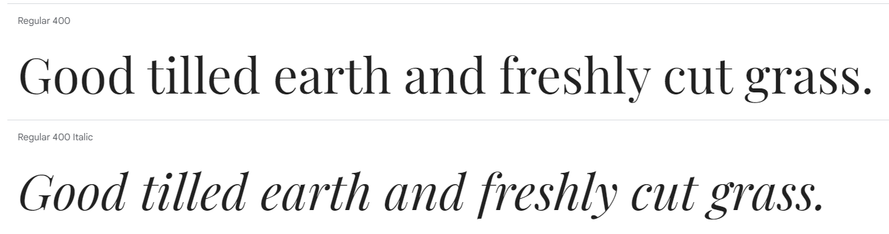
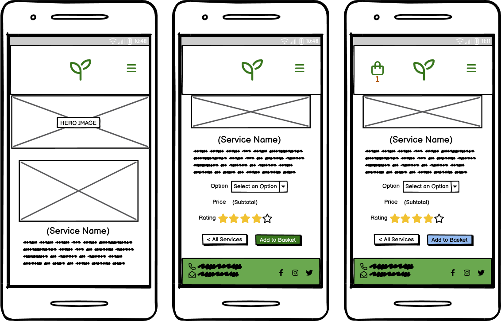
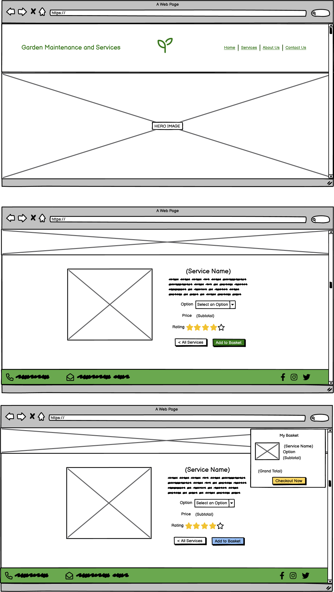
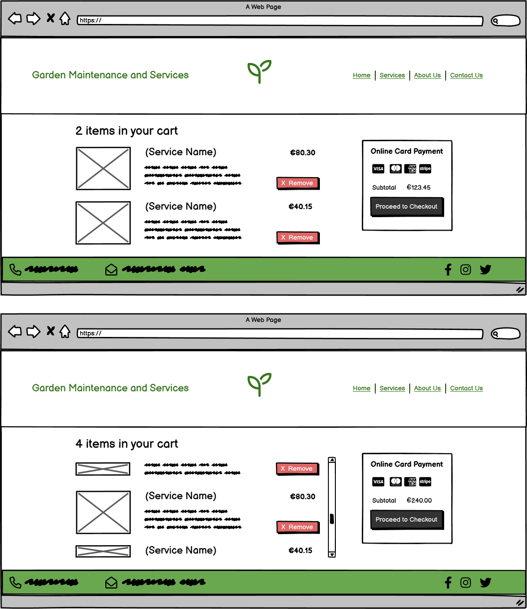
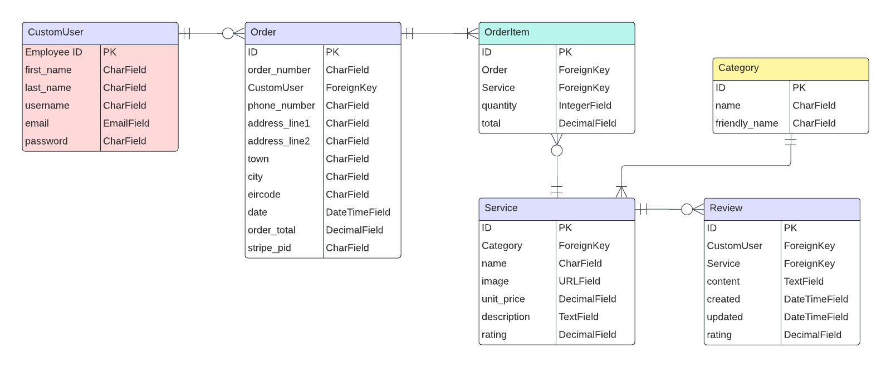

# Gardening Services

This responsive website is designed to be viewed on a variety of screen sizes. Its purpose is to allow a visiting user to view information about and make a booking to stay at a campsite, and to allow an administrator to view all bookings and related information.


Deployed program on Heroku: [Gardening Services]()


## Contents
- [User Experience](#user-experience)
    - [Initial Discussion](#initial-discussion)
    - [Agile Planning](#project-planning-with-the-agile-approach)
    - [Business Model](#business-model)
    - [User Stories](#user-stories)
    - [Kanban Board](#kanban-board)
    - [Marketing](#marketing)
- [Design](#design)
    - [Colour Scheme](#colour-scheme)
    - [Typography](#typography)
    - [Imagery](#imagery)
    - [Wireframes](#wireframes)
    - [ERDs](#entity-relationship-diagrams)
    - [CRUD Functionality](#crud-functionality)
    - [Responsiveness](#responsiveness)
- [Features](#features)
    - [The Homepage](#the-homepage)
    - [The About Page](#the-about-page)
    - [Accounts Pages](#the-signup-page)
    - [The Booking Page](#the-booking-page)
    - [User Bookings](#user-bookings)
    - [Managing Bookings](#managing-bookings)
    - [Error Pages](#error-pages)
    - [Features to be Implemented](#features-to-be-implemented)
- [Technologies Used](#technologies-used)
    - [Languages](#languages)
    - [Frameworks, Libraries, and Programs](#frameworks-libraries-and-programs)
- [Deployment](#deployment)
    - [Local Deployment](#local-deployment)
    - [Live Deployment](#live-deployment)
- [Testing](#testing)
- [Credits](#credits)
    - [Content](#content)
    - [Media](#media)
    - [Code Used](#code-used)
- [Acknowledgements](#acknowledgements)


## User Experience
### Initial Discussion
The Gardening Services website offers a number of services to homeowners and businesses in the maintenance and upkeep of their green spaces. The goal of the website is to showcase the services on offer and encourage the site user to choose Gardening Services for their gardening needs. The website allows users to book various services and stay up to date with offers and seasonal products.

### Project Planning with the Agile Approach
The Gardening Services project was built using the Agile method. This involves breaking projects down into smaller manageable sections which allows teams to deliver continuous working releases to the client and end users. These release periods are known as sprints and this project had four sprints over nine weeks.

User Stories were generated and grouped under different Epics to effectively structure the work involved at different stages of the project. These Epics were:
- "Initial Project Setup"
- "Create Models"
- "User Accounts"
- "Services and Checkout"
- "Payment System"
- "Website Content"
- "Bugs"
- "Writing Documentation"

Each user story was assigned a number of labels to aid in the project workflow. These include:

- `Sprint 1/2/3/4` - To denote in which sprint the user story will be worked on.
- `Story Points: 1/2/3` - To denote how much effort each user story requires.
- `Must-Have` - A user story relating to a feature without which the website will not function correctly.
- `Should-Have` - A user story relating to a feature that will complement the core website features and enhance the user experience.
- `Could-Have` - A user story relating to a feature that could be of benefit to the user but without which the site will still achieve all its design goals.
- `Site User` - A user story from the perspective of a regular site user.
- `Site Admin` - A user story from the perspective of a site administrator.
- `documentation` - A task related to writing the README or TESTING documents.
- `bug` - Denoting an unsolved bug.
- `Solved Bug` - Denoting a bug that has been resolved.

Using the Agile method allowed this project to be managed well in small chunks. The developer was able to work on specific tasks without losing focus and manage and project the time required for these tasks optimally.

### Business Model
Gardening Services is designed as a Business to Customer (B2C) e-commerce application. Individuals are the main type of customer being targeted for the services being sold, although other businesses can also fall into this category. The deliverables are services; repeat transations are expected based on the positive experience and feedback from customers. A single payment systems is used for Gardening Services, as the services on offer can be seasonal or have extended periods of time before being required again.

### User Stories
#### Epic: Initial Project Setup
- **Set Up Django Files**: As a **Developer** I can **set up the Django template files** so that I can **begin to write code for the project**.
    - I can install the correct version of Django.
    - I can create a project called **gardening**.
    - I can create an app called **home**.
    - I can display a "Hello world!" string on the webpage.

- **Create PostgreSQL Database**: As a **Developer** I can **create a could-based database** so that I can **store and retrieve data for my website**.
    - I can create a new PostgreSQL instance
    - I can copy the URL in the Details section
    - I can create the env.py file and set DATABASE_URL constant.
    - I can install the relevant packages for database connection.
    - I can run migrations.

- **Deploy Project to Heroku**: As a **Developer** I can **deploy the project to Heroku** so that I can **see that the website displays properly**.
    - I can create a Heroku app with a unique name.
    - I can update the code for deployment with gunicorn.
    - I can deploy the app on Heroku.

- **Deploy Heroku App with Static Files**: As a **Developer** I can **deploy the project with static files** so that **the app will have the same styling as the local version.**.
    - I can create a staticfiles directory and collect the static files.
    - I can deploy the project on Heroku and ensure all styles are applied.

#### Epic: Create Models
- **Create Bookings Model**: As a **Developer** I can **create a Django model** so that **a user can book a service**.
    - I can create a **services** app.
    - I can create a models file.
    - I can declare the necessary imports.
    - I can create a model with the appropriate fields required.

#### Epic: User Accounts
- **Create an Account**: As a **Site User** I can **create an account** so that I can **make bookings and leave reviews**.
    - When I click the sign-in button, I am prompted to make an account.
    - After registering my details, I can log in and view, create, update, or delete a booking.
    - I can log out and log back in using the password I created.

#### Epic: Website Content
- **Create Base Template**: As a **Developer** I can **create a base template and homepage** so that **the similar aspects of the webpages need only be written once and the UX has a consistent appearance across the app**.
    - I can create a base.html file.
    - I can create a header and nav bar for small screens.
    - I can create a footer for small screens.
    - I can create a header and nav bar for larger screens.
    - I can create a footer for larger screens.

- **View Campsite Information**: As a **Site User** I can **view information about the business** so that I can **make an informed decision about booking a service**.
    - When I visit the About page, I can read the business information.
    - I can view the locations covered by the business.
    - I can view the products and services offered.

- **Create Error Pages**: As a **Developer** I can **create certain error pages** so that **a site user can understand when something goes wrong viewing a webpage**
    - I can create a 404 error page.
    - I can create a 403 error page.
    - I can create a 500 error page.

#### Epic: Bookings System
- **Make a Booking**: As a **Site User** I can **select a booking option** so that I can **book a specific service**.
    - I can view the types of services that can be booked.
    - I can select an option to book.
    - I can only select valid date options.

<!-- - **View My Bookings**: As a **Site User** I can **view my bookings** so that I can **see my bookings history as well as upcoming bookings**.
    - When I open the bookings page, I will see a list of my past and future bookings
    - When the booking is in the past, I will see it displayed in a different style to future bookings.
    - When I click on a booking, I will be able to view more detailed information about it.

- **Edit a Booking**: As a **Site User** I can **edit a booking of mine** so that I can **have control over the details of my bookings**.
    - I can select an upcoming booking to edit.
    - For a past booking, I do not have the option to edit the details.
    - When editing booking details, I can change any details they wish and save the changes.
    - If the booking is less than 48 hours away, I cannot edit the booking and I am instead prompted to ring the campsite for further instruction.

- **Delete a Booking**: As a **Site User** I can **cancel a booking** so that I can **manage my stay at the campsite**.
    - I can navigate to my bookings page and cancel a booking.
    - If the booking is less than 48 hours away, I will not have the option to cancel and will be prompted to ring the campsite for further advice.
    - Otherwise, a modal prompt will ask me to confirm this irreversible action.
    - On successful deletion, a confirmation message will be displayed to me.

- **Manage All Bookings**: As a **Site Admin** I can **view and manage all bookings** so that I can **understand when and have control over how customers will use the campsite**.
    - I can view a list of all bookings and their details.
    - For a given booking, I can amend or delete it.
    - For a booking in the past, I cannot amend or delete it. -->

#### Epic: Bugs
- As a **Developer** I can **detail and keep track of bugs** so that I can **solve them before release or come up with a plan to address them in the future**.

#### Epic: Writing Documentation
- As a **Developer** I can **write a README and TESTING file** so that **others can learn about my app and see the work that has gone into preparing it for final release**.

### Kanban Board
The GitHub Projects tool was used to manage development progress for this website. A kanban board was used to separate tasks into four columns:
- Todo
- In Progress
- Done
- Future Features

The Epics and labels discussed above were used in conjunction with the board and allowed the developer to manage their time well during development. Below is a screenshot of the final state of the kanban board. The project can be viewed on its [GitHub Projects page](https://github.com/users/simonhw/projects/4/).


### Marketing

## Design
An easy payment gateway and authentication system was designed for this application to give the customer the best possible experience in ordering and accessing information on their past or upcoming services booked with the business. Clear descriptions and images of the services on offer will allow the user to make an informed purchase. Ratings and reviews under each service helps the customer to commit to the purchase. 
### Colour Scheme
A palette of ....


### Typography
The Playfair Display font was chosen from the Google Fonts library as its thin and sharp look evoked thought of garden tools, fencing, and ordered lines. This gives the impression of a professional business and links the services offered namely creating something neat and ordered.




### Imagery


### Wireframes
Wireframes were created in Balsamiq for the initial front-end design of the website. The mobile layout was designed first and the tablet and desktop were adapted from this.

**Home Page**

#### Homepage Wireframe - Mobile


#### Homepage Wireframe - Tablet


#### Homepage Wireframe - Desktop


**About Us Page**

<details open><summary>About Us Wireframe - Mobile</summary>


</details>

<details><summary>About Us Wireframe - Tablet</summary>


</details>

<details><summary>About Us Wireframe - Desktop</summary>


</details><br>

**Services Page**

<details open><summary>Services Wireframe - Mobile</summary>


</details>

<details><summary>Services Wireframe - Tablet</summary>


</details>

<details><summary>Services Wireframe - Desktop</summary>


</details>

**Individial Service Pages**

<details open><summary>Individual Service Wireframe - Mobile</summary>



</details>

<details><summary>Individual Service Wireframe - Tablet</summary>


</details>

<details><summary>Individual Service Wireframe - Desktop</summary>



</details>

**Basket Page**

<details open><summary>Basket Wireframe - Mobile</summary>


</details>

<details><summary>Basket Wireframe - Tablet</summary>


</details>

<details><summary>Basket Wireframe - Desktop</summary>



</details>

**Checkout Page**

<details open><summary>Checkout Wireframe - Mobile</summary>


</details>

<details><summary>Checkout Wireframe - Tablet</summary>


</details>

<details><summary>Checkout Wireframe - Desktop</summary>


</details>

### Entity Relationship Diagrams
An ERD was created to plan out the models that would be created and used in this project. A custom user model was planned as this is reccomenede in the official Django documentation and will afford the developer easier control over its structure. Other models include Service, Order, OrderItem, Category, and Review.



### CRUD Functionality
A key requirement for this project was for users to be able to create, read, update, and/or delete data from the database as appropriate. Users could interact with the database in these ways as follows:

#### Create
* Site users and admin users may **create** by creating .
* Site users may **create** by creating a .

#### Read
* Site users and admin users may **read** by viewing .
* Site users may **read** by viewing .
* Admin user may **read** by viewing .

#### Update
* Site users may **update** by amending their .
* Admin user may **update** by amending .

#### Delete
* Site users may **delete** by cancelling .
* Admin users may **delete** by cancelling .

### Responsiveness
- On small screen sizes .... For larger screens ....

    <!-- <details><summary>Comparison of nav bar on small and large screens</summary>

    

    

    </details>

    <details><summary>Comparison of content layout on small and large screens</summary>

    

    

    </details><br> -->

- On tablet-sized screens ....

    <!-- <details><summary>Comparison of footer on mobile and tablet screens</summary>

    

    

    </details>

    <details><summary>Comparison of booking form and cards on small and large screens</summary>

    

    

    

    

    </details><br> -->

- On large screen sizes ....

    <!-- <details><summary>Booking cards on desktop screens</summary>

    

    </details>

    <details><summary>Comparison of Sign Out page on small and large screens</summary>

    
    

    </details> -->

## Features
The website consists of several main pages:
- the homepage
- the about page
- the services page
- the contact us page
- individual service pages
- the shopping bag page
- the checkout page

Other pages include:
- the signup page
- the sign in page
- the sign out page
- the 404, 403, and 500 error pages

**All pages on the website have:**
1. A favicon of a pair of gloves. This icon was chosen to reflect a hands-on and professional business to the customer.  

    

2. A header with a title and nav bar or menu dropdown for page links

    <!-- 

    

    The header contains links to the main pages of the website, depending on the authentication status of the site user. 
    - The website title "Lakeview Campsite" is a link which when clicked will return the user to the `index.html` page.
    - "About" brings the user to the `about.html` page.
    - "Book Now" brings the user to the `bookings.html` page.
    - "Log In" and "Sign Up" will direct the user to the respective account pages of `login.html` and `signup.html`.
    
    When a user is signed in, the header links change.
    - A new link "My Bookings" brings the user to the `user_bookings.html` page.
    - "Log In" and "Sign Up" are hidden and "Log Out" is shown, which will direct the user to the `logout.html` account page.

        

        

    When a user with staff status is logged in, instead of "My Bookings", a link titled "Manage Bookings" is shown which brings the user to the `manage_bookings.html` page.
    <br> -->

3. A footer with contact information and social media links
<!-- 
     -->

### The Homepage

### The About Page

### The Signup Page

### The Sign In Page

### The Sign Out Page

### The Services Page
Gardening Serives offers a number of services to their customers. The different services are displayed in a column on mobile and in a grid on tablet and desktop sizes. Each service has its own page with a full description and price breakdown. Each service has a unit cost depending on the type of work to be done for the customer. The dropdown options show the customer how much they will pay for areas of different sizes.

### Error Pages

### Features to be Implemented

## Technologies Used
### Languages
- HTML
- CSS
- Python
- Javascript

Relational database: PostgreSQL.

### Frameworks, Libraries, and Programs
[Am I Responsive?](https://ui.dev/amiresponsive) - To showcase the website on different screen sizes for this README.

Adobe Photoshop 2020 - To resize and crop images.

[Balsamiq](https://balsamiq.com/) - To create the website wireframes.

[Bootstrap](https://getbootstrap.com/) - To build and style content on the website.

[CI Python Linter](https://pep8ci.herokuapp.com/#) - To ensure code meets minimum PEP8 standards.

Chrome Developer Tools - To visualise and test changes to the website code.

[Coolors](https://coolors.co/) - To showcase the colour palette of the website.

[Django](https://www.djangoproject.com/) - A Python framework used to design the website.

[ElephantSQL](https://www.elephantsql.com/) - To create and store the database.

[Favicon.io](https://favicon.io/) - To source the favicon used.

[Free Logo Design](https://freelogodesign.org) - To create a mock logo for the business.

[Git](https://git-scm.com/) - For version control.

[GitHub](https://github.com/) - To save and store files online.

[Gitpod](https://www.gitpod.io/) - The IDE used to write my code.

[Google Fonts](https://fonts.google.com/) - For imported fonts used on the website.

[Heroku](https://www.heroku.com/) - To host the deployed version of the program.

[JSHint](https://jshint.com/) - To validate the JavaScript code.

[LucidChart](https://lucid.app/) - To create Entity Relationship Diagrams

[Pexels.com](https://www.pexels.com/) - To source images used on the website.

[ScreenToGif](https://www.screentogif.com/) - To create GIF files for this README.

[Shields.io](https://shields.io/) - To add badges to this README.

[Shutter Encoder](https://www.shutterencoder.com/) - To convert images to .webp format.

[TinyPNG](https://tinypng.com/) - To compress images.

[W3C Markup Validation Service](https://validator.w3.org/) - To validate the HTML and CSS files.

[W3Schools.com](https://www.w3schools.com/) and [The Python Library](https://docs.python.org/3/library/) - For researching and learning about Python methods and syntax.

## Deployment
The live version of this website was deployed on Heroku.

### Local Deployment
To deploy this program locally on your device, please follow the steps below:

<!-- #### Forking
1. Log in or sign up to [GitHub](https://github.com/).
2. Navigate to the repository for [Lakeview Campsite](https://github.com/simonhw/campsite-bookings).
3. Click the Fork button located in the top right part of the webpage.

#### Cloning
1. Log in or sign up to GitHub.
2. Navigate to the repository for [Lakeview Campsite](https://github.com/simonhw/campsite-bookings).
3. Click on the green Code button, select your preferred option of HTTPS, SSH, or GitHub CLI, and copy the relevant link.
4. Open the terminal in your IDE and navigate to your directory of choice for this new clone.
5. Type `git clone` into the terminal and paste in your copied link. Press enter.

#### Set Up Your Environment
1. In your IDE, navigate to the root directory and run the command `pip3 install -r requirements.txt`. All the necessary packages should now be installed in your workspace.
2. Run the command `python3 manage.py runserver` in your terminal and open the hosted site in your browser.
3. Add the web address to the list of allowed hosts in the `settings.py` file and hard reload your browser. The website should display properly.
4. If it does not, set Debug to True and check for error messages in the webpage displayed.

#### Creating the Database
1. Navigate to the PostgreSQL provider of your choice and create a new instance.
2. Find the database URL and copy it to the clipboard.
3. Create an `env.py` file in your IDE root directory and confirm that it is listed in the `.gitignore` file.
4. Create a secret key yourself or by using a website of your choice such as [Secret Key Generator](https://secretkeygen.vercel.app/).
5. Add the following code to your `env.py` file making sure to replace `enter-copied-url-here` with the URL you copied in step 2 and `your-secret-key` with the one you generated in step 4:
    ```
      import os

      os.environ.setdefault(
          "DATABASE_URL", "<enter-copied-url-here>")
      os.environ.setdefault("SECRET_KEY", "<your-secret-key>")
    ```
6. Run the following command in your IDE terminal to create your database tables: `python3 manage.py migrate`.
7. Create a superuser account by running `python3 manage.py createsuperuser` and enter details as prompted. -->

### Live Deployment
To deploy this project yourself on Heroku, please follow the following additional steps:
<!-- 
1. Log in or sign up to [Heroku](https://www.heroku.com/).
2. Create a new app with a unique name in a region close to you.
3. In the Settings tab under Config Vars, add the key `DATABASE_URL` with a value of the database URL, and the key `SECRET_KEY` with a value of the secret key you created.
4. Confirm that the `Procfile` is present in your directory.
5. Set Debug to False in `settings.py` and commit and push your code to your GitHub repository.
6. In the Deploy tab on Heroku, connect your GitHub repo and manually deploy the **main** branch.
7. Click "View App" to open your deployed website. -->

## Testing
All documentation on the testing of this application can be found in the [TESTING.md](/TESTING.md) file.

## Credits

### Content
ChatGPT was used to generate most of the text content about the campsite and services offered and was edited by Simon Henleywillis. The "description" and "keywords" meta tags were also generated using ChatGPT.

### Media
The business logo was created on [FreeLogoDesign](https://freelogodesign.org). The website states that "[w]hether you use the free or the paid version (high-resolution plan), you are free to use your logo for promotional purposes without having to credit FreeLogoDesign."

All other images used were found on [Pexels](https://www.pexels.com/). The Pexels website states that "*All photos and videos on Pexels can be downloaded and used for free*".
Images were resized and cropped where necessary.

- Hero image: []()


### Code Used
**All code in this project was written entirely by Simon Henleywillis unless otherwise specified below.**
Various Bootstrap classes and components were used in the styling of this website and were learned about from reading the Bootstrap documentation. Chunks of code that were copied or adapted are specifically credited below.


## Acknowledgements
- [Creating Your First README - Kera Cudmore](https://github.com/kera-cudmore/readme-examples)
- I would like to thank my CI Mentor [Graeme Taylor](https://github.com/G-Taylor) for his support and advice throughout the development phase.