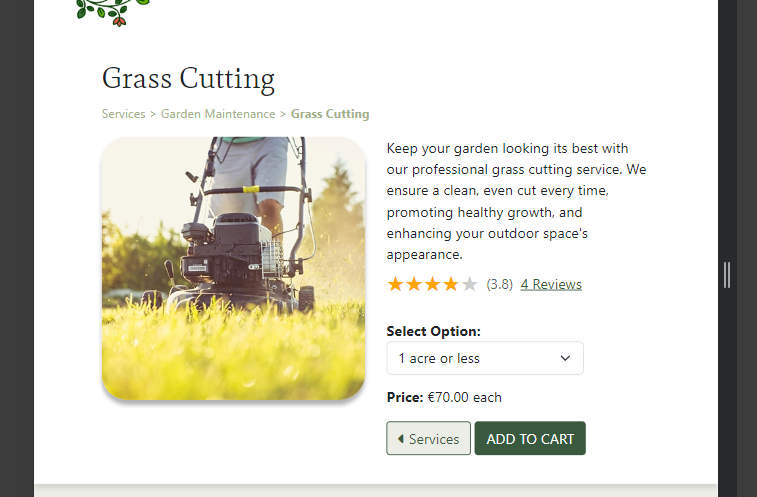

# The Garden Path

The Garden Path is an e-commerce website for a fictional gardening and landscaping business based in Munster, Ireland. The site offers customers a variety of services ranging from grass cutting and weed removal to arboriculture and tree stump removal. Customer reviews are visible to all site users, and registered users can view their order history and update their details.
This website is responsive and designed to be viewed on a variety of screen sizes. 


Deployed program on Heroku: [The Garden Path](https://gardening-services-e596b6371c3f.herokuapp.com/)


## Contents
- [User Experience](#user-experience)
    - [Initial Discussion](#initial-discussion)
    - [Agile Planning](#project-planning-with-the-agile-approach)
    - [Business Model](#business-model)
    - [User Stories](#user-stories)
    - [Kanban Board](#kanban-board)
- [Marketing](#marketing)
- [Design](#design)
    - [Colour Scheme](#colour-scheme)
    - [Typography](#typography)
    - [Imagery](#imagery)
    - [Wireframes](#wireframes)
    - [ERDs](#entity-relationship-diagrams)
    - [CRUD Functionality](#crud-functionality)
    - [Responsiveness](#responsiveness)
- [Features](#features)
    - [The Homepage](#the-homepage)
    - [The About Page](#the-about-page)
    - [Accounts Pages](#the-signup-page)
    - [The Booking Page](#the-booking-page)
    - [User Bookings](#user-bookings)
    - [Managing Bookings](#managing-bookings)
    - [Error Pages](#error-pages)
    - [Features to be Implemented](#features-to-be-implemented)
- [Technologies Used](#technologies-used)
    - [Languages](#languages)
    - [Frameworks, Libraries, and Programs](#frameworks-libraries-and-programs)
- [Deployment](#deployment)
    - [Local Deployment](#local-deployment)
    - [Live Deployment](#live-deployment)
- [Testing](#testing)
- [Credits](#credits)
    - [Content](#content)
    - [Media](#media)
    - [Code Used](#code-used)
- [Acknowledgements](#acknowledgements)


## User Experience
### Initial Discussion
The Garden Path website offers a number of services to homeowners and businesses in the maintenance and upkeep of their green spaces. The goal of the website is to showcase the services on offer and encourage the site user to choose The Garden Path for their gardening needs. The website allows users to order and pay for various services and stay up to date with speical offers and seasonal promotions via a newsletter signup link. Customers can leave reviews for services they have purchased and edit or delete their own reviews.

### Project Planning with the Agile Approach
Planning and development of The Garden Path e-commerce project was carried out using the Agile method. This involves breaking projects down into smaller manageable sections which allows teams to deliver continuous working releases to the client and end users. These release periods are known as sprints and this project had 4 sprints over 8 weeks.

User Stories were generated and grouped under different Epics to effectively structure the work involved at different stages of the project. These Epics were:
- "Initial Project Setup"
- "Create Models"
- "User Accounts"
- "Website Content"
- "Services and Checkout"
- "Payment System"
- "Reviews"
- "Contact Us"
- "Marketing"
- "Bugs"
- "Writing Documentation"

Each user story was assigned a number of labels to aid in the project workflow. These include:

- `Sprint 1/2/3/4` - To denote in which sprint the user story will be worked on.
- `Story Points: 1/2/3` - To denote how much effort each user story requires.
- `Must-Have` - A user story relating to a feature without which the website will not function correctly.
- `Should-Have` - A user story relating to a feature that will complement the core website features and enhance the user experience.
- `Could-Have` - A user story relating to a feature that could be of benefit to the user but without which the site will still achieve all its design goals.
- `Site User` - A user story from the perspective of a regular site user.
- `Site Admin` - A user story from the perspective of a site administrator.
- `documentation` - A task related to writing the README or TESTING documents.
- `bug` - Denoting an unsolved bug.
- `Solved Bug` - Denoting a bug that has been resolved.

Using the Agile method allowed this project to be managed well in small chunks. The developer was able to work on specific tasks without losing focus and manage and project the time required for these tasks optimally.

### Business Model
The Garden Path is designed as a Business to Customer (B2C) e-commerce application. Individuals are the main type of customer being targeted for the services being sold, although other businesses can also fall into this category. The deliverables are services; repeat transations are expected based on the positive experience and feedback from customers. A single payment systems is used for The Garden Path, as the services on offer can be seasonal or have extended periods of time before being required again.

### User Stories
Key user stories for the application are outlined below. An exhaustive list can be viewed on its [GitHub Projects page](https://github.com/users/simonhw/projects/4/).

#### EPIC: Initial Project Setup

<details><summary>Show User Stories</summary>

- **Set Up Django Files**: As a **Developer** I can **set up the Django template files** so that I can **begin to write code for the project**.
    - I can install the correct version of Django.
    - I can create a project called **gardening**.
    - I can create an app called **home**.
    - I can display a "Hello world!" string on the webpage.

- **Create PostgreSQL Database**: As a **Developer** I can **create a could-based database** so that I can **store and retrieve data for my website**.
    - I can create a new PostgreSQL instance
    - I can copy the URL in the Details section
    - I can create the env.py file and set DATABASE_URL constant.
    - I can install the relevant packages for database connection.
    - I can run migrations.

- **Deploy Project to Heroku**: As a **Developer** I can **deploy the project to Heroku** so that I can **see that the website displays properly**.
    - I can create a Heroku app with a unique name.
    - I can update the code for deployment with gunicorn.
    - I can deploy the app on Heroku.

- **Deploy Heroku App with Static Files**: As a **Developer** I can **deploy the project with static files** so that **the app will have the same styling as the local version.**.
    - I can create a staticfiles directory and collect the static files.
    - I can deploy the project on Heroku and ensure all styles are applied.

</details>

#### EPIC: Create Models

<details><summary>Show User Stories</summary>

- **Three Custom Models**: As a **Developer** I can **create three custom models** so that I can **satisfy the assessment criteria for the project**.
    - Custom Model 1: Service
    - Custom Model 2: CustomUser
    - Custom Model 3: Reviews
    - Custom Model 4: ContactUs

- **Create Service Model**: As a **Developer** I can **create a custom Services model** so that **I can add services to the website for the user to purchase**.
    - I can create a **services** app.
    - I can create a models file.
    - I can declare the necessary imports.
    - I can create a model with the appropriate fields required.

- **Create Custom User Model**: As a **Developer** I can **create a custom user model** so that I can **customise the user creation process as compared to the default Django model**.
    - I can create an app called **accounts**
    - I can create the CustomUser model in models.py
    - I can update settings.py to use my custom model

- **Create Order Model**: As a **Developer** I can **create an Order model** so that I can **recieve and store customers orders in my database**.
    - I can create an app called **checkout**
    - I can create the Order model in models.py
    - I can add functions to make a unique order number and calculate the total price

- **Create OrderLineIem Model**: As a **Developer** I can **create an OrderLineItem model** so that I can **separate different services into rows on a given order**.
    - I can create the OrderLineIem model in models.py
    - I can add a function to calculate the line subtotal
    
- **Create Reviews Model**: As a **Developer** I can **create a custom Reviews model** so that I can **display customer reivews and store the data in my database**.
    - I can create an app called **reviews**
    - I can create the Review model in models.py
    - I can add functions to calculate an average rating for a service
    
- **Create ContactUs Model**: As a **Developer** I can **create a custom ContactUs model** so that I can **recieve and store customer messages in my database**.
    - I can create an app called **contact**
    - I can create the ContactUs model in models.py

</details>

#### EPIC: User Accounts

<details><summary>Show User Stories</summary>

- **Create an Account**: As a **Site User** I can **create an account** so that I can **view my account details on the website**.
    - When I click the sign-in button, I am prompted to make an account.
    - After registering my details, I can log in and view, create, update, or delete my account details.
    - I can log out and log back in using the password I created.
    - I can reset my password.

- **View Account Page**: As a **Site User** I can **navigate to my account page** so that I can **view or amend my details or delete my account**.
    - When logged in, I can navigate to the My Account page.
    - I can view and amend my details.
    - I can view my past orders

</details>

#### EPIC: Website Content

<details><summary>Show User Stories</summary>

- **Create Base Template**: As a **Developer** I can **create a base template** so that **the similar aspects of the webpages need only be written once and the UX has a consistent appearance across the app**.
    - I can create a base.html file.
    - I can create a header and nav bar for small screens.
    - I can create a footer for small screens.
    - I can create a header and nav bar for larger screens.
    - I can create a footer for larger screens.

- **View Homepage**: As a **Site User** I can **view the homepage**  so that I can **understand the purpose of the website and navigate it successfully**.
    - When a user visits the homepage they can easily understand the purpose of the website
    - The user can navigate to other pages of the website 
    - The user can view a brief "About Us" section
    - The user can see a summary of services offered

- **View Business Information**: As a **Site User** I can **view information about the business** so that I can **make an informed decision about booking a service**.
    - When I visit the About page, I can read the business information.
    - I can view the locations covered by the business.
    - I can view the products and services offered.

- **Create Error Pages**: As a **Developer** I can **create certain error pages** so that **a site user can understand when something goes wrong viewing a webpage**.
    - I can create a 404 error page.
    - I can create a 403 error page.
    - I can create a 500 error page.

- **View Privacy Policy**: As a **Site User** I can **view the business' privacy policy** so that I can **understand how the business collects and stores my personal data**.
    - I can navigate to the privacy policy page from a link in the footer
    - I can view the privacy policy on a dedicated website page
    - I can understand how to contact the business owners with any inquiries about the policy

</details>

#### EPIC: Services and Checkout

<details><summary>Show User Stories</summary>

- **View Individual Service Details**: As a **Site User** I can **view the Service page** so that I can **see all details related to the service and make an informed decision on my purchase**.
    - When I click on a service I can view its details page.
    - I can see the service description, price, and rating.
    
- **Order a Service**: As a **Site User** I can **select a booking option** so that I can **book a specific service**.
    - I can view the types of services that can be booked.
    - I can select an option to book.
    - I can add the service to my shopping cart.
    
- **View Cart**: As a **Site User** I can **view my cart** so that I can **see what services I am going to order**.
    - When I view my cart, I see a list of services I have selected to order.
    - I can see the individual cost of each service.
    - I can see the total cost of the order.
    - I can click a button to proceed to the online payment stage.
    
- **View Preview of Cart**: As a **Site User** I can **view a preview of the cart when I add a service to it** so that **I can be know the action was successful and confirm what is in the cart without navigating away from the current page**.
    - When I add a service to the cart on smaller screens, I can see a toast preview with the cart details.
    - On desktop screens, when I hover over the Cart nav link, I can see a preview of the cart.
    
- **Update Services from the Cart Page**: As a **Site User** I can **update or remove services from the cart** so that I can **have an improved experience without navigating back to individual service pages**.
    - I can change the number of a given service and see the subtotal and order total price change.
    - I can remove a service from the cart.
    - When I click remove I can see the order total price change.
    
- **Proceed to Checkout**: As a **Site User** I can **navigate to the checkout page with my order** so that I can **enter my details and place my order**.
    - When I click the checkout button, I can enter my personal and delivery details.
    - I can enter my payment information.
    - I can review my order before submitting.

</details>

#### EPIC: Payment System

<details><summary>Show User Stories</summary>

- **Set Up Stripe**: As a **Developer** I can **set up Stripe in my application** so that I can **handle and process payments securely**.
    - I can install Stripe
    - I can set up a webhook handler
    - I can implement views to process the payment and order data

- **Pay for an Order**: As a **Site User** I can **enter my payment details successfully** so that I can **secure my order**.
    - I can enter my payment details in the checkout process
    - I can be informed of the success or failure of the payment attempt.

- **Receive Confirmation of Orders**: As a **Site User** I can **receive confirmation of my successful order** so that I can **confirm that my order was received and have the details available to me outside of the website**.
    - When I submit an order, I can see a confirmation message on the site with an order number provided.
    - I can view the submitted order details on my account page.
    - I can view the order details in an email confirmation.

</details>

#### EPIC: Reviews

<details><summary>Show User Stories</summary>

- **View Reviews**: As a **Site User** I can **view reviews for a service** so that I can **be more informed about the quality of work carried out by the business**.
    - On a particular service page, I can view all reviews for that service.
    - I can navigate through the reviews via pagination.
    
- **Review a Service**: As a **Site User** I can **review a service that I have ordered** so that I can **leave feedback as a customer and feel like I am interacting with the website and business directly**.
    - I can interact with a "Leave a Review" button
    - I can rate the service out of 5 stars
    - I can write a brief review on my experience with the service
    
- **Edit a Review**: As a **Site User** I can **edit a review that I previously made** so that I can **be in control of content created by me on the website**.
    - For a particular review I have made I can click an edit button
    - I can edit the rating and text content of my reviews and save the changes
    
- **Publish Reviews**: As a **Site Admin** I can **publish pending reviews or unpublish them on the live website** so that I can **ensure only genuine reviews are visible for the business' services**.
    - For a given pending review, I can publish it to the website and make it publicly visible
    - For a given published review, I can unpublish it so that users cannot see it.
    
- **Delete a Review**: As a **Site User** I can **delete a review that I previously made** so that I can **be in control of content created by me on the website**. As a **Site Admin** I can **delete any review** so that I can **be in control of content displayed on the website**.
    - For a particular review I can delete it if I am the author or a staff user.
    - I can confirm or cancel the delete action before it takes effect.

</details>

#### EPIC: Contact Us

<details><summary>Show User Stories</summary>

- **View Contact Us Page**: As a **Site User** I can **send a message to the business** so that I can **make enquiries directly from the website**.
    - I can navigate to the Contact Us page from the main nav bar.
    - I can view the business' contact details.
    - I can send a message to the business using a form.

</details> 

#### EPIC: Marketing

<details><summary>Show User Stories</summary>

- **Subscribe to Newsletters**: As a **Site User** I can **sign up to the website's newsletter** so that I can **be made aware of upcoming offers and information disseminated by the company**.
    - I add my email to the newsletter mailing list.
    - I can receive feedback  confirming that I have been added to the mailing list. 

- **Create Facebook Page**: As a **Developer** I can **create a mock-up Facebook business page** so that I can **demonstrate how social media marketing would be implemented for the business**.
    - I can create a mock-up of a Facebook business page for The Garden Path
    - I can add relevant images
    - I can add posts

- **Search Engine Optimisation**: As a **Developer** I can **implement various SEO features** so that I can **improve the website's performance for search engine indexing**.
    - I can conduct research on and implement keywords.
    - I can create a robots.txt file.
    - I can create a sitemap.xml file.
    - I can employ descriptive meta tags.
    - I can add appropriate `rel` attributes on external links.
    - I can add links to reputable websites related to my business.

</details> 

#### EPIC: Bugs

<details><summary>Show User Stories</summary>

- As a **Developer** I can **detail and keep track of bugs** so that I can **solve them before release or come up with a plan to address them in the future**.
    - For a full list of bugs, please view [TESTING.md](/TESTING.md)

</details> 

#### EPIC: Writing Documentation

<details><summary>Show User Stories</summary>

- As a **Developer** I can **write README, TESTING, and MARKETING files** so that **others can learn about my app and see the work that has gone into preparing it for final release**.

</details> 

### Kanban Board
The GitHub Projects tool was used to manage development progress for this website. A kanban board was used to separate tasks into four columns:
- Todo
- In Progress
- Done
- Future Features

The Epics and labels discussed above were used in conjunction with the board and allowed the developer to manage their time well during development. Below is a screenshot of the final state of the kanban board. The project can be viewed on its [GitHub Projects page](https://github.com/users/simonhw/projects/4/).


## Marketing
All documentation on the marketing for this e-commerce application can be found in the [MARKETING.md](/MARKETING.md) file.

## Design

### Colour Scheme
A palette of greens gradually becoming lighter was chosen for this website. The different green colours are reflecting of the environments in which The Garden Path services are carried out. An off-white colour called Isabelline was added to be able to soften areas of the website and avoid using a complete white shade.


### Typography
The Mate font was chosen from the Google Fonts library as its thin and sharp look evoked thought of garden tools, fencing, and ordered lines. This gives the impression of a professional business and evokes thoughts of neat and careful services carried out by the business.


### Imagery
Vibrant and colourful images were chosen for the website to represent the services on offer. Each service image is clear in what it represents with no superfluous information that could mislead the site user. 
The hero image shows a garden path and steps leading to a patio. Red poppies are in focus in the foreground and other plants and trees are in the blurred background. Some pages did not make use of a hero image due to aesthetic design reflecting the pages' purpose. These include but are not limited to the accounts pages, the cart and checkout pages, and the privacy policy page. Individual reasons for this design choice is discussed further in the [Features](#features) section.


### Wireframes
Wireframes were created in Balsamiq for the initial front-end design of the website. The mobile layout was designed first and the tablet and desktop were adapted from this.

**Home Page**

#### Homepage Wireframe - Mobile


#### Homepage Wireframe - Tablet


#### Homepage Wireframe - Desktop


**About Us Page**

<details open><summary>About Us Wireframe - Mobile</summary>


</details>

<details><summary>About Us Wireframe - Tablet</summary>


</details>

<details><summary>About Us Wireframe - Desktop</summary>


</details><br>

**Services Page**

<details open><summary>Services Wireframe - Mobile</summary>


</details>

<details><summary>Services Wireframe - Tablet</summary>


</details>

<details><summary>Services Wireframe - Desktop</summary>


</details>

**Individial Service Pages**

<details open><summary>Individual Service Wireframe - Mobile</summary>


</details>

<details><summary>Individual Service Wireframe - Tablet</summary>


</details>

<details><summary>Individual Service Wireframe - Desktop</summary>


</details>

**Basket Page**

<details open><summary>Basket Wireframe - Mobile</summary>


</details>

<details><summary>Basket Wireframe - Tablet</summary>


</details>

<details><summary>Basket Wireframe - Desktop</summary>


</details>

**Checkout Page**

<details open><summary>Checkout Wireframe - Mobile</summary>


</details>

<details><summary>Checkout Wireframe - Tablet</summary>


</details>

<details><summary>Checkout Wireframe - Desktop</summary>


</details>

### Entity Relationship Diagrams
An ERD was created to plan out the models that would be created and used in this project. In total, 8 custom models were written, including some taken from previous Django projects. These are credited below in the [Code Used](#code-used) section and all custom models are explained in the [Custom Models](#custom-models) section.


### CRUD Functionality
A key requirement for this project was for users to be able to create, read, update, and/or delete data from the database as appropriate. Users could interact with the database in these ways as follows:

#### Create
* Site users and admin users may **create** by creating a user account.
* Site users may **create** by creating an order, review, or submitting a message.

#### Read
* Site users and admin users may **read** by viewing website content, services, reviews, the privacy policy, their account details, and their order history.
* Site users may also **read** by viewing their cart* and account history.
* Admin users may also **read** by viewing unpublished reviews.

#### Update
* Site users may **update** by amending their account details, editing their reviews, or editing the number of service items in their cart*.
* Admin users may **update** by publishing or unpublishing reviews.

#### Delete
* Site users may **delete** by removing items from their cart*, deleting their reviews, or deleting their phone number and address details.
* Admin users may **delete** by deleting reviews.

<br>

**data related to a user's cart would not yet have been saved to the database*

### Responsiveness
Across all pages of the website, Bootstraps powerful grid system was utilised to control content reponsiveness on a wide variety of screen widths. The design of some key website features on different display sizes is demonstrated below. 

#### Navbar
On small screen sizes the navbar is contained with a dropdown menu accessed on the right hand side of the display. For larger screens the navbar links are displayed in a neat row across the top of the page. This was achieved using Bootstrap. 

<details open><summary>Comparison of navbar on small and large screens</summary>


</details>

#### Text Content
Content on small screens is displayed in single column fashion, displaying text and images appropriately as the user scrolls down their device. On larger screens, text and images are displayed side-by-side to make use of the extra horizontal space.

<details open><summary>Comparison on text content layout on small and large screens</summary>


</details>

#### Service Page
On the service page, the service images are displayed in columns of 1, 2, 3, and 4 as the screen width increases. The four pricing model cards follow a similar trend underneath.

<details open><summary>Service page on medium screens</summary>


</details>

<details><summary>Service page on medium screens</summary>


</details>

<details><summary>Service page on large screens</summary>


</details>

#### Individual Services
On each service page, the image and service information are displayed either in a single column or in two columns. This is done to maximise the impact of the imagery on wider screen by allowing for a larger image and to make user of the extra space.

<details open><summary>Comparison of service page on mobile and tablet screens</summary>




</details>

#### Cart
The cart and its features are neatly arranged using the grid system on all screen sizes. The order items and checkout card are displayed in a single column on small screen but are placed side-by-side on wider screens. On large screen sizes the order item list in contained in its own scrollable container, so that the user does not have to scroll away from the checkout card.

<details open><summary>Cart on mobile screens</summary>


</details>

<details><summary>Cart on desktop screens</summary>


</details>

#### Checkout
The site logo, secure checkout text, and progress indicator change position at the top of the screen for different displays to neatly use the extra space provided.
The review order card does not diplay the service images on mobile screen, but on tablets and desktop screens, there is sufficient space to show them.

<details open><summary>Comparison of checkout header on small and large screens</summary>


</details>

<details open><summary>Comparison of review order card on small and large screens</summary>


</details>

#### Reviews 
Reviews are displayed in different ways depending on how many there are for a service. With at least three, they are arranged in columns of 1, 2, or 3 as screen sizes widen. If there is only one review, a single column is used on all screens, albeit with appropriate offsets to give the review card a set maximum width. Similarly if there are only two reviews, the maximum number of columns used on larger screens is 2. This is to keep reviews centered on the page regardless of how many there are.

<details open><summary>Comparison of user reviews small and large screens</summary>


</details>

#### Contact Us

#### Footer
The footer is displayed in a single column on small screens, with a horizontal line separating the differnet information block. On larger screens, these blocks are arrange in a row, using the full width of the screen. 


## Features
The website consists of several main pages:
- the homepage
- the about page
- the services page
- the contact us page
- individual service pages
- the shopping bag page
- the checkout page

Other pages include:
- the signup page
- the sign in page
- the sign out page
- the 404, 403, and 500 error pages

**All pages on the website have:**
1. A favicon of a pair of gloves. This icon was chosen to reflect a hands-on and professional business to the customer.  

    

2. A header with a title and nav bar or menu dropdown for page links

    <!-- 

    

    The header contains links to the main pages of the website, depending on the authentication status of the site user. 
    - The website title "The Garden Path" is a link which when clicked will return the user to the `index.html` page.
    - "About" brings the user to the `about.html` page.
    - "Book Now" brings the user to the `bookings.html` page.
    - "Log In" and "Sign Up" will direct the user to the respective account pages of `login.html` and `signup.html`.
    
    When a user is signed in, the header links change.
    - A new link "My Bookings" brings the user to the `user_bookings.html` page.
    - "Log In" and "Sign Up" are hidden and "Log Out" is shown, which will direct the user to the `logout.html` account page.

        

        

    When a user with staff status is logged in, instead of "My Bookings", a link titled "Manage Bookings" is shown which brings the user to the `manage_bookings.html` page.
    <br> -->

3. A footer with contact information and social media links
<!-- 
     -->

### The Homepage

### The About Page

### The Signup Page

### The Sign In Page

### The Sign Out Page

### The Services Page
The Garden Path offers a number of services to their customers. The different services are displayed in a column on mobile and in a grid on tablet and desktop sizes. Each service has its own page with a full description and price breakdown. Each service has a unit cost depending on the type of work to be done for the customer. The dropdown options show the customer how much they will pay for areas of different sizes.
ratings only takes the number of published reviews into account

### The reviews page
show a paginated list of approved reviews,

have a new page for unpublished reviews
### Error Pages

### Features to be Implemented

## Technologies Used
### Languages
- HTML
- CSS
- Python
- Javascript

Relational database: PostgreSQL.

### Frameworks, Libraries, and Programs
[Am I Responsive?](https://ui.dev/amiresponsive) - To showcase the website on different screen sizes for this README.

Adobe Photoshop 2020 - To resize and crop images.

[Balsamiq](https://balsamiq.com/) - To create the website wireframes.

[Bootstrap](https://getbootstrap.com/) - To build and style content on the website.

[CI Python Linter](https://pep8ci.herokuapp.com/#) - To ensure code meets minimum PEP8 standards.

Chrome Developer Tools - To visualise and test changes to the website code.

[Coolors](https://coolors.co/) - To showcase the colour palette of the website.

[Django](https://www.djangoproject.com/) - A Python framework used to design the website.

[ElephantSQL](https://www.elephantsql.com/) - To create and store the database.

[Favicon.io](https://favicon.io/) - To source the favicon used.

[Free Logo Design](https://freelogodesign.org) - To create a mock logo for the business.

[Git](https://git-scm.com/) - For version control.

[GitHub](https://github.com/) - To save and store files online.

[Gitpod](https://www.gitpod.io/) - The IDE used to write my code.

[Google Fonts](https://fonts.google.com/) - For imported fonts used on the website.

[Heroku](https://www.heroku.com/) - To host the deployed version of the program.

[JSHint](https://jshint.com/) - To validate the JavaScript code.

[LucidChart](https://lucid.app/) - To create Entity Relationship Diagrams

[Pexels.com](https://www.pexels.com/) - To source images used on the website.

[ScreenToGif](https://www.screentogif.com/) - To create GIF files for this README.

[Shields.io](https://shields.io/) - To add badges to this README.

[Shutter Encoder](https://www.shutterencoder.com/) - To convert images to .webp format.

[TinyPNG](https://tinypng.com/) - To compress images.

[W3C Markup Validation Service](https://validator.w3.org/) - To validate the HTML and CSS files.

[W3Schools.com](https://www.w3schools.com/) and [The Python Library](https://docs.python.org/3/library/) - For researching and learning about Python methods and syntax.

## Deployment
The live version of this website was deployed on Heroku.

### Local Deployment
To deploy this program locally on your device, please follow the steps below:

<!-- #### Forking
1. Log in or sign up to [GitHub](https://github.com/).
2. Navigate to the repository for [Lakeview Campsite](https://github.com/simonhw/campsite-bookings).
3. Click the Fork button located in the top right part of the webpage.

#### Cloning
1. Log in or sign up to GitHub.
2. Navigate to the repository for [Lakeview Campsite](https://github.com/simonhw/campsite-bookings).
3. Click on the green Code button, select your preferred option of HTTPS, SSH, or GitHub CLI, and copy the relevant link.
4. Open the terminal in your IDE and navigate to your directory of choice for this new clone.
5. Type `git clone` into the terminal and paste in your copied link. Press enter.

#### Set Up Your Environment
1. In your IDE, navigate to the root directory and run the command `pip3 install -r requirements.txt`. All the necessary packages should now be installed in your workspace.
2. Run the command `python3 manage.py runserver` in your terminal and open the hosted site in your browser.
3. Add the web address to the list of allowed hosts in the `settings.py` file and hard reload your browser. The website should display properly.
4. If it does not, set Debug to True and check for error messages in the webpage displayed.

#### Creating the Database
1. Navigate to the PostgreSQL provider of your choice and create a new instance.
2. Find the database URL and copy it to the clipboard.
3. Create an `env.py` file in your IDE root directory and confirm that it is listed in the `.gitignore` file.
4. Create a secret key yourself or by using a website of your choice such as [Secret Key Generator](https://secretkeygen.vercel.app/).
5. Add the following code to your `env.py` file making sure to replace `enter-copied-url-here` with the URL you copied in step 2 and `your-secret-key` with the one you generated in step 4:
    ```
      import os

      os.environ.setdefault(
          "DATABASE_URL", "<enter-copied-url-here>")
      os.environ.setdefault("SECRET_KEY", "<your-secret-key>")
    ```
6. Run the following command in your IDE terminal to create your database tables: `python3 manage.py migrate`.
7. Create a superuser account by running `python3 manage.py createsuperuser` and enter details as prompted. -->

### Live Deployment
To deploy this project yourself on Heroku, please follow the following additional steps:
<!-- 
1. Log in or sign up to [Heroku](https://www.heroku.com/).
2. Create a new app with a unique name in a region close to you.
3. In the Settings tab under Config Vars, add the key `DATABASE_URL` with a value of the database URL, and the key `SECRET_KEY` with a value of the secret key you created.
4. Confirm that the `Procfile` is present in your directory.
5. Set Debug to False in `settings.py` and commit and push your code to your GitHub repository.
6. In the Deploy tab on Heroku, connect your GitHub repo and manually deploy the **main** branch.
7. Click "View App" to open your deployed website. -->

## Testing
All documentation on the testing of this application can be found in the [TESTING.md](/TESTING.md) file.

## Credits

### Content
ChatGPT was used to generate most of the text content about the campsite and services offered and was edited by Simon Henleywillis. The "description" and "keywords" meta tags were also generated using ChatGPT.

ChatGPT was used to generate a JSON file of users and their respective reviews.

### Media
The business logo was created on [FreeLogoDesign](https://freelogodesign.org). The website states that "[w]hether you use the free or the paid version (high-resolution plan), you are free to use your logo for promotional purposes without having to credit FreeLogoDesign."

All other images used were found on [Pexels](https://www.pexels.com/). The Pexels website states that "*All photos and videos on Pexels can be downloaded and used for free*".
Images were resized and cropped where necessary.

- Hero image: [two-red-flowers-on-stairs](https://www.pexels.com/photo/two-red-flowers-on-stairs-68470/)
- Homepage images: [https://www.pexels.com/photo/a-man-mowing-the-green-lawn-12087398/](https://www.pexels.com/photo/a-man-mowing-the-green-lawn-12087398/), [https://www.pexels.com/photo/man-in-green-jacket-holding-a-green-leaf-3782994/](https://www.pexels.com/photo/man-in-green-jacket-holding-a-green-leaf-3782994/)
- About page images: [https://www.pexels.com/photo/adult-man-wearing-green-jacket-holding-a-tablet-3781932/](https://www.pexels.com/photo/adult-man-wearing-green-jacket-holding-a-tablet-3781932/)
- Grass-cutting Service: [a-person-using-a-lawn-mower](https://www.pexels.com/photo/a-person-using-a-lawn-mower-6728919/)
- Weed Service: [a-group-of-dandelions-in-a-field](https://unsplash.com/photos/a-group-of-dandelions-in-a-field-lYWEUytAj6s)
- Tree service: [https://www.pexels.com/photo/a-firefighter-cutting-a-tree-with-a-chainsaw-7812853/](https://www.pexels.com/photo/a-firefighter-cutting-a-tree-with-a-chainsaw-7812853/)
- Hedge service: [https://www.pexels.com/photo/man-cutting-a-hedge-with-a-trimmer-in-the-garden-24595769/](https://www.pexels.com/photo/man-cutting-a-hedge-with-a-trimmer-in-the-garden-24595769/)
- Flowerbed service: [https://www.pexels.com/photo/photo-of-assorted-color-flowers-at-daytime-1039129/](https://www.pexels.com/photo/photo-of-assorted-color-flowers-at-daytime-1039129/)
- Tree Stump service: [https://www.pexels.com/photo/a-close-up-shot-of-a-tree-stump-10814837/](https://www.pexels.com/photo/a-close-up-shot-of-a-tree-stump-10814837/)


### Code Used
**All code in this project was written entirely by Simon Henleywillis unless otherwise specified below.**
Various Bootstrap classes and components were used in the styling of this website and were learned about from reading the Bootstrap documentation. Chunks of code that were copied or adapted are specifically credited below.

The below tutorial was followed when creating the custom User model:

 - [Learn Django - Django Custom User Model](https://learndjango.com/tutorials/django-custom-user-model)

 The Category model was taken from the Boutique Ado walkthrough.

The JavaScript code to control the decrement and increment of the number input field on the service pages was taken from the Boutique Ado walkthrough.

Getting the toasts to show with B5:

- [Bootstrap 5 Jquery Is It Possible To Force Bootstrap 5 To Inject Its Jquery P](https://stackoverflow.com/questions/67953465/bootstrap-5-jquery-is-it-possible-to-force-bootstrap-5-to-inject-its-jquery-p)

The styling of the toast messages was adapted frome examples in the below article:

-[https://fastbootstrap.com/components/toast/](https://fastbootstrap.com/components/toast/)

The checkout forms and disabling of buttons based on fields

- [https://stackoverflow.com/questions/5614399/disabling-submit-button-until-all-fields-have-values](https://stackoverflow.com/questions/5614399/disabling-submit-button-until-all-fields-have-values)

The following articles were used as guidance when creating the custom user model:

- [https://medium.com/django-unleashed/custom-user-model-in-django-98b9a401a6a2#4826](https://medium.com/django-unleashed/custom-user-model-in-django-98b9a401a6a2#4826)
- [https://docs.djangoproject.com/en/3.2/topics/auth/customizing/#a-full-example](https://docs.djangoproject.com/en/3.2/topics/auth/customizing/#a-full-example)

Code from the Django documentation on pagination was copied for the reviews page:

- [https://docs.djangoproject.com/en/5.1/topics/pagination/](https://docs.djangoproject.com/en/5.1/topics/pagination/)

The JavaScript code to control the color of the select field in the Contact Us form was taken and adapted from the Boutique Ado walkthrough.


## Acknowledgements
- [Creating Your First README - Kera Cudmore](https://github.com/kera-cudmore/readme-examples)
- I would like to thank my CI Mentor [Graeme Taylor](https://github.com/G-Taylor) for his support and advice throughout the development phase.
