# The Garden Path - Testing

Deployed program on Heroku: [The Garden Path](https://gardening-services-e596b6371c3f.herokuapp.com/)


## Contents
- [Form Validation](#form-validation)
    - [Service Form](#adding-a-service-to-the-cart)
    - [Checkout Form](#the-checkout-form)
    - [Review Form](#creating-a-review)
    - [Contact Us Form](#contact-us-form)
    - [My Account Details](#updating-account-details)
    - [Authentication Pages](#authetication-pages)
- [Testing](#testing)
    - [Manual Testing](#manual-testing)
    - [Full Testing](#full-testing)
    - [Automated Testing](#automated-testing)
- [Bugs](#bugs)
    - [Known Bugs](#known-bugs)
    - [Solved Bugs](#solved-bugs)

## Form Validation
### Adding a Service to the Cart
For each of the 6 services available to the user, there is at least 1 and at most 3 form fields to interact with. These include select and number inputs, depending on the type of service.
For all select inputs, it is impossible for the user not to select one of the options, as each input has one value already marked as selected.


The form on each service pages differs as follows:
- Grass Cutting
    - One select input for a range of areas to cut
- Weeding
    - One select input for the type of surface, either "Driveway/Patio" or "Bed/Planter"
    - If the user selects "Bed/Planter", another select input is displayed with a range of sizes.
    - A number input representing the number of surfaces.
- Tree Felling and Maintenance
    - A select input for the type of tree service (felling, pruning, coppicing, or pollarding).
    - A select input with a range of sizes for the tree.
    - A number input for the number of trees.
- Hedge Cutting and Flowerbed Care
    - Both of these services have one select input with a range of sizes and a number input for the number of hedge/flowerbeds
- Tree Stump Removal
    - This service has just one number input.

Each number input has a minimum value of 1 and a maximum value of 99. The decrement button is disabled by JavaScript code when the value is 1 and the increment button disabled when the value reaches 99. On desktop screens, the user can click the default arrow buttons inside the input field or use the keyboard to increase or decrease the numbers but the values will not go outside the set range of 1-99. The user may manually edit the number in the field to be less than 1 or greater than 99, but the form will not submit in this case and a validation message is displayed to the user.


### The Checkout Form
The checkout form is displayed to the user in three distinct sections and custom validation was written for each section.

#### Personal Details
The first set of fields presented to the user are personal, contact, and address details. Required fields are marked with an asterisk and the **Continue to Payment** button is disabled until those fields contain data. This is achieved using [custom JavaScript code](https://github.com/simonhw/gardening-services/blob/main/static/js/checkout_form.js). An keyup event listener is added to each required input field which calls the `continueCheck()` and `allFilled()` functions. This functions together check the the value of each required input field, and if any are blank or only contain whitespace(s), keep the continue button disabled and only enable it when all required inputs contain text. In cases where users are logged in and have their personal details saved on their profile, these fields will already be filled with their data. For this reason, the `continueCheck()` function is also called when the page first loads.


<details><summary>Continue button being enabled on page load</summary>


</details>

The only validation messages that the user can see in this section relate to an invalid email address. If the user does not enter an email in the correct format, a validation message will appear when they click the **Continue to Payment** button. This was achieved by adding custom JavaScript code that uses the `.checkValidity()` method on the email field.

<details><summary>Email address validation warnings</summary>


</details>

#### Payment Details
This section consists of a single Stripe input field. Similar to above, the button that brings the user to the next step in the checkout process is disabled while the Stripe field remains empty. Realtime error handling is managed by code in the `stripe_elements.js` file. An change event listener checks if any error events are detected and displays the error messages in a div under the input. The **Review Order** button has a `disabled` attribute applied to it in these cases. If a "complete" event is detected, the script removes the disabled attribute from the **Review Order** button. If any other event occur, the button is kept disabled. In this way, the user may only continue to the final step of the checkout process when the Stripe input has been completed with no errors.

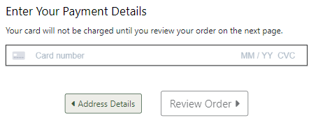
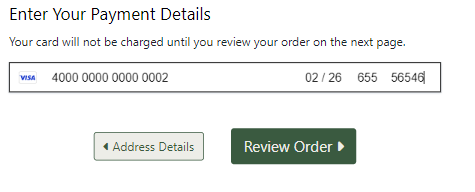

<details><summary>Stripe input error messages</summary>

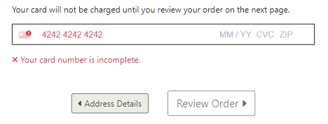

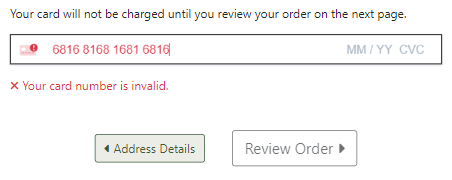

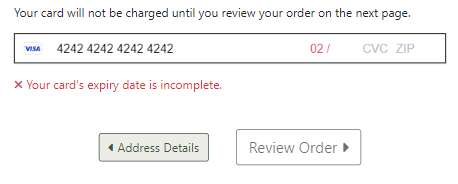

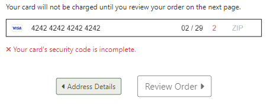

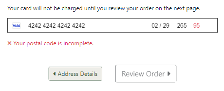

</details>

<details><summary>Enabling and disabling button when data is deleted</summary>

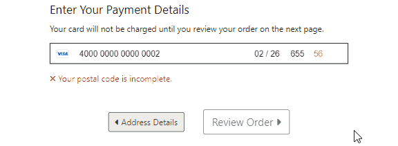

</details>

#### Review Order
In this section, the user will not find any form fields to complete, only a button to submit their order. Upon form submission, there should be no possibility that the user has left any form fields blank or with invalid data. There may still be a problem processing the user's payment and in these cases, feedback is given to the user under the Payment heading. One scenario would be a user with insufficient funds on their card. In cases like this where Stripe returns an error event, the error message is displayed and the user may navigate back to the payment section to amend their details.

<details><summary>Payment error feedback in the Review Order section</summary>

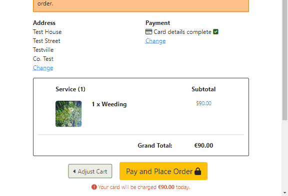

</details>

On the back end, the checkout view utilises a number of try-except blocks and if-else statements to ensure the submitted data is valid, and if not, raise validation errors:
- If the order form is valid, each item in the cart is added to the card inside a try block. If this fails for any reason, the process is abandoned, the order is deleted, an error toast message displayed to the user, and the user is redirected back to their cart.
- If the front-end validation failed somehow and invalid form data is received, an error toast message is displayed telling the user that their form is not correct and to double check their inputs again.

### Creating a Review
Users who have previously ordered a service may leave a review for it. The review form may be accessed through the **Leave a Review** button on the service's reviews page. This button is displayed dynamically through the the use of the `service_history` function and a Boolean context variable `ordered` returned from the view. The user's order history is looped through and if any have the service, `ordered` is returned which by default is set to `False` but in this case has now been set to `True`. This allows the user to interact with the **Leave a Review** button and navigate to the form page.

Three input fields are presented to the user and each have custom validation. All three are set as required fields on the backend and the data is cleaned and checked for validity on form submission. If either of the three fields are not complete, ValidationErrors are raised and the fields outlined in red with an error message in bold red text displayed under the field. The ratings stars are given a red colour if the input is left blank.

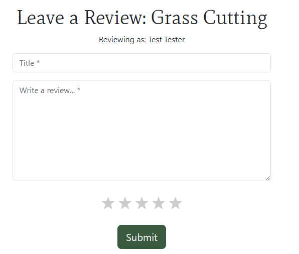

<details><summary>ValidationError messages and styles</summary>

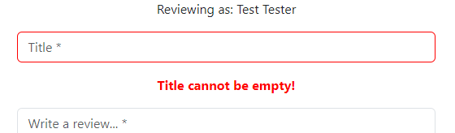

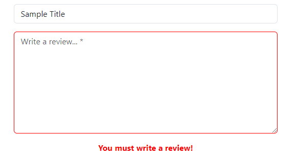

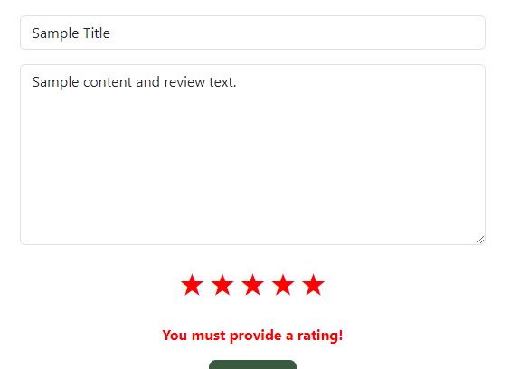

</details>

<details><summary>Error styling resetting when inputs are corrected</summary>


</details>

### Contact Us Form
Any site user may send a message to the business by using the contact form. There are six input fields presented to the user all of which are required. The first five fields will show browser validation messages without reloading the page if left blank when the **Send** button is clicked. The email field will show additional custom validation if the user enters an incomplete email of the form `example@email` without a top-level domain. This validation message is displayed after the user clicks the **Send** button and the page reloads. The reCAPTCHA field validation is displayed in the same way. This was achieved by cleaning the form data on the back end and raising ValidationError messages if any data was missing.

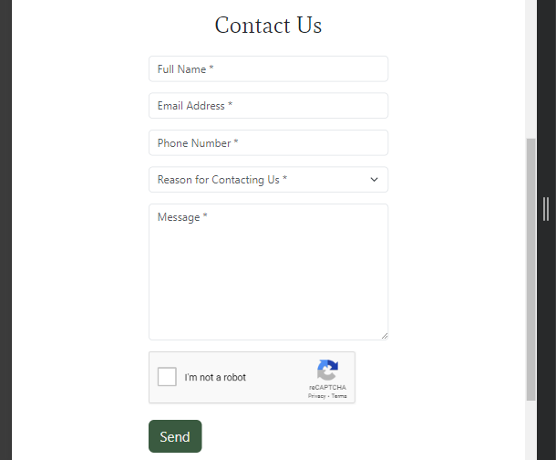

<details><summary>ValidationError messages and styles</summary>

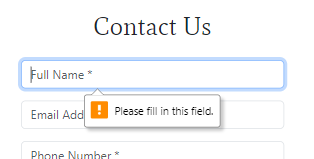

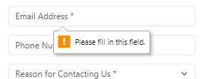

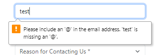

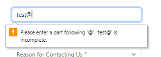

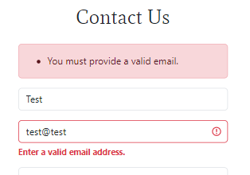

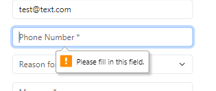


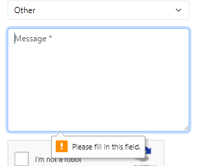

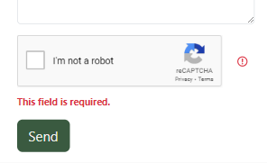

</details>

When a user is logged in, the form can be pre-filled with their name and email address and, if saved on their profile, their phone number. This is achieved in the view by checking the user authentication status and getting the data from their UserAccount database entry in a try-except block. If the user data is not found or if they are not authenticated, an empty instance of the form is rendered. This ensures that user data is only displayed if the user is logged in and currently has data saved to their UserAccount on the database.

### Updating Account Details
An authenticated user has the option of updating or deleting their phone number and address details on their My Account page. Currently no fields in this form are required, as the user can submit the form with blank fields to delete their information from the database. Functionality does exist for any of these fields to be required in the future, and one field was set as required just for the purposes of demonstrating the validation for this discussion. This was done by simply adding the following line to the `UserAccountForm` class in `forms.py`:
```
default_phone_number = forms.CharField(required=True)
```
An existing code block adds an asterisk to any form field that is required, so no further changes to the code were necessary to make the user aware of the change to the form.

<details><summary>Demonstration of Account Details form validation</summary>

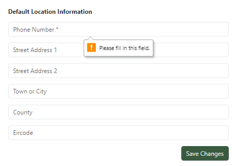

</details>

### Authetication Pages
Various allauth templates were used in this application and those that have forms came with built-in form validation. These templates are `login.html`, `signup.html`, `password_reset.html`, and `password_reset_from_key.html`. Full testing if these pages is demonstrated below in the [Full Testing](#full-testing) section.

## Testing
### Manual Testing
**User Stories** | **Achieved By:** | **Supporting Images**
--- | --- | ---
**Initial Project Setup** | |
Set Up Django Files | Installing the correct version of Django in the IDE. Creating a project named "gardening". Creating an app called "home" and writing a basic view to display "Hello World!" on the homepage. | 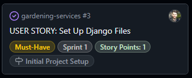
Create PostgreSQL Database | Creating a new PostgreSQL instance, copying the URL in the Details section, creating the `env.py` file and setting the `DATABASE_URL` constant, installing the relevant packages for database connection, and running migrations. | 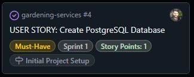
Deploy Project to Heroku | Creating a Heroku app with a unique name, updating the code for deployment with Gunicorn, and deploying the app on Heroku. | 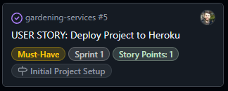
Deploy Heroku App with Static Files | Creating a staticfiles directory and collecting the static files, deploying the project on Heroku, and ensuring all styles are applied. | 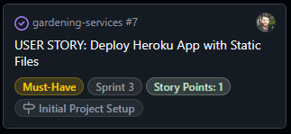
**Create Models** | |
Three Custom Models | Creating custom Django models that were not directly copied from other sources. | 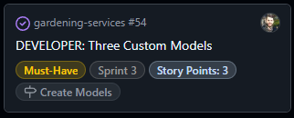
Create Service Model | Creating a **services** app, creating a models file, declaring the necessary imports, and creating a model with the appropriate fields required. | 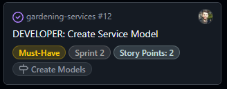
Create Custom User Model | Creating an app called **accounts**, creating the CustomUser model in `models.py`, and updating `settings.py` to use the custom model. | 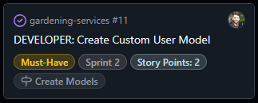
Create Order Model | Creating an app called **checkout**, creating the Order model in `models.py`, and adding functions to generate a unique order number and calculate the total price. | 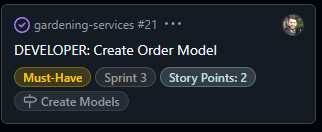
Create OrderLineIem Model | Creating the OrderLineItem model in `models.py` and adding a function to calculate the line subtotal. | 
Create Reviews Model | Creating an app called **reviews**, creating the Review model in `models.py`, and adding functions to calculate an average rating for a service. | 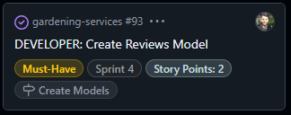
Create ContactUs Model | Creating an app called **contact** and creating the ContactUs model in `models.py`. | 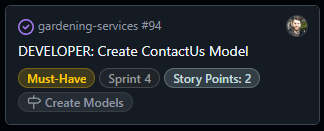
**User Accounts** | |
Create an Account | Clicking the sign-in button to prompt account creation. Verifying email address and logging out and logging back in using the created password. | 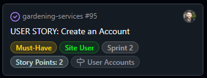
View Account Page | Navigating to the My Account page and viewing and amending details, and viewing past orders. | 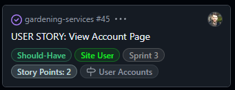
**Website Content** | |
Create Base Template | Creating a `base.html` file, creating a header and nav bar for small screens, creating a footer for small screens, creating a header and nav bar for larger screens, and creating a footer for larger screens. | 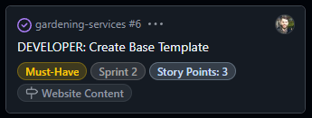
View Homepage | Viewing the landing page on website load. | 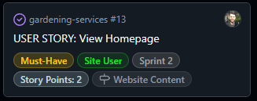
View Business Information | Viewing the About Us page. Reading the business information, viewing the locations covered by the business, and seeing the products and services offered. | 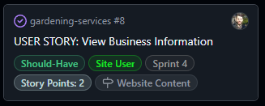
Create Error Pages | Creating 404, 403, and 500 error page templates. | 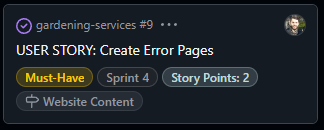
View Privacy Policy | Navigating to the privacy policy page from a link in the footer and reading the privacy policy on a dedicated webpage. | 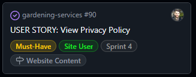
**Services and Checkout** | |
View Individual Service Details | Clicking on a service link in the navbar or services page. Reading the service description, price, and rating. | 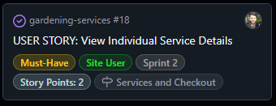
Order a Service | Viewing the list of services that can be booked, selecting the relevant options, and adding the service(s) to the shopping cart. | 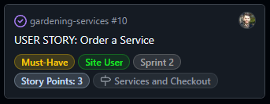
View Cart | Navigating to the cart page and viewing the list of services. Viewing each service's individual cost and the total cost of the order. | 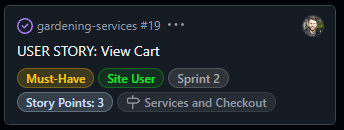
View Preview of Cart | Adding a service to the cart on smaller screens and viewing the toast message with the cart details. On desktop screens, adding a service to the cart and viewing the cart preview in the offcanvas window. | 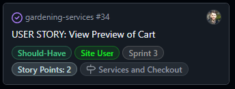
Update Services from the Cart Page | Changing the number of a given service with the **+** and **-** buttons and seeing the subtotal price change. Removing a service from the cart with the remove button or by entering 0 into the number field. Viewing the order total update after updating or deleting a service. | 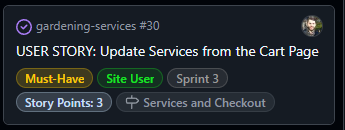
Proceed to Checkout | Clicking the checkout button and entering personal details, delivery details, and payment information before reviewing a summary of the order. | 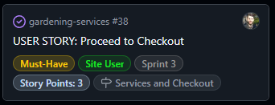
**Payment System** | |
Set Up Stripe | Installing Stripe, setting up a webhook handler, and implementing views to process the payment and order data. | 
Pay for an Order | Entering payment details in the checkout process and being informed of the success or failure of the payment attempt. | 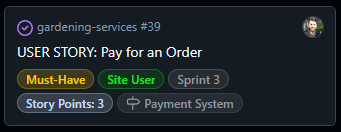
Receive Confirmation of Orders | Seeing a confirmation message on the site with an order number provided, viewing the submitted order details on the account page, and viewing the order details in an email confirmation. | 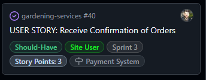
**Reviews** | |
View Reviews | On a particular service page, viewing all reviews for that service and navigating through the reviews via pagination. | 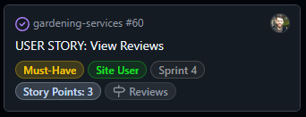
Review a Service | Interacting with a "Leave a Review" button, rating the service out of 5 stars, and writing a title and brief review. | 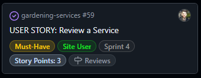
Edit a Review | For a particular review made, clicking the edit button and amending the title, content, and or the rating and saving the changes. | 
Publish Reviews | For a given pending review, publishing it to the website making it publicly visible.  For a given published review, unpublishing and preventing users from seeing it. | 
Delete a Review | Clicking the delete button when rendered and interacting with the modal to  with the option to confirm or cancel the delete action before it takes effect. | 
**Contact Us** | |
View Contact Us Page | Navigating to the Contact Us page from the main nav bar and sending a message to the business using a form. | 
Contact Us Email Confirmation | Submitting a message using the Contact Us form and receiving a copy of the message via email. | 
Pre-filled Contact Us Form | Being logged into an account with details saved to the database and navigating to the Contact Us page. Seeing that the full name, email, and phone number fields are already completed using this data. | 
**Marketing** | |
Subscribe to Newsletters | Submitting an email in the newsletter form and receiving visual feedback confirming successful addition to the mailing list. | 
Create Facebook Page | Creating a mock-up of a Facebook business page for The Garden Path with relevant images and text. | 
Search Engine Optimisation | Conducting research on and implementing keywords, creating a `robots.txt` file, creating a `sitemap.xml` file, employing descriptive meta tags, adding appropriate `rel` attributes on external links, and adding links to reputable websites related to the business. | 

### Full Testing
The program was deployed on Heroku and tested there on a Windows 10 desktop with a 26" monitor and on a One Plus 9 Pro mobile phone.

The site was tested on Google Chrome, Mozilla Firefox, and Edge on desktop, DuckDuckGo on mobile, and using Chrome Developer Tools for some other screen sizes.

**Feature**|**Expected Outcome**|**Test Performed**|**Results**|**Test Status**
-----|-----|-----|-----|-----
**All Pages**| | | | 
Navbar Logo and Title Link|When clicked, the user is redirected to the homepage.|Link clicked|User redirected to homepage|Pass
Navbar About Us Link|When clicked, the user is redirected to the About Us page.|Link clicked|User redirected to About Us page|Pass
Navbar Services dropdown|When clicked, the user sees a dropdown list of links to different service pages.|Dropdown Link clicked|Dropdown list of services pages shown.|Pass
Navbar All Services Link|When clicked, the user is redirected to the All Services page.|Link clicked|User redirected to All Services page|Pass
Navbar Grass Cutting Link|When clicked, the user is redirected to the Grass Cutting page.|Link clicked|User redirected to Grass Cutting page|Pass
Navbar Weed Control Link|When clicked, the user is redirected to the Weed Control page.|Link clicked|User redirected to Weed Control page|Pass
Navbar Tree Felling & Maintenance Link|When clicked, the user is redirected to the Tree Felling & Maintenance page.|Link clicked|User redirected to Tree Felling & Maintenance page|Pass
Navbar Hedge Maintenance Link|When clicked, the user is redirected to the Hedge Maintenance page.|Link clicked|User redirected to Hedge Maintenance page|Pass
Navbar Flowerbed Maintenance Link|When clicked, the user is redirected to the Flowerbed Maintenance page.|Link clicked|User redirected to Flowerbed Maintenance page|Pass
Navbar Tree Stump Removal Link|When clicked, the user is redirected to the Tree Stump Removal page.|Link clicked|User redirected to Tree Stump Removal page|Pass
Navbar Cart Link|When clicked, the user is redirected to the Cart page.|Link clicked|User redirected to Cart page|Pass
Navbar Cart Link|When items are present in the cart, the cart subtotal amout is appended after the word Cart in the link.|Services added to cart|The cart subtotal amount was appended after the word Cart in the link|Pass
Navbar Contact Us Link|When clicked, the user is redirected to the Contact Us page.|Link clicked|User redirected to Contact Us page|Pass
Navbar Log In/Sign Up Link|When clicked, the user is redirected to the Sign In page.|Link clicked|User redirected to Sign In page|Pass
Navbar My Account Link|When clicked, the user is redirected to the My Account page.|Link clicked|User redirected to My Account page|Pass
Navbar Log Out Link|When clicked, the user is redirected to the Sign Out page.|Link clicked|User redirected to Sign Out page|Pass
Navbar burger button on small screens | When clicked, a dropdown list of the navbar links is displayed. | Burger button clicked | Dropdown list of the navbar links is displayed | Pass
Navbar burger button on small screens | When clicked, the displayed dropdown list of navbar links is hidden. | Burger button clicked with dropdown displaying | Dropdown list of the navbar links is hidden | Pass
Footer ALCI Link | When clicked, the ALCI website opens in a new tab. | Link clicked | ALCI website opens in a new tab | Pass
Footer Phone Number Link | When clicked, the device asks to confirm opening in another app. App opens prefilled with the phone number.|Link clicked and confirmation given.|App opened with phone number prefilled|Pass
Footer Email Link|When clicked, the device asks to confirm opening in another app. App opens with email address prefilled in To field.|Link clicked and confirmation given.|App opened with email address prefilled in To field|Pass
Footer Facebook Link|When clicked, the linked webpage is opened in a new tab.|Link clicked|Webpage was opened in a new tab.|Pass
Footer Instagram Link|When clicked, the linked webpage is opened in a new tab.|Link clicked|Webpage was opened in a new tab.|Pass
Footer Privacy Policy Link | When clicked, the user is redirected to the Privacy Policy page. | Link clicked | User redirected to the Privacy Policy page | Pass
Footer Mailing List Link | When clicked, the user is redirected to the Newsletter signup page. | Link clicked | User redirected to the Newsletter signup page | Pass
Footer RHSI Link | When clicked, the RHSI website opens in a new tab. | Link clicked | RHSI website opens in a new tab | Pass
**Home Page**| | | | 
View All Services button|When clicked, the user is redirected to the All Services page.|Button clicked|User redirected to All Services page|Pass
**About Us Page**| | | | 
Get a Quote button|When clicked, the user is redirected to the Contact Us page.|Button clicked|User redirected to Contact Us page|Pass
**All Services Page**| | | | 
Grass Cutting card |When clicked, the user is redirected to the Grass Cutting page.|Service card clicked|User redirected to Grass Cutting page|Pass
Weed Control card |When clicked, the user is redirected to the Weed Control page.|Service card clicked|User redirected to Weed Control page|Pass
Tree Felling & Maintenance card |When clicked, the user is redirected to the Tree Felling & Maintenance page.|Service card clicked|User redirected to Tree Felling & Maintenance page|Pass
Hedge Maintenance card |When clicked, the user is redirected to the Hedge Maintenance page.|Service card clicked|User redirected to Hedge Maintenance page|Pass
Flowerbed Maintenance card |When clicked, the user is redirected to the Flowerbed Maintenance page.|Service card clicked|User redirected to Flowerbed Maintenance page|Pass
Tree Stump Removal card |When clicked, the user is redirected to the Tree Stump Removal page.|Service card clicked|User redirected to Tree Stump Removal page|Pass
**Grass Cutting Page**| | | | 
Services Breadcrumb link|When clicked, the user is redirected to the All Services page.|Link clicked|User redirected to All Services page|Pass
Category Breadcrumb link|When clicked, the user is redirected to the All Services page with only services of that category displayed.|Link clicked|User redirected to All Services page with only services of the same category displayed|Pass
Number of Reviews link | When clicked, the user is redirected to the reviews page for the service.|Link clicked|User redirected to correct reviews page|Pass
Select Option dropdown input field | When clicked, the user can select any of the options from the list.| Input field clicked and different options selected in turn|User was able to select different options from the dropdown list.|Pass
Services button |When clicked, the user is redirected to the All Services page.|Button clicked|User redirected to All Services page|Pass
Add to cart button |When clicked, the service is added to the user's cart with the selected acre option and the user can see a confirmation of this either in a toast message on small screens or in an offcanvas window on larger screens.|Button clicked| Service added to the user's cart with the selected acre option and confirmation is displayed in a toast message on small screens and in an offcanvas window on larger screens|Pass
Toast message | When a service is successfully added to the cart on smaller screens, the user can view a summary of the cart contents in the message| Service added to cart while viewing page on smaller screens|Toast message displayed with a summary of the cart contents|Pass
Toast message | When the **X** button is clicked, the toast message is dismissed.|**X** button clicked in toast message|Toast message was dismissed|Pass
Toase message|For a long list of services in the toast cart preview, the user can drag the list up and down to view all the services.|Toast preview with a long list of cart items viewed|The list of services was scrollable by draggin it up and down|Pass
Toast message | When the **View Cart** button is clicked, the user is redirected to the cart page| **View Cart** button clicked in toast message| User redirected to cart page|Pass
Offcanvas | When a service is successfully added to the cart on larger screens, the user can view a summary of the cart contents in an offcanvas element that displays on the right hand side of their screen.| Service added to cart while viewing page on larger screens|Offcanvas element displayed on right hand side of screen with a summary of the cart contents|Pass
Offcanvas | When the offcanvas is displayed, the user can click the **X** to dismiss the offcanvas element.|**X** button clicked in offcanvas element|The offcanvas element was closed|Pass
Offcanvas | When the offcanvas is displayed, the user can click anywhere else on their screen to dismiss the offcanvas element.| Part of screen other than the offcanvas element clicked|The offcanvas element was closed|Pass
Offcanvas|For a long list of services in the offcanvas preview, the user can scroll up and down the list contained inside the offcanvas element.|Offcanvas with a long list of cart items viewed|The list of services was scrollable|Pass
**Weeding Page**| | | | 
Services Breadcrumb link|When clicked, the user is redirected to the All Services page.|Link clicked|User redirected to All Services page|Pass
Category Breadcrumb link|When clicked, the user is redirected to the All Services page with only services of that category displayed.|Link clicked|User redirected to All Services page with only services of the same category displayed|Pass
Number of Reviews link | When clicked, the user is redirected to the reviews page for the service.|Link clicked|User redirected to correct reviews page|Pass
Surface Type dropdown input field | When clicked, the user can select any of the options from the list.| Input field clicked and different options selected in turn|User was able to select different options from the dropdown list.|Pass
Extra input fields| When the user selects "Bed/Planter" as the surface type, two more fields are displayed: a select input field of sizes and a number input field.|Bed/Planter option selected from Surface Type dropdown input| Select input field of sizes and number input field displayed|Pass
Size of Bed/Planter input field | When clicked, the user can select any of the size options from the list.| Input field clicked and different options selected in turn|User was able to select different size options from the dropdown list.|Pass
Number of Bed/Planters input field | The user can increase the number to a maximum value of 99 with the **+** button.|Button clicked until the number reached 99| The **+** was disabled and the user could not increase the number higher than 99 | Pass
Number of Bed/Planters input field | The user can decrease the number to a minimum value of 1 with the **-** button.|Button clicked until the number reached 1| The **-** was disabled and the user could not set the number lower than 1 | Pass
Number of Bed/Planters input field | The user can increase the number to a maximum value of 99 with up arrow on their keyboard.|Up arrow held until the number reached 99| The **+** was disabled and the user could not increase the number higher than 99 | Pass
Number of Bed/Planters input field | The user can decrease the number to a minimum value of 1 with down arrow on their keyboard.|Down arrow held until the number reached 1| The **-** was disabled and the user could not set the number lower than 1 | Pass
Number of Bed/Planters input field | The user can change the number in the field with their keyboard.|Keyboard used to enter various number in the input field| The input field was update with the numbers entered with the keyboard | Pass
Services button |When clicked, the user is redirected to the All Services page.|Button clicked|User redirected to All Services page|Pass
Add to Cart button |When clicked, the service is added to the user's cart with the selected acre option and the user can see a confirmation of this either in a toast message on small screens or in an offcanvas window on larger screens.|Button clicked| Service added to the user's cart with the selected acre option and confirmation is displayed in a toast message on small screens and in an offcanvas window on larger screens|Pass
Add to Cart button | When clicked with a value less than 1 in the input field, the service is not added to the cart and a validation message is displayed stating that the value must be greater than or equal to 1.|Button clicked with values less than 1 in the input field| The service was not added to the cart and a validation message was displayed stating that the value must be greater than or equal to 1|Pass
Add to Cart button | When clicked with a value greater than 99 in the input field, the service is not added to the cart and a validation message is displayed stating that the value must be less than or equal to 99.|Button clicked with values greater than 99 in the input field| The service was not added to the cart and a validation message was displayed stating that the value must be less than or equal to 99|Pass
Toast message | When a service is successfully added to the cart on smaller screens, the user can view a summary of the cart contents in the message| Service added to cart while viewing page on smaller screens|Toast message displayed with a summary of the cart contents|Pass
Toast message | When the **X** button is clicked, the toast message is dismissed.|**X** button clicked in toast message|Toast message was dismissed|Pass
Toase message|For a long list of services in the toast cart preview, the user can drag the list up and down to view all the services.|Toast preview with a long list of cart items viewed|The list of services was scrollable by draggin it up and down|Pass
Toast message | When the **View Cart** button is clicked, the user is redirected to the cart page| **View Cart** button clicked in toast message| User redirected to cart page|Pass
Offcanvas | When a service is successfully added to the cart on larger screens, the user can view a summary of the cart contents in an offcanvas element that displays on the right hand side of their screen.| Service added to cart while viewing page on larger screens|Offcanvas element displayed on right hand side of screen with a summary of the cart contents|Pass
Offcanvas | When the offcanvas is displayed, the user can click the **X** to dismiss the offcanvas element.|**X** button clicked in offcanvas element|The offcanvas element was closed|Pass
Offcanvas | When the offcanvas is displayed, the user can click anywhere else on their screen to dismiss the offcanvas element.| Part of screen other than the offcanvas element clicked|The offcanvas element was closed|Pass
Offcanvas|For a long list of services in the offcanvas preview, the user can scroll up and down the list contained inside the offcanvas element.|Offcanvas with a long list of cart items viewed|The list of services was scrollable|Pass
**Tree Felling and Maintenance Page**| | | | 
Services Breadcrumb link|When clicked, the user is redirected to the All Services page.|Link clicked|User redirected to All Services page|Pass
Category Breadcrumb link|When clicked, the user is redirected to the All Services page with only services of that category displayed.|Link clicked|User redirected to All Services page with only services of the same category displayed|Pass
Number of Reviews link | When clicked, the user is redirected to the reviews page for the service.|Link clicked|User redirected to correct reviews page|Pass
Select Option dropdown input field | When clicked, the user can select any of the options from the list.| Input field clicked and different options selected in turn|User was able to select different options from the dropdown list.|Pass
Size of Tree input field | When clicked, the user can select any of the size options from the list.| Input field clicked and different options selected in turn|User was able to select different size options from the dropdown list.|Pass
Number of Trees input field | The user can increase the number to a maximum value of 99 with the **+** button.|Button clicked until the number reached 99| The **+** was disabled and the user could not increase the number higher than 99 | Pass
Number of Trees input field | The user can decrease the number to a minimum value of 1 with the **-** button.|Button clicked until the number reached 1| The **-** was disabled and the user could not set the number lower than 1 | Pass
Number of Trees input field | The user can increase the number to a maximum value of 99 with up arrow on their keyboard.|Up arrow held until the number reached 99| The **+** was disabled and the user could not increase the number higher than 99 | Pass
Number of Trees input field | The user can decrease the number to a minimum value of 1 with down arrow on their keyboard.|Down arrow held until the number reached 1| The **-** was disabled and the user could not set the number lower than 1 | Pass
Number of Trees input field | The user can change the number in the field with their keyboard.|Keyboard used to enter various number in the input field| The input field was update with the numbers entered with the keyboard | Pass
Services button |When clicked, the user is redirected to the All Services page.|Button clicked|User redirected to All Services page|Pass
Add to Cart button |When clicked, the service is added to the user's cart with the selected acre option and the user can see a confirmation of this either in a toast message on small screens or in an offcanvas window on larger screens.|Button clicked| Service added to the user's cart with the selected acre option and confirmation is displayed in a toast message on small screens and in an offcanvas window on larger screens|Pass
Add to Cart button | When clicked with a value less than 1 in the input field, the service is not added to the cart and a validation message is displayed stating that the value must be greater than or equal to 1.|Button clicked with values less than 1 in the input field| The service was not added to the cart and a validation message was displayed stating that the value must be greater than or equal to 1|Pass
Add to Cart button | When clicked with a value greater than 99 in the input field, the service is not added to the cart and a validation message is displayed stating that the value must be less than or equal to 99.|Button clicked with values greater than 99 in the input field| The service was not added to the cart and a validation message was displayed stating that the value must be less than or equal to 99|Pass
Toast message | When a service is successfully added to the cart on smaller screens, the user can view a summary of the cart contents in the message| Service added to cart while viewing page on smaller screens|Toast message displayed with a summary of the cart contents|Pass
Toast message | When the **X** button is clicked, the toast message is dismissed.|**X** button clicked in toast message|Toast message was dismissed|Pass
Toase message|For a long list of services in the toast cart preview, the user can drag the list up and down to view all the services.|Toast preview with a long list of cart items viewed|The list of services was scrollable by draggin it up and down|Pass
Toast message | When the **View Cart** button is clicked, the user is redirected to the cart page| **View Cart** button clicked in toast message| User redirected to cart page|Pass
Offcanvas | When a service is successfully added to the cart on larger screens, the user can view a summary of the cart contents in an offcanvas element that displays on the right hand side of their screen.| Service added to cart while viewing page on larger screens|Offcanvas element displayed on right hand side of screen with a summary of the cart contents|Pass
Offcanvas | When the offcanvas is displayed, the user can click the **X** to dismiss the offcanvas element.|**X** button clicked in offcanvas element|The offcanvas element was closed|Pass
Offcanvas | When the offcanvas is displayed, the user can click anywhere else on their screen to dismiss the offcanvas element.| Part of screen other than the offcanvas element clicked|The offcanvas element was closed|Pass
Offcanvas|For a long list of services in the offcanvas preview, the user can scroll up and down the list contained inside the offcanvas element.|Offcanvas with a long list of cart items viewed|The list of services was scrollable|Pass
**Hedge Cutting Page**| | | | 
Services Breadcrumb link|When clicked, the user is redirected to the All Services page.|Link clicked|User redirected to All Services page|Pass
Category Breadcrumb link|When clicked, the user is redirected to the All Services page with only services of that category displayed.|Link clicked|User redirected to All Services page with only services of the same category displayed|Pass
Number of Reviews link | When clicked, the user is redirected to the reviews page for the service.|Link clicked|User redirected to correct reviews page|Pass
Size of Hedge input field | When clicked, the user can select any of the size options from the list.| Input field clicked and different options selected in turn|User was able to select different size options from the dropdown list.|Pass
Number of Hedges input field | The user can increase the number to a maximum value of 99 with the **+** button.|Button clicked until the number reached 99| The **+** was disabled and the user could not increase the number higher than 99 | Pass
Number of Hedges input field | The user can decrease the number to a minimum value of 1 with the **-** button.|Button clicked until the number reached 1| The **-** was disabled and the user could not set the number lower than 1 | Pass
Number of Hedges input field | The user can increase the number to a maximum value of 99 with up arrow on their keyboard.|Up arrow held until the number reached 99| The **+** was disabled and the user could not increase the number higher than 99 | Pass
Number of Hedges input field | The user can decrease the number to a minimum value of 1 with down arrow on their keyboard.|Down arrow held until the number reached 1| The **-** was disabled and the user could not set the number lower than 1 | Pass
Number of Hedges input field | The user can change the number in the field with their keyboard.|Keyboard used to enter various number in the input field| The input field was update with the numbers entered with the keyboard | Pass
Services button |When clicked, the user is redirected to the All Services page.|Button clicked|User redirected to All Services page|Pass
Add to Cart button |When clicked, the service is added to the user's cart with the selected acre option and the user can see a confirmation of this either in a toast message on small screens or in an offcanvas window on larger screens.|Button clicked| Service added to the user's cart with the selected acre option and confirmation is displayed in a toast message on small screens and in an offcanvas window on larger screens|Pass
Add to Cart button | When clicked with a value less than 1 in the input field, the service is not added to the cart and a validation message is displayed stating that the value must be greater than or equal to 1.|Button clicked with values less than 1 in the input field| The service was not added to the cart and a validation message was displayed stating that the value must be greater than or equal to 1|Pass
Add to Cart button | When clicked with a value greater than 99 in the input field, the service is not added to the cart and a validation message is displayed stating that the value must be less than or equal to 99.|Button clicked with values greater than 99 in the input field| The service was not added to the cart and a validation message was displayed stating that the value must be less than or equal to 99|Pass
Toast message | When a service is successfully added to the cart on smaller screens, the user can view a summary of the cart contents in the message| Service added to cart while viewing page on smaller screens|Toast message displayed with a summary of the cart contents|Pass
Toast message | When the **X** button is clicked, the toast message is dismissed.|**X** button clicked in toast message|Toast message was dismissed|Pass
Toase message|For a long list of services in the toast cart preview, the user can drag the list up and down to view all the services.|Toast preview with a long list of cart items viewed|The list of services was scrollable by draggin it up and down|Pass
Toast message | When the **View Cart** button is clicked, the user is redirected to the cart page| **View Cart** button clicked in toast message| User redirected to cart page|Pass
Offcanvas | When a service is successfully added to the cart on larger screens, the user can view a summary of the cart contents in an offcanvas element that displays on the right hand side of their screen.| Service added to cart while viewing page on larger screens|Offcanvas element displayed on right hand side of screen with a summary of the cart contents|Pass
Offcanvas | When the offcanvas is displayed, the user can click the **X** to dismiss the offcanvas element.|**X** button clicked in offcanvas element|The offcanvas element was closed|Pass
Offcanvas | When the offcanvas is displayed, the user can click anywhere else on their screen to dismiss the offcanvas element.| Part of screen other than the offcanvas element clicked|The offcanvas element was closed|Pass
Offcanvas|For a long list of services in the offcanvas preview, the user can scroll up and down the list contained inside the offcanvas element.|Offcanvas with a long list of cart items viewed|The list of services was scrollable|Pass
**Flowerbed Care Page**| | | | 
Services Breadcrumb link|When clicked, the user is redirected to the All Services page.|Link clicked|User redirected to All Services page|Pass
Category Breadcrumb link|When clicked, the user is redirected to the All Services page with only services of that category displayed.|Link clicked|User redirected to All Services page with only services of the same category displayed|Pass
Number of Reviews link | When clicked, the user is redirected to the reviews page for the service.|Link clicked|User redirected to correct reviews page|Pass
Size of Flowerbed input field | When clicked, the user can select any of the size options from the list.| Input field clicked and different options selected in turn|User was able to select different size options from the dropdown list.|Pass
Number of Flowerbeds input field | The user can increase the number to a maximum value of 99 with the **+** button.|Button clicked until the number reached 99| The **+** was disabled and the user could not increase the number higher than 99 | Pass
Number of Flowerbeds input field | The user can decrease the number to a minimum value of 1 with the **-** button.|Button clicked until the number reached 1| The **-** was disabled and the user could not set the number lower than 1 | Pass
Number of Flowerbeds input field | The user can increase the number to a maximum value of 99 with up arrow on their keyboard.|Up arrow held until the number reached 99| The **+** was disabled and the user could not increase the number higher than 99 | Pass
Number of Flowerbeds input field | The user can decrease the number to a minimum value of 1 with down arrow on their keyboard.|Down arrow held until the number reached 1| The **-** was disabled and the user could not set the number lower than 1 | Pass
Number of Flowerbeds input field | The user can change the number in the field with their keyboard.|Keyboard used to enter various number in the input field| The input field was update with the numbers entered with the keyboard | Pass
Services button |When clicked, the user is redirected to the All Services page.|Button clicked|User redirected to All Services page|Pass
Add to Cart button |When clicked, the service is added to the user's cart with the selected acre option and the user can see a confirmation of this either in a toast message on small screens or in an offcanvas window on larger screens.|Button clicked| Service added to the user's cart with the selected acre option and confirmation is displayed in a toast message on small screens and in an offcanvas window on larger screens|Pass
Add to Cart button | When clicked with a value less than 1 in the input field, the service is not added to the cart and a validation message is displayed stating that the value must be greater than or equal to 1.|Button clicked with values less than 1 in the input field| The service was not added to the cart and a validation message was displayed stating that the value must be greater than or equal to 1|Pass
Add to Cart button | When clicked with a value greater than 99 in the input field, the service is not added to the cart and a validation message is displayed stating that the value must be less than or equal to 99.|Button clicked with values greater than 99 in the input field| The service was not added to the cart and a validation message was displayed stating that the value must be less than or equal to 99|Pass
Toast message | When a service is successfully added to the cart on smaller screens, the user can view a summary of the cart contents in the message| Service added to cart while viewing page on smaller screens|Toast message displayed with a summary of the cart contents|Pass
Toast message | When the **X** button is clicked, the toast message is dismissed.|**X** button clicked in toast message|Toast message was dismissed|Pass
Toase message|For a long list of services in the toast cart preview, the user can drag the list up and down to view all the services.|Toast preview with a long list of cart items viewed|The list of services was scrollable by draggin it up and down|Pass
Toast message | When the **View Cart** button is clicked, the user is redirected to the cart page| **View Cart** button clicked in toast message| User redirected to cart page|Pass
Offcanvas | When a service is successfully added to the cart on larger screens, the user can view a summary of the cart contents in an offcanvas element that displays on the right hand side of their screen.| Service added to cart while viewing page on larger screens|Offcanvas element displayed on right hand side of screen with a summary of the cart contents|Pass
Offcanvas | When the offcanvas is displayed, the user can click the **X** to dismiss the offcanvas element.|**X** button clicked in offcanvas element|The offcanvas element was closed|Pass
Offcanvas | When the offcanvas is displayed, the user can click anywhere else on their screen to dismiss the offcanvas element.| Part of screen other than the offcanvas element clicked|The offcanvas element was closed|Pass
Offcanvas|For a long list of services in the offcanvas preview, the user can scroll up and down the list contained inside the offcanvas element.|Offcanvas with a long list of cart items viewed|The list of services was scrollable|Pass
**Tree Stump Removal Page**| | | | 
Services Breadcrumb link|When clicked, the user is redirected to the All Services page.|Link clicked|User redirected to All Services page|Pass
Category Breadcrumb link|When clicked, the user is redirected to the All Services page with only services of that category displayed.|Link clicked|User redirected to All Services page with only services of the same category displayed|Pass
Number of Reviews link | When clicked, the user is redirected to the reviews page for the service.|Link clicked|User redirected to correct reviews page|Pass
Number of Stumps input field | The user can increase the number to a maximum value of 99 with the **+** button.|Button clicked until the number reached 99| The **+** was disabled and the user could not increase the number higher than 99 | Pass
Number of Stumps input field | The user can decrease the number to a minimum value of 1 with the **-** button.|Button clicked until the number reached 1| The **-** was disabled and the user could not set the number lower than 1 | Pass
Number of Stumps input field | The user can increase the number to a maximum value of 99 with up arrow on their keyboard.|Up arrow held until the number reached 99| The **+** was disabled and the user could not increase the number higher than 99 | Pass
Number of Stumps input field | The user can decrease the number to a minimum value of 1 with down arrow on their keyboard.|Down arrow held until the number reached 1| The **-** was disabled and the user could not set the number lower than 1 | Pass
Number of Stumps input field | The user can change the number in the field with their keyboard.|Keyboard used to enter various number in the input field| The input field was update with the numbers entered with the keyboard | Pass
Services button |When clicked, the user is redirected to the All Services page.|Button clicked|User redirected to All Services page|Pass
Add to Cart button |When clicked, the service is added to the user's cart with the selected acre option and the user can see a confirmation of this either in a toast message on small screens or in an offcanvas window on larger screens.|Button clicked| Service added to the user's cart with the selected acre option and confirmation is displayed in a toast message on small screens and in an offcanvas window on larger screens|Pass
Add to Cart button | When clicked with a value less than 1 in the input field, the service is not added to the cart and a validation message is displayed stating that the value must be greater than or equal to 1.|Button clicked with values less than 1 in the input field| The service was not added to the cart and a validation message was displayed stating that the value must be greater than or equal to 1|Pass
Add to Cart button | When clicked with a value greater than 99 in the input field, the service is not added to the cart and a validation message is displayed stating that the value must be less than or equal to 99.|Button clicked with values greater than 99 in the input field| The service was not added to the cart and a validation message was displayed stating that the value must be less than or equal to 99|Pass
Toast message | When a service is successfully added to the cart on smaller screens, the user can view a summary of the cart contents in the message| Service added to cart while viewing page on smaller screens|Toast message displayed with a summary of the cart contents|Pass
Toast message | When the **X** button is clicked, the toast message is dismissed.|**X** button clicked in toast message|Toast message was dismissed|Pass
Toase message|For a long list of services in the toast cart preview, the user can drag the list up and down to view all the services.|Toast preview with a long list of cart items viewed|The list of services was scrollable by draggin it up and down|Pass
Toast message | When the **View Cart** button is clicked, the user is redirected to the cart page| **View Cart** button clicked in toast message| User redirected to cart page|Pass
Offcanvas | When a service is successfully added to the cart on larger screens, the user can view a summary of the cart contents in an offcanvas element that displays on the right hand side of their screen.| Service added to cart while viewing page on larger screens|Offcanvas element displayed on right hand side of screen with a summary of the cart contents|Pass
Offcanvas | When the offcanvas is displayed, the user can click the **X** to dismiss the offcanvas element.|**X** button clicked in offcanvas element|The offcanvas element was closed|Pass
Offcanvas | When the offcanvas is displayed, the user can click anywhere else on their screen to dismiss the offcanvas element.| Part of screen other than the offcanvas element clicked|The offcanvas element was closed|Pass
Offcanvas|For a long list of services in the offcanvas preview, the user can scroll up and down the list contained inside the offcanvas element.|Offcanvas with a long list of cart items viewed|The list of services was scrollable|Pass
**Cart Page**| | | | 
**Login Page**| | | | 
Sign Up Link|When clicked, the user is redirected to the Sign Up page.|Link clicked|User redirected to Sign Up page|Pass

### Automated Testing
#### HTML and CSS
The W3C validator sites were used to validate the [HTML](https://validator.w3.org/) and [CSS](https://jigsaw.w3.org/css-validator/) files. [JSHint](https://jshint.com/) was used to validate the JavaScript files.

HTML Page | Passed with no Errors or Warnings? | Comments
:--- | :---: | :---
LOCAL [about.html](static/images/testing/w3c-about.png) | &check; | Trailing slash in self-closing `` element is flagged as having no effect.
LOCAL [account.html](static/images/testing/w3c-account.png) | &check; |
LOCAL [privacy.html](static/images/testing/w3c-privacy.png) | &check; |
LOCAL [cart.html](static/images/testing/w3c-cart.png) | &check; | Trailing slash in self-closing `` element is flagged as having no effect.
LOCAL [checkout.html](static/images/testing/w3c-checkout.png) | &check; | Trailing slash in self-closing `` element is flagged as having no effect.
LOCAL [checkout_success.html](static/images/testing/w3c-checkout-success.png) | &check; |
LOCAL [contact_us.html](static/images/testing/w3c-contact_us.png) | &check;* | This page had one warning and one error, both of which are due to third-party lines of code that are rendered by the reCAPTCHA library. The warning states that having a type attribute in its JavaScript `<script>` tag is unessecary. The error states that the attribute `required` is not allowed on the checkbox div rendered by reCAPTCHA. Attempts were made using JavaScript to remove the attribute on page load, as the field is set as required on the backend already; however, the third-party library still rendered the element with the `required` attribute. Even with this error, the form works as intended with no bugs present. For the purposes of this application, and espcially considering the error is due to third-party code that can't be easily edited, this page is considered as having **passed with no errors**. A trailing slash in a self-closing `` element is flagged as having no effect.
LOCAL [subscribe.html](static/images/testing/w3c-subscribe.png) | &check; | Trailing slash in self-closing `` element is flagged as having no effect.
LOCAL [index.html](static/images/testing/w3c-index.png) | &check; | Trailing slash in self-closing `` element is flagged as having no effect.
LOCAL [create_review.html](static/images/testing/w3c-create_review.png) | &check; | Trailing slash in self-closing `` element is flagged as having no effect.
LOCAL [reviews.html](static/images/testing/w3c-reviews.png) | &check; | Trailing slash in self-closing `` element is flagged as having no effect.
LOCAL [unpublished_reviews.html](static/images/testing/w3c-unpublished_reviews.png) | &check; |
LOCAL [service_page.html](static/images/testing/w3c-service_page.png) | &check; | Trailing slash in self-closing `<input/>` element is flagged as having no effect.
LOCAL [services.html](static/images/testing/w3c-services.png) | &check; | Trailing slash in self-closing `` element is flagged as having no effect.
LOCAL [403.html](static/images/testing/w3c-403.png) | &check; |
| &check; |LOCAL [404.html](static/images/testing/w3c-404.png) | &check; |
NOT TESTED YET!!! [500.html](static/images/testing/w3c-500.png) | | 
Toast messages and Offcanvas | &check; | Toast messages and the Offcanvas element were triggered and validation of the HTML code was done by direct input e.g. a success toast after adding items to the cart.
LOCAL [login.html](static/images/testing/w3c-login.png) | &check; |
LOCAL [signup.html](static/images/testing/w3c-signup.png) | &check; |
LOCAL [logout.html](static/images/testing/w3c-logout.png) | &check; |
[password_reset.html](static/images/testing/w3c-password-reset.png) | &check; | Validated by direct input
[password_reset_done.html](static/images/testing/w3c-password-reset-done.png) | &check; | Validated by direct input
[password_reset_from_key.html](static/images/testing/w3c-password-reset-from-key.png) | &check; | Validated by direct input
[password_reset_from_key_done.html](static/images/testing/w3c-password-reset-from-key-done.png) | &check; | Validated by direct input
[verification_sent.html](static/images/testing/w3c-verification-sent.png) | &check; | Validated by direct input
[email_confirm.html](static/images/testing/w3c-email-confirm.png) | &check; | Validated by direct input

CSS File | Passed with no Errors or Warnings? | Comments
:--- | :---: | :---
LOCAL [style.css](static/images/testing/w3c-css.png) | &check; | ????
LOCAL [accounts.css](static/images/testing/w3c-css-accounts.png) | &check; |
LOCAL [cart.css](static/images/testing/w3c-css-cart.png) | &check; |
LOCAL [checkout.css](static/images/testing/w3c-css-checkout.png) | &check; |
LOCAL [contact.css](static/images/testing/w3c-css-contact.png) | &check; |
LOCAL [reviews.css](static/images/testing/w3c-css-reviews.png) | &check; |

#### JavaScript
JavaScript File | Passed with no Errors or Warnings? | Comments
:--- | :---: | :---
[cart.js](static/images/testing/jshint-cart.png) | &check; |
[cart_numbers.js](static/images/testing/jshint-cart-numbers.png) | &check; |
[cart_preview.js](static/images/testing/jshint-cart-preview.png) | &check; | One variable flagged as undefined: `bootstrap`. This variable is defined in the `bootstrap.bundle.min.js` script which is called before `cart_preview.js` thus allowing the function to work as intended.
[checkout_form.js](static/images/testing/jshint-checkout-form.png) | &check; |
[contact_us.js](static/images/testing/jshint-contact-us.png) | &check; |
[delete_buttons.js](static/images/testing/jshint-delete-buttons.png) | &check; |
[number_inputs.js](static/images/testing/jshint-number-inputs.png) | &check; |
[review_stars.js](static/images/testing/jshint-review-stars.png) | &check; |
[service_form.js](static/images/testing/jshint-service-form.png) | &check; |
[star_ratings.js](static/images/testing/jshint-star-ratings.png) | &check; |
[stripe_elements.js](static/images/testing/jshint-stripe-elements.png) | &check; | One variable flagged as undefined: `Stripe`. This variable is defined in `<script src="https://js.stripe.com/v3/"></script>` which is called before `stripe_elements.js` allowing it to be used correctly.

#### Python
Flake8 was used to check original Python code to ensure compliance with PEP8 standards. This was done by navigating to each Django app in turn and running `python3 -m flake8` in workspace terminal. Any issues were then listed in the terminal along with the filename and location within the file. When no issues remain, the terminal did not print any output.

Flake8 flagged E501 errors in migrations files for lines longer than 79 characters. These files are automatically generated and editing them could result in migration errors. These errors were therefore ignored in this context and no corrections were made to the files.

<details><summary>The Gardening app - Acceptable error</summary>

There were two different types of errors flagged in the `settings.py` file:
- The first was flagging `env` as being imported but not used. This is because the linter is looking for the word `env` being called elsewhere in the file and not finding it; however, this is an acceptable error as the file is still using the imported data but calling it via `os.environ.get`.
- The second related to lines longer than 79 characters in the `ALLOWED_ORIGINS` and `AUTH_PASSWORD_VALIDATORS` blocks. There was no realistic way of splitting these lines in two and not breaking the functionality of the website; therefore, these errors flagged by the linter were deemed acceptable to have.
    - PEP8 [allows for this](https://peps.python.org/pep-0008/#a-foolish-consistency-is-the-hobgoblin-of-little-minds):
    "However, know when to be inconsistent – sometimes style guide recommendations just aren't applicable. When in doubt, use your best judgment. Look at other examples and decide what looks best. And don't hesitate to ask! ... ... Some other good reasons to ignore a particular guideline:
    When applying the guideline would make the code less readable, even for someone who is used to reading code that follows this PEP."
    - The comment `# noqa` was added after each of these long lines so that the linter would ignore the error.

    

</details>

<details><summary>The About app - No errors</summary>


</details>

<details><summary>The Accounts app - No errors</summary>


</details>

<details><summary>The Cart app - No errors</summary>


</details>

<details><summary>The Checkout app - No true errors</summary>

In `apps.py`, Flake8 flags `checkout.signals` as being imported but never used. This is due to the linter seeing this file in isolation and not understanding the purpose of the import. It is included so that Django is aware of the signals module and the update listeners contained within.


</details>

<details><summary>The Reviews app - No errors</summary>


</details>

#### Accessibility Testing
The WAVE tool was used to assess the website for any errors or issues associated with accessibility. The results and comments for each page are as follows:

##### Index Page
No errors were detected.


##### About Page
No errors were detected.


#### Lighthouse Testing
##### Home Page

Desktop test:


Mobile test:


##### About Page
Desktop and mobile tests for about.html were all very good with scores ranging from 80 to 100.

Desktop test:


Mobile test:


## Bugs
### Known Bugs
| # | Bug | Image | Plan to Solve |
| --- | --- | --- | --- |

### Solved Bugs
| # | Bug | Image | Solution |
| --- | --- | --- | --- |

<br>

Back to [README.md](/README.md)