# The Garden Path - Testing

Deployed program on Heroku: [The Garden Path](https://gardening-services-e596b6371c3f.herokuapp.com/)


## Contents
- [Form Validation](#form-validation)
    - [Service Form](#adding-a-service-to-the-cart)
    - [Checkout Form](#the-checkout-form)
    - [Review Form](#creating-a-review)
    - [Contact Us Form](#contact-us-form)
    - [My Account Details](#updating-account-details)
    - [Authentication Pages](#authetication-pages)
- [Testing](#testing)
    - [Manual Testing](#manual-testing)
    - [Full Testing](#full-testing)
    - [Automated Testing](#automated-testing)
- [Bugs](#bugs)
    - [Known Bugs](#known-bugs)
    - [Solved Bugs](#solved-bugs)

## Form Validation
### Adding a Service to the Cart
Each of the six services available to the user has at least one and at most three form fields to interact with. Depending on the service, these include select and number inputs.
For all select inputs, the user can only select one option, as each input has one value already marked as selected.

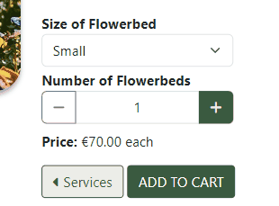

The form on each service page differs as follows:
- Grass Cutting
    - One select input for a range of areas to cut
- Weeding
    - One select input for the type of surface, either "Driveway/Patio" or "Bed/Planter".
    - If the user selects "Bed/Planter", another select input is displayed with a range of sizes.
    - A number input representing the number of surfaces.
- Tree Felling and Maintenance
    - A select input for the type of tree service (felling, pruning, coppicing, or pollarding).
    - A select input with a range of sizes for the tree.
    - A number input for the number of trees.
- Hedge Cutting and Flowerbed Care
    - Both of these services have one select input with a range of sizes and a number input for the number of hedge/flowerbeds
- Tree Stump Removal
    - This service has just one number input.

Each number input has a minimum value of 1 and a maximum value of 99. The decrement button is disabled by JavaScript code when the value is 1, and the increment button is disabled when the value reaches 99. On desktop screens, the user can click the default arrow buttons inside the input field or use the keyboard to increase or decrease the numbers, but the values will not go outside the set range of 1-99. The user may manually edit the number in the field to be less than 1 or greater than 99, but the form will not submit in this case and a validation message is displayed to the user.


### The Checkout Form
The checkout form is displayed to the user in three distinct sections, and custom validation was written for each section.

#### Personal Details
The first set of fields presented to the user are personal, contact, and address details. Required fields are marked with an asterisk, and the **Continue to Payment** button is disabled until those fields contain data. This is achieved using [custom JavaScript code](https://github.com/simonhw/gardening-services/blob/main/static/js/checkout_form.js). A keyup event listener is added to each required input field which, calls the `continueCheck()` and `allFilled()` functions. These functions together check the value of each required input field, and if any are blank or only contain whitespace(s), keep the continue button disabled and only enable it when all required inputs contain text. In cases where users are logged in and have their personal details saved on their profile, these fields will already be filled with their data. For this reason, the `continueCheck()` function is also called when the page first loads.


<details><summary>Continue button being enabled on page load</summary>


</details>

The only validation messages that the user can see in this section relate to an invalid email address. If the user does not enter an email in the correct format, a validation message will appear when they click the **Continue to Payment** button. This was achieved by adding custom JavaScript code that uses the `.checkValidity()` method on the email field.

<details><summary>Email address validation warnings</summary>


</details>

#### Payment Details
This section consists of a single Stripe input field. Similar to above, the button that brings the user to the next step in the checkout process is disabled while the Stripe field remains empty. Real-time error handling is managed by code in the `stripe_elements.js` file. A change event listener checks if any error events are detected and displays the error messages in a div under the input. The **Review Order** button has a `disabled` attribute applied to it in these cases. If a "complete" event is detected, the script removes the disabled attribute from the **Review Order** button. If any other event occur, the button is kept disabled. In this way, the user may only continue to the final step of the checkout process when the Stripe input has been completed with no errors.

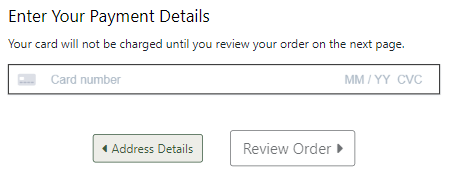
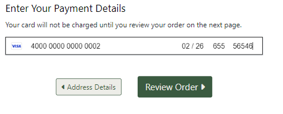

<details><summary>Stripe input error messages</summary>

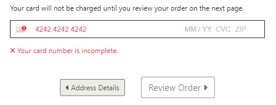

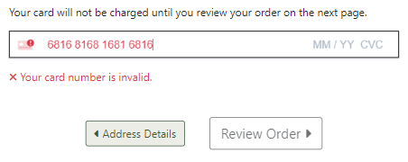

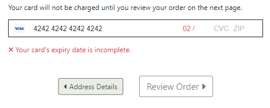

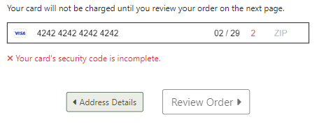

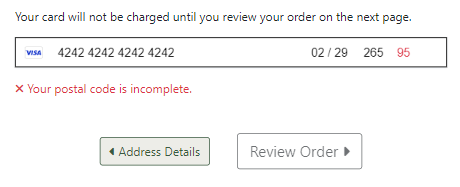

</details>

<details><summary>Enabling and disabling button when data is deleted</summary>

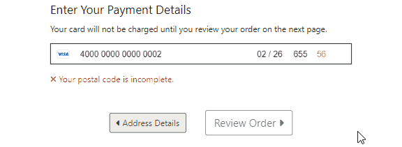

</details>

#### Review Order
In this section, the user will not find any form fields to complete, only a button to submit their order. Upon form submission, there should be no possibility that the user has left any form fields blank or with invalid data. There may still be a problem processing the user's payment, and in these cases, feedback is given to the user under the Payment heading. One scenario would be a user with insufficient funds on their card. In cases like this, where Stripe returns an error event, the error message is displayed, and the user may navigate back to the payment section to amend their details.

<details><summary>Payment error feedback in the Review Order section</summary>

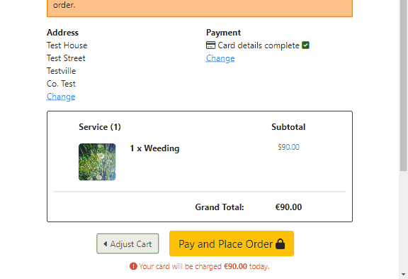

</details>

On the back end, the checkout view utilises a number of try-except blocks and if-else statements to ensure the submitted data is valid and, if not, raise validation errors:
- If the order form is valid, each item in the cart is added to the card inside a try block. If this fails for any reason, the process is abandoned, the order is deleted, an error toast message displayed to the user, and the user is redirected back to their cart.
- If the front-end validation failed somehow and invalid form data is received, an error toast message is displayed telling the user that their form is not correct and to double check their inputs again.

### Creating a Review
Users who have previously ordered a service may leave a review for it. The review form may be accessed through the **Leave a Review** button on the service's reviews page. This button is displayed dynamically through the use of the `service_history` function and a Boolean context variable `ordered` returned from the view. The user's order history is looped through, and if any have the service, `ordered` is returned, which by default is set to `False` but in this case has now been set to `True`. This allows the user to interact with the **Leave a Review** button and navigate to the form page.

Three input fields are presented to the user and each have custom validation. All three are set as required fields on the backend and the data is cleaned and checked for validity on form submission. If either of the three fields are not complete, ValidationErrors are raised and the fields outlined in red with an error message in bold red text displayed under the field. The ratings stars are given a red colour if the input is left blank. When the enters valid inputs, the error styling is removed.

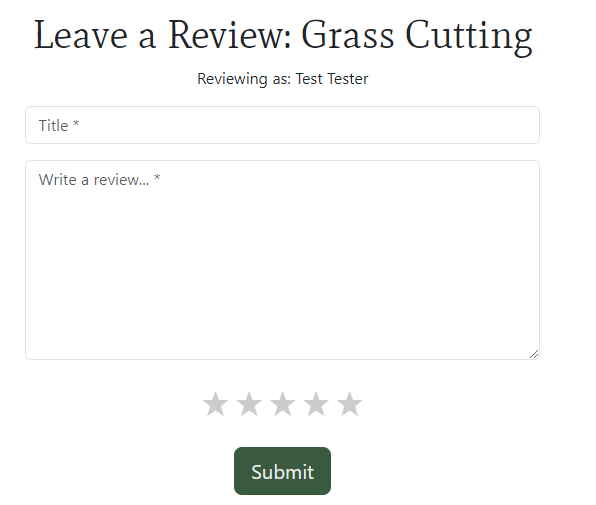

<details><summary>ValidationError messages and styles</summary>


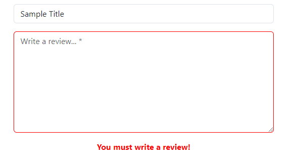

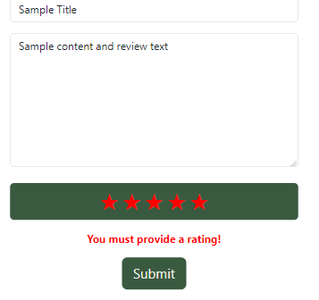

</details>

### Contact Us Form
Any site user may send a message to the business by using the contact form. There are six input fields presented to the user, all of which are required. The first five fields will show browser validation messages without reloading the page if left blank when the **Send** button is clicked. The email field will show additional custom validation if the user enters an incomplete email of the form `example@email` without a top-level domain. This validation message is displayed after the user clicks the **Send** button and the page reloads. The reCAPTCHA field validation is displayed in the same way. This was achieved by cleaning the form data on the back end and raising ValidationError messages if any data was missing.

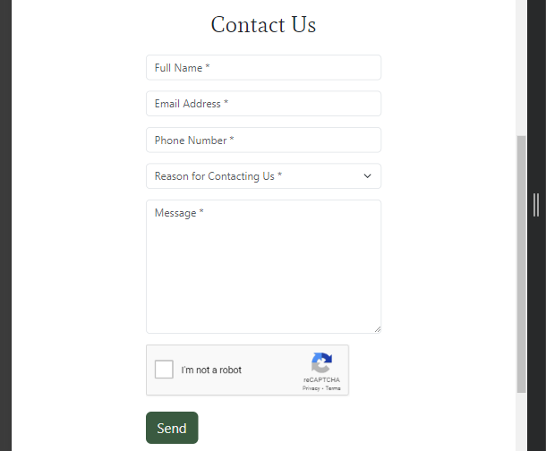

<details><summary>ValidationError messages and styles</summary>

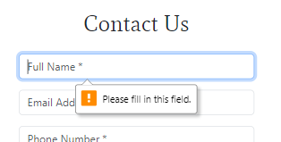

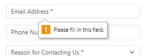

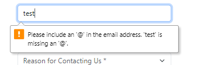

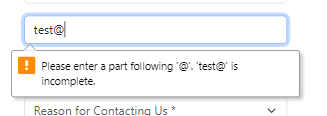

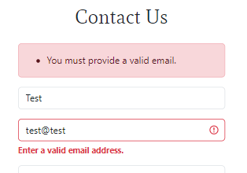

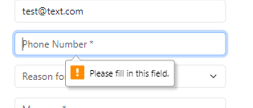

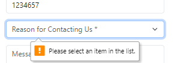

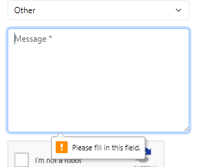

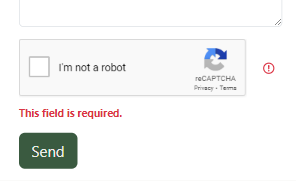

</details>

When a user is logged in, the form can be pre-filled with their name and email address and, if saved on their profile, their phone number. This is achieved in the view by checking the user authentication status and getting the data from their UserAccount database entry in a try-except block. If the user data is not found or if they are not authenticated, an empty instance of the form is rendered. This ensures that user data is only displayed if the user is logged in and currently has data saved to their UserAccount on the database.

### Updating Account Details
An authenticated user has the option of updating or deleting their phone number and address details on their My Account page. Currently, no fields in this form are required, as the user can submit the form with blank fields to delete their information from the database. Functionality does exist for any of these fields to be required in the future, and one field was set as required just for the purposes of demonstrating the validation for this discussion. This was done by simply adding the following line to the `UserAccountForm` class in `forms.py`:
```python
default_phone_number = forms.CharField(required=True)
```
An existing code block adds an asterisk to any form field that is required, so no further changes to the code were necessary to make the user aware of the change to the form.

<details><summary>Demonstration of Account Details form validation</summary>

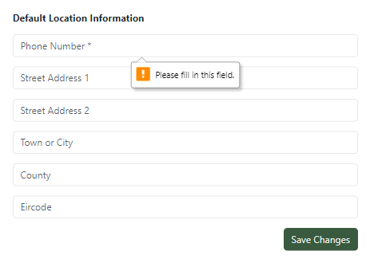

</details>

### Authentication Pages
Various allauth templates were used in this application and those that have forms came with built-in form validation. These templates are `login.html`, `signup.html`, `password_reset.html`, and `password_reset_from_key.html`. Full testing of these pages is demonstrated below in the [Full Testing](#full-testing) section.

## Testing
### Manual Testing
**User Stories** | **Achieved By:** | **Supporting Images**
--- | --- | ---
**Initial Project Setup** | |
Set Up Django Files | Installing the correct version of Django in the IDE. Creating a project named "gardening". Creating an app called "home" and writing a basic view to display "Hello World!" on the homepage. | 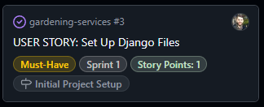
Create PostgreSQL Database | Creating a new PostgreSQL instance, copying the URL in the Details section, creating the `env.py` file and setting the `DATABASE_URL` constant, installing the relevant packages for database connection, and running migrations. | 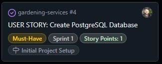
Deploy Project to Heroku | Creating a Heroku app with a unique name, updating the code for deployment with Gunicorn, and deploying the app on Heroku. | 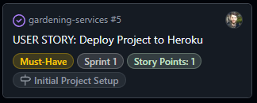
Deploy Heroku App with Static Files | Creating a static files directory and collecting the static files, deploying the project on Heroku, and ensuring all styles are applied. | 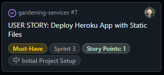
**Create Models** | |
Three Custom Models | Creating custom Django models that were not directly copied from other sources. | 
Create Service Model | Creating a **services** app, creating a models file, declaring the necessary imports, and creating a model with the appropriate fields required. | 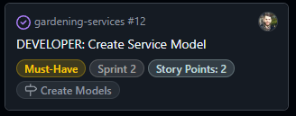
Create Custom User Model | Creating an app called **accounts**, creating the CustomUser model in `models.py`, and updating `settings.py` to use the custom model. | 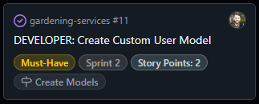
Create Order Model | Creating an app called **checkout**, creating the Order model in `models.py`, and adding functions to generate a unique order number and calculate the total price. | 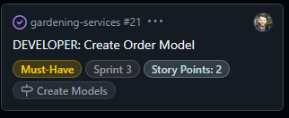
Create OrderLineIem Model | Creating the OrderLineItem model in `models.py` and adding a function to calculate the line subtotal. | 
Create Reviews Model | Creating an app called **reviews**, creating the Review model in `models.py`, and adding functions to calculate an average rating for a service. | 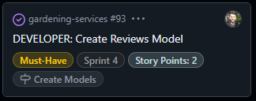
Create ContactUs Model | Creating an app called **contact** and creating the ContactUs model in `models.py`. | 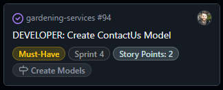
**User Accounts** | |
Create an Account | Clicking the sign-in button to prompt account creation. Verifying email address and logging out and logging back in using the created password. | 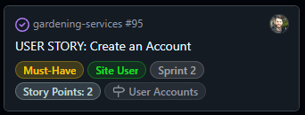
View Account Page | Navigating to the My Account page and viewing and amending details, and viewing past orders. | 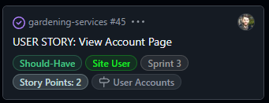
**Website Content** | |
Create Base Template | Creating a `base.html` file, creating a header and nav bar for small screens, creating a footer for small screens, creating a header and nav bar for larger screens, and creating a footer for larger screens. | 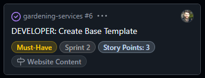
View Homepage | Viewing the landing page on website load. | 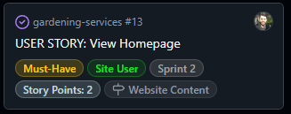
View Business Information | Viewing the About Us page. Reading the business information, viewing the locations covered by the business, and seeing the products and services offered. | 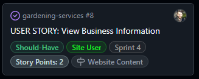
Create Error Pages | Creating 404, 403, and 500 error page templates. | 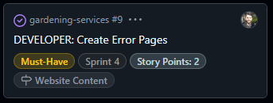
View Privacy Policy | Navigating to the privacy policy page from a link in the footer and reading the privacy policy on a dedicated webpage. | 
**Services and Checkout** | |
View Individual Service Details | Clicking on a service link in the navbar or services page. Reading the service description, price, and rating. | 
Order a Service | Viewing the list of services that can be booked, selecting the relevant options, and adding the service(s) to the shopping cart. | 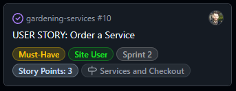
View Cart | Navigating to the cart page and viewing the list of services. Viewing each service's individual cost and the total cost of the order. | 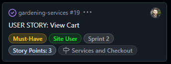
View Preview of Cart | Adding a service to the cart on smaller screens and viewing the toast message with the cart details. On desktop screens, adding a service to the cart and viewing the cart preview in the offcanvas window. | 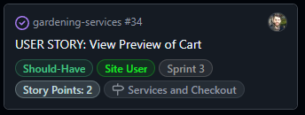
Update Services from the Cart Page | Changing the number of a given service with the **+** and **-** buttons and seeing the subtotal price change. Removing a service from the cart with the remove button or by entering 0 into the number field. Viewing the order total update after updating or deleting a service. | 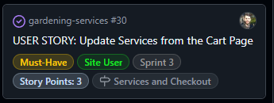
Proceed to Checkout | Clicking the checkout button and entering personal details, delivery details, and payment information before reviewing a summary of the order. | 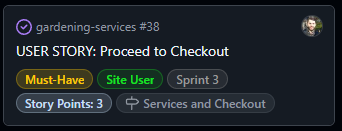
**Payment System** | |
Set Up Stripe | Installing Stripe, setting up a webhook handler, and implementing views to process the payment and order data. | 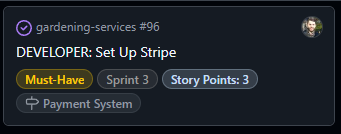
Pay for an Order | Entering payment details in the checkout process and being informed of the success or failure of the payment attempt. | 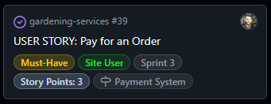
Receive Confirmation of Orders | Seeing a confirmation message on the site with an order number provided, viewing the submitted order details on the account page, and viewing the order details in an email confirmation. | 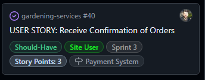
**Reviews** | |
View Reviews | On a particular service page, viewing all reviews for that service and navigating through the reviews via pagination. | 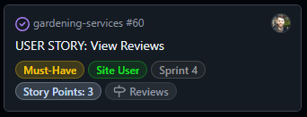
Review a Service | Interacting with a "Leave a Review" button, rating the service out of 5 stars, and writing a title and brief review. | 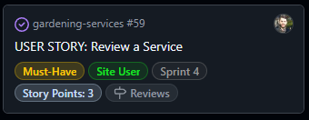
Edit a Review | For a particular review made, clicking the edit button and amending the title, content, and or the rating and saving the changes. | 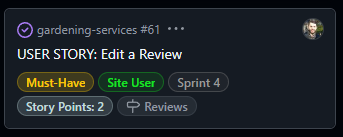
Publish Reviews | For a given pending review, publishing it to the website making it publicly visible.  For a given published review, unpublishing and preventing users from seeing it. | 
Delete a Review | Clicking the delete button when rendered and interacting with the modal with the option to confirm or cancel the delete action before it takes effect. | 
**Contact Us** | |
View Contact Us Page | Navigating to the Contact Us page from the main nav bar and sending a message to the business using a form. | 
Contact Us Email Confirmation | Submitting a message using the Contact Us form and receiving a copy of the message via email. | 
Pre-filled Contact Us Form | Being logged into an account with details saved to the database and navigating to the Contact Us page. Seeing that the full name, email, and phone number fields are already completed using this data. | 
**Marketing** | |
Subscribe to Newsletters | Submitting an email in the newsletter form and receiving visual feedback confirming successful addition to the mailing list. | 
Create Facebook Page | Creating a mock-up of a Facebook business page for The Garden Path with relevant images and text. | 
Search Engine Optimisation | Conducting research on and implementing keywords, creating a `robots.txt` file, creating a `sitemap.xml` file, employing descriptive meta tags, adding appropriate `rel` attributes on external links, and adding links to reputable websites related to the business. | 

### Full Testing
The program was deployed on Heroku and tested there on a Windows 10 desktop with a 26" monitor and on a One Plus 9 Pro mobile phone.

The site was tested on Google Chrome, Mozilla Firefox, and Edge on desktop, DuckDuckGo on mobile, and using Chrome Developer Tools for some other screen sizes.

**Feature**|**Expected Outcome**|**Test Performed**|**Results**|**Test Status**
-----|-----|-----|-----|-----
**All Pages**| | | | 
Navbar Logo and Title Link|When clicked, the user is redirected to the homepage.|Link clicked|User redirected to homepage|Pass
Navbar About Us Link|When clicked, the user is redirected to the About Us page.|Link clicked|User redirected to About Us page|Pass
Navbar Services dropdown|When clicked, the user sees a dropdown list of links to different service pages.|Dropdown Link clicked|Dropdown list of services pages shown.|Pass
Navbar All Services Link|When clicked, the user is redirected to the All Services page.|Link clicked|User redirected to All Services page|Pass
Navbar Grass Cutting Link|When clicked, the user is redirected to the Grass Cutting page.|Link clicked|User redirected to Grass Cutting page|Pass
Navbar Weed Control Link|When clicked, the user is redirected to the Weed Control page.|Link clicked|User redirected to Weed Control page|Pass
Navbar Tree Felling & Maintenance Link|When clicked, the user is redirected to the Tree Felling & Maintenance page.|Link clicked|User redirected to Tree Felling & Maintenance page|Pass
Navbar Hedge Maintenance Link|When clicked, the user is redirected to the Hedge Maintenance page.|Link clicked|User redirected to Hedge Maintenance page|Pass
Navbar Flowerbed Maintenance Link|When clicked, the user is redirected to the Flowerbed Maintenance page.|Link clicked|User redirected to Flowerbed Maintenance page|Pass
Navbar Tree Stump Removal Link|When clicked, the user is redirected to the Tree Stump Removal page.|Link clicked|User redirected to Tree Stump Removal page|Pass
Navbar Cart Link|When clicked, the user is redirected to the Cart page.|Link clicked|User redirected to Cart page|Pass
Navbar Cart Link|When items are present in the cart, the cart subtotal amount is appended after the word Cart in the link.|Services added to cart|The cart subtotal amount was appended after the word Cart in the link|Pass
Navbar Contact Us Link|When clicked, the user is redirected to the Contact Us page.|Link clicked|User redirected to Contact Us page|Pass
Navbar Log In/Sign Up Link|When clicked, the user is redirected to the Sign In page.|Link clicked|User redirected to Sign In page|Pass
Navbar My Account Link|When clicked, the user is redirected to the My Account page.|Link clicked|User redirected to My Account page|Pass
Navbar Log Out Link|When clicked, the user is redirected to the Sign Out page.|Link clicked|User redirected to Sign Out page|Pass
Navbar burger button on small screens | When clicked, a dropdown list of the navbar links is displayed. | Burger button clicked | Dropdown list of the navbar links is displayed | Pass
Navbar burger button on small screens | When clicked, the displayed dropdown list of navbar links is hidden. | Burger button clicked with dropdown displaying | Dropdown list of the navbar links is hidden | Pass
Footer ALCI Link | When clicked, the ALCI website opens in a new tab. | Link clicked | ALCI website opens in a new tab | Pass
Footer Phone Number Link | When clicked, the device asks to confirm opening in another app. App opens prefilled with the phone number.|Link clicked and confirmation given.|App opened with phone number prefilled|Pass
Footer Email Link|When clicked, the device asks to confirm opening in another app. App opens with email address prefilled in To field.|Link clicked and confirmation given.|App opened with email address prefilled in To field|Pass
Footer Facebook Link|When clicked, the linked webpage is opened in a new tab.|Link clicked|Webpage was opened in a new tab.|Pass
Footer Instagram Link|When clicked, the linked webpage is opened in a new tab.|Link clicked|Webpage was opened in a new tab.|Pass
Footer Privacy Policy Link | When clicked, the user is redirected to the Privacy Policy page. | Link clicked | User redirected to the Privacy Policy page | Pass
Footer Mailing List Link | When clicked, the user is redirected to the Newsletter signup page. | Link clicked | User redirected to the Newsletter signup page | Pass
Footer RHSI Link | When clicked, the RHSI website opens in a new tab. | Link clicked | RHSI website opens in a new tab | Pass
**Home Page**| | | | 
View All Services button|When clicked, the user is redirected to the All Services page.|Button clicked|User redirected to All Services page|Pass
**About Us Page**| | | | 
Get a Quote button|When clicked, the user is redirected to the Contact Us page.|Button clicked|User redirected to Contact Us page|Pass
**All Services Page**| | | | 
Grass Cutting card |When clicked, the user is redirected to the Grass Cutting page.|Service card clicked|User redirected to Grass Cutting page|Pass
Weed Control card |When clicked, the user is redirected to the Weed Control page.|Service card clicked|User redirected to Weed Control page|Pass
Tree Felling & Maintenance card |When clicked, the user is redirected to the Tree Felling & Maintenance page.|Service card clicked|User redirected to Tree Felling & Maintenance page|Pass
Hedge Maintenance card |When clicked, the user is redirected to the Hedge Maintenance page.|Service card clicked|User redirected to Hedge Maintenance page|Pass
Flowerbed Maintenance card |When clicked, the user is redirected to the Flowerbed Maintenance page.|Service card clicked|User redirected to Flowerbed Maintenance page|Pass
Tree Stump Removal card |When clicked, the user is redirected to the Tree Stump Removal page.|Service card clicked|User redirected to Tree Stump Removal page|Pass
**Grass Cutting Page**| | | | 
Services Breadcrumb link|When clicked, the user is redirected to the All Services page.|Link clicked|User redirected to All Services page|Pass
Category Breadcrumb link|When clicked, the user is redirected to the All Services page with only services of that category displayed.|Link clicked|User redirected to All Services page with only services of the same category displayed|Pass
Number of Reviews link | When clicked, the user is redirected to the reviews page for the service.|Link clicked|User redirected to correct reviews page|Pass
Select Option dropdown input field | When clicked, the user can select any of the options from the list.| Input field clicked and different options selected in turn|User was able to select different options from the dropdown list.|Pass
Services button |When clicked, the user is redirected to the All Services page.|Button clicked|User redirected to All Services page|Pass
Add to cart button |When clicked, the service is added to the user's cart with the selected acre option, and the user can see a confirmation of this either in a success toast message on small screens or in an offcanvas window on larger screens.|Button clicked| Service added to the user's cart with the selected acre option and confirmation is displayed in a success toast message on small screens and in an offcanvas window on larger screens|Pass
Toast message | When a service is successfully added to the cart on smaller screens, the user can view a summary of the cart contents in the message| Service added to cart while viewing page on smaller screens|Toast message displayed with a summary of the cart contents|Pass
Toast message | When the **X** button is clicked, the toast message is dismissed.|**X** button clicked in toast message|Toast message was dismissed|Pass
Toast message|For a long list of services in the toast cart preview, the user can drag the list up and down to view all the services.|Toast preview with a long list of cart items viewed|The list of services was scrollable by dragging it up and down|Pass
Toast message | When the **View Cart** button is clicked, the user is redirected to the cart page| **View Cart** button clicked in toast message| User redirected to cart page|Pass
Offcanvas | When a service is successfully added to the cart on larger screens, the user can view a summary of the cart contents in an offcanvas element that displays on the right-hand side of their screen.| Service added to cart while viewing page on larger screens|Offcanvas element displayed on right-hand side of screen with a summary of the cart contents|Pass
Offcanvas | When the offcanvas is displayed, the user can click the **X** to dismiss the offcanvas element.|**X** button clicked in offcanvas element|The offcanvas element was closed|Pass
Offcanvas | When the offcanvas is displayed, the user can click anywhere else on their screen to dismiss the offcanvas element.| Part of screen other than the offcanvas element clicked|The offcanvas element was closed|Pass
Offcanvas|For a long list of services in the offcanvas preview, the user can scroll up and down the list contained inside the offcanvas element.|Offcanvas with a long list of cart items viewed|The list of services was scrollable|Pass
**Weeding Page**| | | | 
Services Breadcrumb link|When clicked, the user is redirected to the All Services page.|Link clicked|User redirected to All Services page|Pass
Category Breadcrumb link|When clicked, the user is redirected to the All Services page with only services of that category displayed.|Link clicked|User redirected to All Services page with only services of the same category displayed|Pass
Number of Reviews link | When clicked, the user is redirected to the reviews page for the service.|Link clicked|User redirected to correct reviews page|Pass
Surface Type dropdown input field | When clicked, the user can select any of the options from the list.| Input field clicked and different options selected in turn|User was able to select different options from the dropdown list.|Pass
Extra input fields| When the user selects "Bed/Planter" as the surface type, two more fields are displayed: a select input field of sizes and a number input field.|Bed/Planter option selected from Surface Type dropdown input| Select input field of sizes and number input field displayed|Pass
Size of Bed/Planter input field | When clicked, the user can select any of the size options from the list.| Input field clicked and different options selected in turn|User was able to select different size options from the dropdown list.|Pass
Number of Bed/Planters input field | The user can increase the number to a maximum value of 99 with the **+** button.|Button clicked until the number reached 99| The **+** was disabled and the user could not increase the number higher than 99 | Pass
Number of Bed/Planters input field | The user can decrease the number to a minimum value of 1 with the **-** button.|Button clicked until the number reached 1| The **-** was disabled and the user could not set the number lower than 1 | Pass
Number of Bed/Planters input field | The user can increase the number to a maximum value of 99 with up arrow on their keyboard.|Up arrow held until the number reached 99| The **+** was disabled and the user could not increase the number higher than 99 | Pass
Number of Bed/Planters input field | The user can decrease the number to a minimum value of 1 with down arrow on their keyboard.|Down arrow held until the number reached 1| The **-** was disabled and the user could not set the number lower than 1 | Pass
Number of Bed/Planters input field | The user can change the number in the field with their keyboard.|Keyboard used to enter various number in the input field| The input field was updated with the numbers entered with the keyboard | Pass
Services button |When clicked, the user is redirected to the All Services page.|Button clicked|User redirected to All Services page|Pass
Add to Cart button |When clicked, the service is added to the user's cart with the selected acre option, and the user can see a confirmation of this either in a success toast message on small screens or in an offcanvas window on larger screens.|Button clicked| Service added to the user's cart with the selected acre option and confirmation is displayed in a success toast message on small screens and in an offcanvas window on larger screens|Pass
Add to Cart button | When clicked with a value less than 1 in the input field, the service is not added to the cart, and a validation message is displayed stating that the value must be greater than or equal to 1.|Button clicked with values less than 1 in the input field| The service was not added to the cart and a validation message was displayed stating that the value must be greater than or equal to 1|Pass
Add to Cart button | When clicked with a value greater than 99 in the input field, the service is not added to the cart, and a validation message is displayed stating that the value must be less than or equal to 99.|Button clicked with values greater than 99 in the input field| The service was not added to the cart and a validation message was displayed stating that the value must be less than or equal to 99|Pass
Toast message | When a service is successfully added to the cart on smaller screens, the user can view a summary of the cart contents in the message| Service added to cart while viewing page on smaller screens|Toast message displayed with a summary of the cart contents|Pass
Toast message | When the **X** button is clicked, the toast message is dismissed.|**X** button clicked in toast message|Toast message was dismissed|Pass
Toast message|For a long list of services in the toast cart preview, the user can drag the list up and down to view all the services.|Toast preview with a long list of cart items viewed|The list of services was scrollable by dragging it up and down|Pass
Toast message | When the **View Cart** button is clicked, the user is redirected to the cart page| **View Cart** button clicked in toast message| User redirected to cart page|Pass
Offcanvas | When a service is successfully added to the cart on larger screens, the user can view a summary of the cart contents in an off-canvas element that displays on the right-hand side of their screen.| Service added to cart while viewing page on larger screens|Offcanvas element displayed on right-hand side of screen with a summary of the cart contents|Pass
Offcanvas | When the offcanvas is displayed, the user can click the **X** to dismiss the offcanvas element.|**X** button clicked in offcanvas element|The offcanvas element was closed|Pass
Offcanvas | When the offcanvas is displayed, the user can click anywhere else on their screen to dismiss the offcanvas element.| Part of screen other than the offcanvas element clicked|The offcanvas element was closed|Pass
Offcanvas|For a long list of services in the offcanvas preview, the user can scroll up and down the list contained inside the offcanvas element.|Offcanvas with a long list of cart items viewed|The list of services was scrollable|Pass
**Tree Felling and Maintenance Page**| | | | 
Services Breadcrumb link|When clicked, the user is redirected to the All Services page.|Link clicked|User redirected to All Services page|Pass
Category Breadcrumb link|When clicked, the user is redirected to the All Services page with only services of that category displayed.|Link clicked|User redirected to All Services page with only services of the same category displayed|Pass
Number of Reviews link | When clicked, the user is redirected to the reviews page for the service.|Link clicked|User redirected to correct reviews page|Pass
Select Option dropdown input field | When clicked, the user can select any of the options from the list.| Input field clicked and different options selected in turn|User was able to select different options from the dropdown list.|Pass
Size of Tree input field | When clicked, the user can select any of the size options from the list.| Input field clicked and different options selected in turn|User was able to select different size options from the dropdown list.|Pass
Number of Trees input field | The user can increase the number to a maximum value of 99 with the **+** button.|Button clicked until the number reached 99| The **+** was disabled, and the user could not increase the number higher than 99 | Pass
Number of Trees input field | The user can decrease the number to a minimum value of 1 with the **-** button.|Button clicked until the number reached 1| The **-** was disabled, and the user could not set the number lower than 1 | Pass
Number of Trees input field | The user can increase the number to a maximum value of 99 with up arrow on their keyboard.|Up arrow held until the number reached 99| The **+** was disabled, and the user could not increase the number higher than 99 | Pass
Number of Trees input field | The user can decrease the number to a minimum value of 1 with down arrow on their keyboard.|Down arrow held until the number reached 1| The **-** was disabled and the user could not set the number lower than 1 | Pass
Number of Trees input field | The user can change the number in the field with their keyboard.|Keyboard used to enter various number in the input field| The input field was updated with the numbers entered with the keyboard | Pass
Services button |When clicked, the user is redirected to the All Services page.|Button clicked|User redirected to All Services page|Pass
Add to Cart button |When clicked, the service is added to the user's cart with the selected acre option, and the user can see a confirmation of this either in a success toast message on small screens or in an offcanvas window on larger screens.|Button clicked| Service added to the user's cart with the selected acre option and confirmation is displayed in a success toast message on small screens and in an offcanvas window on larger screens|Pass
Add to Cart button | When clicked with a value less than 1 in the input field, the service is not added to the cart, and a validation message is displayed stating that the value must be greater than or equal to 1.|Button clicked with values less than 1 in the input field| The service was not added to the cart and a validation message was displayed stating that the value must be greater than or equal to 1|Pass
Add to Cart button | When clicked with a value greater than 99 in the input field, the service is not added to the cart, and a validation message is displayed stating that the value must be less than or equal to 99.|Button clicked with values greater than 99 in the input field| The service was not added to the cart, and a validation message was displayed stating that the value must be less than or equal to 99|Pass
Toast message | When a service is successfully added to the cart on smaller screens, the user can view a summary of the cart contents in the message| Service added to cart while viewing page on smaller screens|Toast message displayed with a summary of the cart contents|Pass
Toast message | When the **X** button is clicked, the toast message is dismissed.|**X** button clicked in toast message|Toast message was dismissed|Pass
Toast message|For a long list of services in the toast cart preview, the user can drag the list up and down to view all the services.|Toast preview with a long list of cart items viewed|The list of services was scrollable by dragging it up and down|Pass
Toast message | When the **View Cart** button is clicked, the user is redirected to the cart page| **View Cart** button clicked in toast message| User redirected to cart page|Pass
Offcanvas | When a service is successfully added to the cart on larger screens, the user can view a summary of the cart contents in an off-canvas element that displays on the right-hand side of their screen.| Service added to cart while viewing page on larger screens|Offcanvas element displayed on right-hand side of screen with a summary of the cart contents|Pass
Offcanvas | When the offcanvas is displayed, the user can click the **X** to dismiss the offcanvas element.|**X** button clicked in offcanvas element|The offcanvas element was closed|Pass
Offcanvas | When the offcanvas is displayed, the user can click anywhere else on their screen to dismiss the offcanvas element.| Part of the screen other than the offcanvas element clicked|The offcanvas element was closed|Pass
Offcanvas|For a long list of services in the offcanvas preview, the user can scroll up and down the list contained inside the offcanvas element.|Offcanvas with a long list of cart items viewed|The list of services was scrollable|Pass
**Hedge Cutting Page**| | | | 
Services Breadcrumb link|When clicked, the user is redirected to the All Services page.|Link clicked|User redirected to All Services page|Pass
Category Breadcrumb link|When clicked, the user is redirected to the All Services page with only services of that category displayed.|Link clicked|User redirected to All Services page with only services of the same category displayed|Pass
Number of Reviews link | When clicked, the user is redirected to the reviews page for the service.|Link clicked|User redirected to correct reviews page|Pass
Size of Hedge input field | When clicked, the user can select any of the size options from the list.| Input field clicked and different options selected in turn|User was able to select different size options from the dropdown list.|Pass
Number of Hedges input field | The user can increase the number to a maximum value of 99 with the **+** button.|Button clicked until the number reached 99| The **+** was disabled and the user could not increase the number higher than 99 | Pass
Number of Hedges input field | The user can decrease the number to a minimum value of 1 with the **-** button.|Button clicked until the number reached 1| The **-** was disabled and the user could not set the number lower than 1 | Pass
Number of Hedges input field | The user can increase the number to a maximum value of 99 with up arrow on their keyboard.|Up arrow held until the number reached 99| The **+** was disabled and the user could not increase the number higher than 99 | Pass
Number of Hedges input field | The user can decrease the number to a minimum value of 1 with down arrow on their keyboard.|Down arrow held until the number reached 1| The **-** was disabled and the user could not set the number lower than 1 | Pass
Number of Hedges input field | The user can change the number in the field with their keyboard.|Keyboard used to enter various numbers in the input field| The input field was updated with the numbers entered with the keyboard | Pass
Services button |When clicked, the user is redirected to the All Services page.|Button clicked|User redirected to All Services page|Pass
Add to Cart button |When clicked, the service is added to the user's cart with the selected acre option, and the user can see a confirmation of this either in a success toast message on small screens or in an offcanvas window on larger screens.|Button clicked| Service added to the user's cart with the selected acre option and confirmation is displayed in a success toast message on small screens and in an offcanvas window on larger screens|Pass
Add to Cart button | When clicked with a value less than 1 in the input field, the service is not added to the cart, and a validation message is displayed stating that the value must be greater than or equal to 1.|Button clicked with values less than 1 in the input field| The service was not added to the cart and a validation message was displayed stating that the value must be greater than or equal to 1|Pass
Add to Cart button | When clicked with a value greater than 99 in the input field, the service is not added to the cart, and a validation message is displayed stating that the value must be less than or equal to 99.|Button clicked with values greater than 99 in the input field| The service was not added to the cart, and a validation message was displayed stating that the value must be less than or equal to 99|Pass
Toast message | When a service is successfully added to the cart on smaller screens, the user can view a summary of the cart contents in the message| Service added to cart while viewing page on smaller screens|Toast message displayed with a summary of the cart contents|Pass
Toast message | When the **X** button is clicked, the toast message is dismissed.|**X** button clicked in toast message|Toast message was dismissed|Pass
Toast message|For a long list of services in the toast cart preview, the user can drag the list up and down to view all the services.|Toast preview with a long list of cart items viewed|The list of services was scrollable by dragging it up and down|Pass
Toast message | When the **View Cart** button is clicked, the user is redirected to the cart page| **View Cart** button clicked in toast message| User redirected to cart page|Pass
Offcanvas | When a service is successfully added to the cart on larger screens, the user can view a summary of the cart contents in an offcanvas element that displays on the right-hand side of their screen.| Service added to cart while viewing page on larger screens|Offcanvas element displayed on right-hand side of screen with a summary of the cart contents|Pass
Offcanvas | When the offcanvas is displayed, the user can click the **X** to dismiss the offcanvas element.|**X** button clicked in offcanvas element|The offcanvas element was closed|Pass
Offcanvas | When the offcanvas is displayed, the user can click anywhere else on their screen to dismiss the offcanvas element.| Part of screen other than the offcanvas element clicked|The offcanvas element was closed|Pass
Offcanvas|For a long list of services in the offcanvas preview, the user can scroll up and down the list contained inside the offcanvas element.|Offcanvas with a long list of cart items viewed|The list of services was scrollable|Pass
**Flowerbed Care Page**| | | | 
Services Breadcrumb link|When clicked, the user is redirected to the All Services page.|Link clicked|User redirected to All Services page|Pass
Category Breadcrumb link|When clicked, the user is redirected to the All Services page with only services of that category displayed.|Link clicked|User redirected to All Services page with only services of the same category displayed|Pass
Number of Reviews link | When clicked, the user is redirected to the reviews page for the service.|Link clicked|User redirected to correct reviews page|Pass
Size of Flowerbed input field | When clicked, the user can select any of the size options from the list.| Input field clicked and different options selected in turn|User was able to select different size options from the dropdown list.|Pass
Number of Flowerbeds input field | The user can increase the number to a maximum value of 99 with the **+** button.|Button clicked until the number reached 99| The **+** was disabled and the user could not increase the number higher than 99 | Pass
Number of Flowerbeds input field | The user can decrease the number to a minimum value of 1 with the **-** button.|Button clicked until the number reached 1| The **-** was disabled and the user could not set the number lower than 1 | Pass
Number of Flowerbeds input field | The user can increase the number to a maximum value of 99 with up arrow on their keyboard.|Up arrow held until the number reached 99| The **+** was disabled and the user could not increase the number higher than 99 | Pass
Number of Flowerbeds input field | The user can decrease the number to a minimum value of 1 with down arrow on their keyboard.|Down arrow held until the number reached 1| The **-** was disabled and the user could not set the number lower than 1 | Pass
Number of Flowerbeds input field | The user can change the number in the field with their keyboard.|Keyboard used to enter various number in the input field| The input field was updated with the numbers entered with the keyboard | Pass
Services button |When clicked, the user is redirected to the All Services page.|Button clicked|User redirected to All Services page|Pass
Add to Cart button |When clicked, the service is added to the user's cart with the selected acre option, and the user can see a confirmation of this either in a success toast message on small screens or in an offcanvas window on larger screens.|Button clicked| Service added to the user's cart with the selected acre option and confirmation is displayed in a success toast message on small screens and in an offcanvas window on larger screens|Pass
Add to Cart button | When clicked with a value less than 1 in the input field, the service is not added to the cart, and a validation message is displayed stating that the value must be greater than or equal to 1.|Button clicked with values less than 1 in the input field| The service was not added to the cart and a validation message was displayed stating that the value must be greater than or equal to 1|Pass
Add to Cart button | When clicked with a value greater than 99 in the input field, the service is not added to the cart, and a validation message is displayed stating that the value must be less than or equal to 99.|Button clicked with values greater than 99 in the input field| The service was not added to the cart, and a validation message was displayed stating that the value must be less than or equal to 99|Pass
Toast message | When a service is successfully added to the cart on smaller screens, the user can view a summary of the cart contents in the message| Service added to cart while viewing page on smaller screens|Toast message displayed with a summary of the cart contents|Pass
Toast message | When the **X** button is clicked, the toast message is dismissed.|**X** button clicked in toast message|Toast message was dismissed|Pass
Toast message|For a long list of services in the toast cart preview, the user can drag the list up and down to view all the services.|Toast preview with a long list of cart items viewed|The list of services was scrollable by dragging it up and down|Pass
Toast message | When the **View Cart** button is clicked, the user is redirected to the cart page| **View Cart** button clicked in toast message| User redirected to cart page|Pass
Offcanvas | When a service is successfully added to the cart on larger screens, the user can view a summary of the cart contents in an offcanvas element that displays on the right hand side of their screen.| Service added to cart while viewing page on larger screens|Offcanvas element displayed on right hand side of screen with a summary of the cart contents|Pass
Offcanvas | When the offcanvas is displayed, the user can click the **X** to dismiss the offcanvas element.|**X** button clicked in offcanvas element|The offcanvas element was closed|Pass
Offcanvas | When the offcanvas is displayed, the user can click anywhere else on their screen to dismiss the offcanvas element.| Part of screen other than the offcanvas element clicked|The offcanvas element was closed|Pass
Offcanvas|For a long list of services in the offcanvas preview, the user can scroll up and down the list contained inside the offcanvas element.|Offcanvas with a long list of cart items viewed|The list of services was scrollable|Pass
**Tree Stump Removal Page**| | | | 
Services Breadcrumb link|When clicked, the user is redirected to the All Services page.|Link clicked|User redirected to All Services page|Pass
Category Breadcrumb link|When clicked, the user is redirected to the All Services page with only services of that category displayed.|Link clicked|User redirected to All Services page with only services of the same category displayed|Pass
Number of Reviews link | When clicked, the user is redirected to the reviews page for the service.|Link clicked|User redirected to correct reviews page|Pass
Number of Stumps input field | The user can increase the number to a maximum value of 99 with the **+** button.|Button clicked until the number reached 99| The **+** was disabled and the user could not increase the number higher than 99 | Pass
Number of Stumps input field | The user can decrease the number to a minimum value of 1 with the **-** button.|Button clicked until the number reached 1| The **-** was disabled and the user could not set the number lower than 1 | Pass
Number of Stumps input field | The user can increase the number to a maximum value of 99 with up arrow on their keyboard.|Up arrow held until the number reached 99| The **+** was disabled and the user could not increase the number higher than 99 | Pass
Number of Stumps input field | The user can decrease the number to a minimum value of 1 with down arrow on their keyboard.|Down arrow held until the number reached 1| The **-** was disabled and the user could not set the number lower than 1 | Pass
Number of Stumps input field | The user can change the number in the field with their keyboard.|Keyboard used to enter various number in the input field| The input field was update with the numbers entered with the keyboard | Pass
Services button |When clicked, the user is redirected to the All Services page.|Button clicked|User redirected to All Services page|Pass
Add to Cart button |When clicked, the service is added to the user's cart with the selected acre option and the user can see a confirmation of this either in a success toast message on small screens or in an offcanvas window on larger screens.|Button clicked| Service added to the user's cart with the selected acre option and confirmation is displayed in a success toast message on small screens and in an offcanvas window on larger screens|Pass
Add to Cart button | When clicked with a value less than 1 in the input field, the service is not added to the cart and a validation message is displayed stating that the value must be greater than or equal to 1.|Button clicked with values less than 1 in the input field| The service was not added to the cart and a validation message was displayed stating that the value must be greater than or equal to 1|Pass
Add to Cart button | When clicked with a value greater than 99 in the input field, the service is not added to the cart and a validation message is displayed stating that the value must be less than or equal to 99.|Button clicked with values greater than 99 in the input field| The service was not added to the cart and a validation message was displayed stating that the value must be less than or equal to 99|Pass
Toast message | When a service is successfully added to the cart on smaller screens, the user can view a summary of the cart contents in the message| Service added to cart while viewing page on smaller screens|Toast message displayed with a summary of the cart contents|Pass
Toast message | When the **X** button is clicked, the toast message is dismissed.|**X** button clicked in toast message|Toast message was dismissed|Pass
Toast message|For a long list of services in the toast cart preview, the user can drag the list up and down to view all the services.|Toast preview with a long list of cart items viewed|The list of services was scrollable by draggin it up and down|Pass
Toast message | When the **View Cart** button is clicked, the user is redirected to the cart page| **View Cart** button clicked in toast message| User redirected to cart page|Pass
Offcanvas | When a service is successfully added to the cart on larger screens, the user can view a summary of the cart contents in an offcanvas element that displays on the right hand side of their screen.| Service added to cart while viewing page on larger screens|Offcanvas element displayed on right hand side of screen with a summary of the cart contents|Pass
Offcanvas | When the offcanvas is displayed, the user can click the **X** to dismiss the offcanvas element.|**X** button clicked in offcanvas element|The offcanvas element was closed|Pass
Offcanvas | When the offcanvas is displayed, the user can click anywhere else on their screen to dismiss the offcanvas element.| Part of screen other than the offcanvas element clicked|The offcanvas element was closed|Pass
Offcanvas|For a long list of services in the offcanvas preview, the user can scroll up and down the list contained inside the offcanvas element.|Offcanvas with a long list of cart items viewed|The list of services was scrollable|Pass
**Reviews Page** ||||
Login Link|When clicked, the user is redirected to the Sign In page.|Link clicked|User redirected to Sign In page|Pass
Back to Services button|When clicked, the user is redirected back to the service page.|Button clicked|User was redirected back to the service page|Pass
Leave a Review button|When clicked, the user is redirected to the leave a review page.|Button clicked|User redirected to the leave a review page|Pass
Edit button|When clicked, the user is redirected to the create a review page with their review data pre-filled in the form.|Button clicked|User was redirected to the create a review page with their review data pre-filled in the form|Pass
Unpublish button|When clicked, the page reloads with the review moved to the Unpublished Reviews page and a success toast message is displayed.|Button clicked|Page reloaded with the review moved to the Unpublished Reviews page and a success toast message was displayed|Pass
Delete button|When clicked, the delete review modal window was displayed to the user.|Button clicked|The delete review modal was displayed|Pass
Delete Modal - Cancel button|When clicked, the modal closes without the review being deleted.|Button clicked|The modal closed and the review was not deleted|Pass
Delete Modal - Delete button|When clicked, the review is deleted and the page reloads with a success toast message confirming the deletion|Button clicked|Page reloaded with a success toast message and the review was deleted|Pass
Next link|When clicked, the page reloads with the next set of reviews displayed.|Link clicked|Page reloaded with the next set of reviews displayed|Pass
Previous link|When clicked, the page reloads with the previous set of reviews displayed.|Link clicked|Page reloaded with the previous set of reviews displayed|Pass
First link|When clicked, the page reloads with the first set of reviews displayed.|Link clicked|Page reloaded with the first set of reviews displayed|Pass
Last link|When clicked, the page reloads with the last set of reviews displayed.|Link clicked|Page reloaded with the last set of reviews displayed|Pass
View Pending Reviews button|When clicked, the user is redirected to the Unpublished Reviews page.|Button clicked|User was redirected to the Unpublished Reviews page|Pass
**Unpublished Reviews Page** ||||
Back to Published Reviews button|When clicked, the user is redirected back to the service's reviews page.|Button clicked|User was redirected back to the service's reviews page|Pass
Publish button|When clicked, the page reloads with the review moved to the reviews page and a success toast message is displayed.|Button clicked|Page reloaded with the moved to the reviews page and a success toast message was displayed|Pass
Edit button|When clicked, the user is redirected to the create a review page with their review data pre-filled in the form.|Button clicked|User was redirected to the create a review page with their review data pre-filled in the form|Pass
Delete button|When clicked, the delete review modal window was displayed to the user.|Button clicked|The delete review modal was displayed|Pass
Delete Modal - Cancel button|When clicked, the modal closes without the review being deleted.|Button clicked|The modal closed and the review was not deleted|Pass
Delete Modal - Delete button|When clicked, the review is deleted and the page reloads with a success toast message confirming the deletion|Button clicked|Page reloaded with a success toast message and the review was deleted|Pass
Next link|When clicked, the page reloads with the next set of reviews displayed.|Link clicked|Page reloaded with the next set of reviews displayed|Pass
Previous link|When clicked, the page reloads with the previous set of reviews displayed.|Link clicked|Page reloaded with the previous set of reviews displayed|Pass
First link|When clicked, the page reloads with the first set of reviews displayed.|Link clicked|Page reloaded with the first set of reviews displayed|Pass
Last link|When clicked, the page reloads with the last set of reviews displayed.|Link clicked|Page reloaded with the last set of reviews displayed|Pass
**Create/Edit Review Page** ||||
Required input fields|When the **Submit** button is clicked with any required fields left blank, a validation message displays under the first empty field and the form is not submitted.|Button clicked with all or various combinations of required fields left empty| Validation message appears under the first blank field and the form is not submitted|Pass
Submit button|When all form fields are valid and complete and the **Submit** button is pressed, the user is redirected to the reviews page and a success toast message displays stating that their review has been submitted pending approval.|Submit button clicked with all form fields valid and complete| The user was redirected to the reviews page and the success toast message displayed |Pass
Update button|When a user is editing a review and removes data from any input field, a validation message displays under the first empty field and the form is not submitted.|Edit button clicked on existing review, existing data removed from form fields, and **Update** button clicked|Validation message appears under the first blank field and the form is not submitted|Pass
Update button|When all form fields are valid and complete and the **Update** button is pressed, the user is redirected to the reviews page and a success toast message displays stating that their review has been successfully edited and is not pending approval. The review is not rendered on the reviews page.|Update button clicked with all form fields valid and complete| The user was redirected to the reviews page, and the success toast message was displayed. Their review was no longer rendered on the page |Pass
**Cart Page**| | | | 
Empty Cart | When the cart page is viewed with no service in the cart, the total number of services is listed as 0 in the page heading|Cart page views when cart contained no services|Number of services listed as 0 in page heading|Pass
Empty Cart | When the cart page is viewed with no service in the cart, text is displayed informing the user that their cart is empty and a **View Services** button is displayed.|Cart page views when cart contained no services|Text was displayed informing the user than their cart is empty and a **View Services** button was displayed|Pass
View Services button|When clicked, the user is redirected to the All Services page.|Button clicked|User redirected to All Services page|Pass
Service number input|When the increment button is clicked, the page is reloaded with the amended number and the subtotal and order total is updated appropriately. A success toast message displays confirming the service was updated correctly.|Increment button clicked| Page reloads and number of services, subtotal, and order total updated appropriately. A success toast message displayed confirming the service was updated correctly|Pass
Service number input|When the decrement button is clicked, the page is reloaded with the amended number and the subtotal and order total updated appropriately. A success toast message displays confirmed the service was updated correctly.|Decrement button clicked| Page reloads and number of services, subtotal, and order total updated appropriately. A success toast message displayed confirmed the service was updated correctly|Pass
Service number input|When a number less than 1 is entered into the field, the page is reloaded and the item is removed from the cart. The order total is updated appropriately and a success toast message displays confirming the service was updated correctly.|Numbers smaller than 1 directly entered into the input field| Page reloads and the service is removed from the cart. The order total was updated appropriately. A success toast message was displayed confirming that the service was removed from the cart|Pass
Service number input|When a number greater than 99 is entered into the field, an error toast message is displayed stating the maximum number of services is 99.|Numbers greater than 99 entered into the input field| An error toast message displayed stating the maximum number of services is 99 and the service number did not update| Pass
Remove button on mobile screens|When the button is clicked, the page is reloaded and the item is removed from the cart. The order total is updated appropriately and a success toast message displays confirmed the service was updated correctly.|Button clicked| Page reloads and the service is removed from the cart. The order total was updated appropriately. A success toast message was displayed confirming that the service was removed from the cart|Pass
Remove button on desktop screens|When the button is clicked, the page is reloaded and the item is removed from the cart. The order total is updated appropriately and a success toast message displays confirmed the service was updated correctly.|Button clicked| Page reloads and the service is removed from the cart. The order total was updated appropriately. A success toast message was displayed confirming that the service was removed from the cart|Pass
List of Services | For a long list of services on mobile screens, an arrow button is displayed when the user scrolls down the page. | Cart page viewed on mobile with several services in the cart and page was scrolled down. | A arrow button appeared in the bottom right corner of the screen|Pass
List of Services | For a long list of services on desktop screens, the list is scrollable inside the main container. | Cart page viewed on desktop screens with several services in the cart and list was scrolled down. | The list was scrollable inside the main container|Pass
Arrow button|When the arrow button is clicked, the page automatically scrolls back to the top.|Button clicked| The page autoscrolled back to the top|Pass
Secure Checkout button | When clicked, the user is brought to the checkout page.|Button clicked|User was redirected to the checkout page|Pass
**Checkout Page - Address Section**| | | | 
Adjust Cart button|When clicked, the user is redirected to the Cart page.|Button clicked|User redirected to Cart page|Pass
Continue to Payment button|The button is disabled when all required form fields are empty|Required form fields left blank|Button remained disabled|Pass
Continue to Payment button|The button is enabled when all required form fields are completed|Data entered in required form fields|Button was enabled|Pass
Continue to Payment button|When the button is enabled, and data is cleared from at least one required form field, the button is disabled again.|Data removed from at least one required form field when the button was enabled|Button was disabled again|Pass
Continue to Payment button|When the button is clicked with an invalid email address in the email field, a validation message is displayed to the user under the email field and the form does not progress to the next section.|Invalid data entered into the email field and **Continue to Payment** button clicked|The form did not progress to the next section and a validation message was displayed to the user under the email field|Pass
Continue to Payment button|When the button is clicked with valid data in all required input fields, the page content changes to the payment section of the form and the progress indicator in the header updates accordingly.|Button clicked with valid data in the input fields.|Page content changed to the payment section and the progress indicator in the header updated accordingly|Pass
Save details checkbox | When the checkbox is ticked in the address section, the supplied user data is saved to their user account after successful form submission|Checkbox ticked and valid checkout form submitted| Data was saved to the database and visible to the user on their My Account page|Pass
**Checkout Page - Payment Section**| | | | 
Address Details button|When clicked, the page content changes back to the address section and the progress indicator in the header updates accordingly.|Button clicked|Page content changed back to the address section and the progress indicator in the header updated accordingly|Pass
Review Order button|The button is disabled when the Stripe input field is empty|Stripe input left blank|Button remained disabled|Pass
Review Order button|The button is enabled when the Stripe input field is completed with valid data|Stripe input completed with valid data|Button was enabled|Pass
Review Order button|The button is disabled again when the data in the Stripe input field is made incomplete or invalid data|Completed Stripe input amended to contain incomplete or invalid data|Button was disabled again|Pass
Stripe input field | When an incomplete card number is entered and the user clicks elsewhere on the page, a relevant error message displays under the input.|Incomplete card number entered into the field|An error message displayed and the **Review Order** button was disabled|Pass
Stripe input field | When an invalid card number is entered and the user clicks elsewhere on the page, a relevant error message displays under the input.|Invalid card number entered into the field|An error message displayed and the **Review Order** button was disabled|Pass
Stripe input field | When an incomplete expiry date is entered and the user clicks elsewhere on the page, a relevant error message displays under the input.|Incomplete expiry date entered into the field|An error message displayed and the **Review Order** button was disabled|Pass
Stripe input field | When an invalid expiry date is entered and the user clicks elsewhere on the page, a relevant error message displays under the input.|Invalid expiry date entered into the field|An error message displayed and the **Review Order** button was disabled|Pass
Stripe input field | When an incomplete security code is entered and the user clicks elsewhere on the page, a relevant error message displays under the input.|Incomplete security code entered into the field|An error message displayed and the **Review Order** button was disabled|Pass
Stripe input field | When an incomplete postal code is entered and the user clicks elsewhere on the page, a relevant error message displays under the input.|Incomplete postal code entered into the field|An error message displayed and the **Review Order** button was disabled|Pass
Review Order button|When the button is enabled and clicked, the page content changes to the review section of the form and the progress indicator in the header updates accordingly.|Button clicked|Page content changed to the review section and the progress indicator in the header updated accordingly|Pass
**Checkout Page - Review Section**| | | | 
Address Change button|When clicked, the page content changes back to the address section and the progress indicator in the header updates accordingly.|Button clicked|Page content changed back to the address section and the progress indicator in the header updated accordingly|Pass
Payment Change button|When clicked, the page content changes back to the payment section and the progress indicator in the header updates accordingly.|Button clicked|Page content changed back to the address section and the progress indicator in the header updated accordingly|Pass
Adjust Cart button|When clicked, the user is redirected to the Cart page.|Button clicked|User redirected to Cart page|Pass
Pay and Place Order button|When clicked, the button text changes to "Processing..." with a spinner icon, the order is processed, and the order success page is shown.|Button clicked| Button text changed to "Processing..." with a spinner icon, the order was processed, and the order success page was shown|Pass
Pay and Place Order button|When Stripe is unable to process the payment, the button text changes to "Processing..." with a spinner icon and then back to its original state and Stripe error messages is displayed under the Payment heading.|Button clicked with card details that will result in a payment error| Button text changed to "Processing..." with a spinner icon and then back to its original state, and a Stripe error messages was displayed under the Payment heading|Pass
**Checkout Success Page**| | | | 
Toast message|When the page load, a success toast message is displayed informing the user that the order was processed and a confirmation email will be sent to the email address provided.|Page loaded after successful checkout process|Success toast message was displayed informing the user that the order was processed and a confirmation email will be sent to the email address provided|Pass
Back to Site button|When clicked, the user is redirected to the homepage.|Button clicked|User redirected to homepage|Pass
**Contact Us Page**| | | | 
Required input fields|When the send button is clicked with any required fields left blank, a validation message displays under the first empty field and the form is not submitted.|Button clicked with all or various combinations of required fields left empty| Validation message appears under the first blank field and the form is not submitted|Pass
Email input field|When the send button is clicked with an invalid email address in the email field, a validation message is displayed to the user under the email field and the form does not submit.|Invalid data entered into the email field and **Send** button clicked|The form did not submit and a validation message was displayed to the user under the email field|Pass
reCAPTHCA checkbox|When the send button is clicked with all other fields but the reCAPTCHA checkbox complete, the page reloads and a validation message is shown above the form informing the user that they must complete the reCAPTCHA|Button clicked with reCAPTCHA check incomplete|Page reloads and a validation message was shown above the form stating that the user must complete the reCAPTCHA check|Pass
Send button|When all form fields are valid and complete and the send button is pressed, the user is redirected to the homepage and a success toast message displays stating that their message was sent and a copy will be sent to their provided email address.|Send button pressed with all form fields valid and complete| The user was redirected to the homepage and a success toast message displayed stating that their message was sent and a copy will be sent to their provided email address|Pass
**My Account Page**| | | |
Default Information form | If the user enters or amends data in these form fields and clicks the **Save Changes** button, the page will reload and a success toast message will display confirming that their data was successfully updated.|Data entered or amended and **Save Changes** button clicked.| Page reloaded and a success toast message was displayed|Pass
Default Information form | If the user enters or amends data in these form fields and clicks the **Save Changes** button, the page will reload and the new or amended data will be rendered in the form fields|Data entered or amended and **Save Changes** button clicked.| Page reloaded and the new or changed data was rendered in the form fields|Pass
Default Information form | If the user deletes data in these form fields and clicks the **Save Changes** button, the page will reload, and a success toast message will display confirming that their data was successfully updated.|Data deleted and **Save Changes** button clicked.| Page reloaded and a success toast message was displayed|Pass
Default Information form | If the user deletes data in these form fields and clicks the **Save Changes** button, the page will reload and the deleted data will no longer be rendered in the form field(s)|Data entered or amended and **Save Changes** button clicked.| Page reloaded and the deleted data was no longer rendered in the form fields|Pass
Order History|Hovering the cursor over a given truncated order number will display the full order number in a small text box.|Cursor placed over truncated order number|The full order number was displayed in a small text box|Pass
Order History|When an order number link is clicked, the user is redirected to a past order confirmation page and an information toast message is displayed.|Order number link clicked|The user was redirected to the order confirmation page and an information toast message was displayed|Pass
**Order Confirmation Page - Past Order**| | | |
Back to My Account button|When clicked, the user is redirected to the My Account page.|Button clicked|User redirected to My Account page|Pass
**Newsletter Page**| | | |
Email address field|When the email address field is left blank and the **Subscribe** button is clicked, the form does not submit and a validation message informs the user that the field is required|Field left blank and button clicked|Validation message is rendered and form does not submit|Pass
Email address field|When an invalid email address is entered into the field and the **Subscribe** button is clicked, the form does not submit and a validation message informs the user that a valid email address is required|Field left blank and button clicked|Validation message is rendered and form does not submit|Pass
Submit button | When a valid email address is entered into the field and the **Subscribe** button is clicked, the form submits and a success message thanks the user for subscribing.|Valid email address provided and **Subscribe** button clicked|Form submitted and the success message was displayed|Pass
**Privacy Policy Page**| | | |
Privacy Policy Generator link |When clicked, the policy generator website is opened in a new tab.|Link clicked|The website opened in a new tab|Pass
The Garden Path website link |When clicked, The Garden Path website is opened in a new tab.|Link clicked|The website opened in a new tab|Pass
TermsFeed website link|When clicked, the TermsFeed website is opened in a new tab.|Link clicked|The website opened in a new tab|Pass
Contact Us Link| When clicked, the website's Contact Us page is opened in a new tab.|Link clicked|Contact Us page opened in a new tab|Pass
**Sign In Page**| | | | 
Sign Up Link|When clicked, the user is redirected to the Sign Up page.|Link clicked|User redirected to Sign Up page|Pass
Email Address field| If this field is left blank and the **Sign In** button is clicked, a validation message is displayed to the user stating that the field is required|Field left blank and button clicked|Validation message was displayed stating that the field is required|Pass
Password field| If this field is left blank and the **Sign In** button is clicked, a validation message is displayed to the user stating that the field is required|Field left blank and button clicked|Validation message was displayed stating that the field is required|Pass
Email Address field|If an email that does not exist on the database is entered and the **Sign In** button is clicked with a password provided, a validation message is displayed stating that the email address and/or password are not correct.|Email that does not exist on the database entered along with a password and **Sign In** button clicked|Validation message displayed stating that the email address and/or password were not correct|Pass
Password field|If an existing email is provided with the incorrect password for that user account and the **Sign In** button is clicked, a validation message is displayed stating that the email address and/or password are not correct.|Existing email and an incorrect password entered in the fields and **Sign I**n button clicked|Validation message displayed stating that the email address and/or password were not correct|Pass
Forgot password link | When clicked, the user is redirected to the Password Reset page|Link clicked|User was redirected to the Password Reset page|Pass
Remember Me checkbox | When checked, the user will not be logged out from their account after closing the browser, but will instead remain signed in for 7 days.|Checkbox checked and **Sign In** button clicked. Browser revisited after 24 hours.|On website load, the user was still logged into their user account|Pass
Sign In button | When clicked, the user is signed in to their account if the details are correct and redirected to the homepage where a success toast message confirms that they have signed in under the specified email address.|Valud account details entered and button clicked|User was signed in and redirected to the homepage with the success toast message displayed|Pass
**Sign Up Page**| | | | 
Sign In Link|When clicked, the user is redirected to the **Sign In** page.|Link clicked|User redirected to **Sign In** page|Pass
First Name field | If this field is left blank and the **Sign Up** button is clicked, the form does not submit and a validation message appears asking the user to fill in the field.|Field left blank and **Sign Up** button clicked| The form did not submit and the validation message was displayed|Pass
Last Name field | If this field is left blank and the **Sign Up** button is clicked, the form does not submit and a validation message appears asking the user to fill in the field.|Field left blank and **Sign Up** button clicked| The form did not submit and the validation message was displayed|Pass
Email Address field | If this field is left blank and the **Sign Up** button is clicked, the form does not submit and a validation message appears asking the user to fill in the field.|Field left blank and **Sign Up** button clicked| The form did not submit and the validation message was displayed|Pass
Email Address field | If an email without an `@` is entered into the field and the **Sign Up** button is clicked, the form does not submit and a validation message appears reminding the user of the correct email format.|Text without an `@` is entered into the field and **Sign Up** button clicked| The form did not submit and the validation message was displayed|Pass
Email Address field | If an email without a domain after the `@` is entered into the field and the **Sign Up** button is clicked, the form does not submit and a validation message appears reminding the user of the correct email format.|Text ending with a `@` entered into the field and **Sign Up** button clicked| The form did not submit and the validation message was displayed|Pass
Email Address field | If an email without a top-level domain e.g. `.com` is entered into the field and the **Sign Up** button is clicked, the page reloads and a validation message appears reminding the user of the correct email format.|Email without a top-level domain entered into the field and **Sign Up** button clicked| Page reloaded and the validation message was displayed|Pass
Confirm Email Address field | If this field is left blank and the **Sign Up** button is clicked, the form does not submit and a validation message appears asking the user to fill in the field.|Field left blank and **Sign Up** button clicked| The form did not submit and the validation message was displayed|Pass
Confirm Email Address field | If this field does not match the Email Address field exactly and the **Sign Up** button is clicked, the page reloads and a validation message tells the user that the same email must be entered in each field.|Field left blank and **Sign Up** button clicked| Page reloaded and the validation message was displayed|Pass
Password field | If this field is left blank and the **Sign Up** button is clicked, the form does not submit and a validation message appears asking the user to fill in the field.|Field left blank and **Sign Up** button clicked| The form did not submit and the validation message was displayed|Pass
Confirm Password field | If this field is left blank and the **Sign Up** button is clicked, the form does not submit and a validation message appears asking the user to fill in the field.|Field left blank and **Sign Up** button clicked| The form did not submit and the validation message was displayed|Pass
Short password | If a password consisting of less that 8 characters is entered, the page is reloaded and a validation message is displayed stating that the password must contain at least 8 characters.|Password consisting of less than 8 characters entered and **Sign Up** button clicked| Page reloaded and the validation message was displayed|Pass
Similar password | If a password that is similar to the provided email address is entered and the **Sign Up** button is clicked, the page is reloaded and a validation message is displayed stating that the password is too similar to the email address.|Password similar to the email address entered and **Sign Up** button clicked| Page reloaded and the validation message was displayed|Pass
Common password | If a password that is too common is entered and the **Sign Up** button is clicked, the page is reloaded and a validation message is displayed stating that the password is too common.|[Common passwords](https://en.wikipedia.org/wiki/List_of_the_most_common_passwords) were entered in the field and **Sign Up** button clicked| Page reloaded and the validation message was displayed|Pass
Numeric password | If password consisting solely of numbers is entered, the page is reloaded and a validation message is displayed stating that the password is entirely numeric.|Password consisting of just numbers entered and **Sign Up** button clicked| Page reloaded and the validation message was displayed|Pass
Existing Email Address | If a user tries to register a new account with an email address that is already in use by another user in the database, the page reloads and a validation message is shown stating that the email is already in use.|Existing email address entered into email field and **Sign Up** button clicked| The page reloaded and the validation message was displayed around the email input field|Pass
Sign Up button | If all fields are completed correctly and the **Sign Up** button is clicked, the form is submitted and the user is redirected to the Verify Email page where an information toast message is displayed stating that an email had been sent to the address provided.|Fields completed correctly and **Sign Up** button clicked | User was redirected to the Verify Email page and toast message was displayedd|Pass
**Confirm Email Address Page**| | | | 
Email address Link|When clicked, the device asks to confirm opening in another app. App opens with the email address prefilled in To field.|Link clicked and confirmation given.|App opened with email address prefilled in To field|Pass
Confirm button | When clicked, the user is redirected to the Sign In page and a success toast message is displayed stating that the email address has been confirmed.|Button clicked|User was redirected to Sign In page and toast message was displayed|Pass
**Sign Out Page**| | | | 
Back button|When clicked, the user is redirected to the previous page that they were viewing.|Button clicked|User was redirected back to the previous page that they were viewing|Pass
Sign Out button| When clicked, the user signed out and redirected to the homepage, and a success toast message is displayed confirming the action|Button clicked|User was signed out and redirected to the homepage with a success toast message displayed|Pass
**Password Reset Page**| | | | 
Back button|When clicked, the user is redirected back to the **Sign In** page.|Button clicked|User redirected back to **Sign In** page|Pass
Email Address field | If this field is left blank and the **Reset My Password** button is clicked, the form does not submit and a validation message appears asking the user to fill in the field.|Field left blank and **Reset My Password** button clicked| The form did not submit and the validation message was displayed|Pass
Email Address field | If email without an `@` is entered into the field and the **Reset My Password** button is clicked, the form does not submit and a validation message appears reminding the user of the correct email format.|Text without an `@` is entered into the field and **Reset My Password** button clicked| The form did not submit and the validation message was displayed|Pass
Email Address field | If an email without a top-level domain e.g. `.com` is entered into the field and the **Reset My Password** button is clicked, the page reloads and a validation message appears reminding the user of the correct email format.|Email without a top-level domain entered into the field and **Reset My Password** button clicked| Page reloaded and the validation message was displayed|Pass
Reset My Password button | If a valid email address is entered and the **Reset My Password** button is clicked, the form submits and the user is redirected to a page informing them that they have been sent an email.|Valid email address entered and button clicked|Forms submit and user is redirected to the correct page|Pass
**Change Password** ||||
New Password field | If this field is left blank and the **Change Password** button is clicked, the form does not submit and a validation message appears asking the user to fill in the field.|Field left blank and **Change Password** button clicked| The form did not submit and the validation message was displayed|Pass
New Password (again) field | If this field is left blank and the **Change Password** button is clicked, the form does not submit and a validation message appears asking the user to fill in the field.|Field left blank and **Change Password** button clicked| The form did not submit and the validation message was displayed|Pass
Short password | If a password consisting of less that 8 characters is entered, the page is reloaded and a validation message is displayed stating that the password must contain at least 8 characters.|Password consisting of less than 8 characters entered and **Change Password** button clicked| Page reloaded and the validation message was displayed|Pass
Similar password | If a password that is similar to the provided email address is entered and the **Change Password** button is clicked, the page is reloaded and a validation message is displayed stating that the password is too similar to the email address.|Password similar to the email address entered and **Change Password** button clicked| Page reloaded and the validation message was displayed|Pass
Common password | If a password that is too common is entered and the **Change Password** button is clicked, the page is reloaded and a validation message is displayed stating that the password is too common.|[Common passwords](https://en.wikipedia.org/wiki/List_of_the_most_common_passwords) were entered in the field and **Change Password** button clicked| Page reloaded and the validation message was displayed|Pass
Numeric password | If a password consisting solely of numbers is entered, the page is reloaded and a validation message is displayed stating that the password is entirely numeric.|Password consisting of just numbers entered and **Change Password** button clicked| Page reloaded and the validation message was displayed|Pass
Change Password button | If both password fields are completed correctly and the **Change Password** button is clicked, the user is redirected to the Change Password Success page and a success toast message is displayed stating that the password has been changed.|Password fields completed correctly and **Change Password** button clicked| User redirected to the success page and toast message displayed|Pass
**Change Password Success Page** ||||
Back to Login Page button|When clicked, the user is redirected to the **Sign In** page.|Button clicked|User redirected to **Sign In** page|Pass
**Error Pages** ||||
403 Error Page | When a user attempts to access a URL for which they do not have sufficient permissions, the 403 error page will be rendered instead.|Logging in as standard user and attempting to access the Unpublished Reviews page|The 403 error page was displayed to the user|Pass
404 Error Page | When a user navigates to a URL that doesn't exist, the 404 error page is rendered.|URL entered in the address bar that does not exist|The 404 page was rendered|Pass
500 Error Page | When a server error occurs, the 500 error page is displayed to the user|A test method was included that raises an Exception at the URL `/500-test`.|The specified URL was entered into the address bar|The 500 error page was displayed|Pass
Back to Homepage button|When clicked, the user is redirected to the homepage.|Button clicked|User redirected to homepage|Pass

### Automated Testing
#### HTML and CSS
The W3C validator sites were used to validate the [HTML](https://validator.w3.org/) and [CSS](https://jigsaw.w3.org/css-validator/) files. [JSHint](https://jshint.com/) was used to validate the JavaScript files.

HTML Page | Passed with no Errors or Warnings? | Comments
:--- | :---: | :---
[about.html](docs/images/testing/w3c-about.png) | &check; | Trailing slash in self-closing `` element is flagged as having no effect.
[account.html](docs/images/testing/w3c-account.png) | &check; | Validated by direct input
[privacy.html](docs/images/testing/w3c-privacy.png) | &check; |
[cart.html](docs/images/testing/w3c-cart.png) | &check; |
[checkout.html](docs/images/testing/w3c-checkout.png) | &check; | Trailing slash in self-closing `` element is flagged as having no effect. Validated by direct input
[checkout_success.html](docs/images/testing/w3c-checkout-success.png) | &check; | Trailing slash in self-closing `` element is flagged as having no effect. Validated by direct input
[contact_us.html](docs/images/testing/w3c-contact_us.png) | &check;* | This page had one warning and two errors, all due to third-party lines of code that are rendered by the reCAPTCHA library. The warning states that having a type attribute in its JavaScript `<script>` tag is unnecessary. The errors state that the attribute `required` is not allowed on the checkbox div rendered by reCAPTCHA and that the attribute of its label element must be linked to a non-hidden form control. Attempts were made using JavaScript to remove the attribute on page load, as the field is already set as required on the backend; however, the third-party library still rendered the element with the `required` attribute. The form control is added to comply with WAVE accessibility recommendations and is hidden. Even with these errors, the form works as intended with no bugs present. For this application's purposes, especially considering the errors are due to third-party code that can't be easily edited, this page is considered as having **passed with no errors**. A trailing slash in a self-closing `` element is flagged as having no effect.
[subscribe.html](docs/images/testing/w3c-subscribe.png) | &check; | Trailing slash in self-closing `` element is flagged as having no effect.
[index.html](docs/images/testing/w3c-index.png) | &check; | Trailing slash in self-closing `` element is flagged as having no effect.
[create_review.html](docs/images/testing/w3c-create_review.png) | &check; | 
[reviews.html](docs/images/testing/w3c-reviews.png) | &check; | Trailing slash in self-closing `` element is flagged as having no effect.
[unpublished_reviews.html](docs/images/testing/w3c-unpublished_reviews.png) | &check; |
[service_page.html](docs/images/testing/w3c-service_page.png) | &check; | Trailing slash in self-closing `<input/>` element is flagged as having no effect.
[services.html](docs/images/testing/w3c-services.png) | &check; | Trailing slash in self-closing `` element is flagged as having no effect.
[403.html](docs/images/testing/w3c-403.png) | &check; |
[404.html](docs/images/testing/w3c-404.png) | &check; | Validated by direct input
[500.html](docs/images/testing/w3c-500.png) | | 
[login.html](docs/images/testing/w3c-login.png) | &check; |
[signup.html](docs/images/testing/w3c-signup.png) | &check; |
[logout.html](docs/images/testing/w3c-logout.png) | &check; | Validated by direct input
[password_reset.html](docs/images/testing/w3c-password-reset.png) | &check; | Validated by direct input
[password_reset_done.html](docs/images/testing/w3c-password-reset_done.png) | &check; | Validated by direct input
[password_reset_from_key.html](docs/images/testing/w3c-password-reset-from-key.png) | &check; | Validated by direct input
[password_reset_from_key_done.html](docs/images/testing/w3c-password-reset-from-key-done.png) | &check; | Validated by direct input
[verification_sent.html](docs/images/testing/w3c-verification-sent.png) | &check; | Validated by direct input
[email_confirm.html](docs/images/testing/w3c-email-confirm.png) | &check; | Validated by direct input

CSS File | Passed with no Errors or Warnings? | Comments
:--- | :---: | :---
[style.css](docs/images/testing/w3c-css.png) | &check; | One [warning](docs/images/testing/w3c-css-warning.png) to do with a current limitation of Jigsaw in checking CSS variables.
[accounts.css](docs/images/testing/w3c-css-accounts.png) | &check; |
[cart.css](docs/images/testing/w3c-css-cart.png) | &check; |
[checkout.css](docs/images/testing/w3c-css-checkout.png) | &check; | One [warning](docs/images/testing/w3c-css-checkout-warning.png) noting a vendor extension which was taken from the Stripe styles in the Boutique Ado walkthrough
[contact.css](docs/images/testing/w3c-css-contact.png) | &check; |
[reviews.css](docs/images/testing/w3c-css-reviews.png) | &check; |

#### JavaScript
JavaScript File | Passed with no Errors or Warnings? | Comments
:--- | :---: | :---
[cart.js](docs/images/testing/jshint-cart.png) | &check; |
[cart_numbers.js](docs/images/testing/jshint-cart-numbers.png) | &check; |
[cart_preview.js](docs/images/testing/jshint-cart-preview.png) | &check; | One variable flagged as undefined: `bootstrap`. This variable is defined in the `bootstrap.bundle.min.js` script, which is called before `cart_preview.js`, thus allowing the function to work as intended.
[checkout_form.js](docs/images/testing/jshint-checkout-form.png) | &check; |
[contact_us.js](docs/images/testing/jshint-contact-us.png) | &check; |
[delete_buttons.js](docs/images/testing/jshint-delete-buttons.png) | &check; |
[number_inputs.js](docs/images/testing/jshint-number-inputs.png) | &check; |
[review_stars.js](docs/images/testing/jshint-review-stars.png) | &check; |
[service_form.js](docs/images/testing/jshint-service-form.png) | &check; |
[star_ratings.js](docs/images/testing/jshint-star-ratings.png) | &check; |
[stripe_elements.js](docs/images/testing/jshint-stripe-elements.png) | &check; | One variable flagged as undefined: `Stripe`. This variable is defined in `<script src="https://js.stripe.com/v3/"></script>`, which is called before `stripe_elements.js`, allowing it to be used correctly.

#### Python
Flake8 was used to check original Python code to ensure compliance with PEP8 standards. This was done by navigating to each Django app in turn and running `python3 -m flake8` in workspace terminal. Any issues were then listed in the terminal along with the filename and location within the file. When no issues remain, the terminal did not print any output.

Flake8 flagged E501 errors in migrations files for lines longer than 79 characters. These files are automatically generated and editing them could result in migration errors. These errors were therefore ignored in this context and no corrections were made to the files.

A `.flake8` file was created that excluded all migration files, system files, and `env.py`. Running the flake8 command in the root folder afterwards resulted in this final list of issues for the application:


<details><summary>The Gardening app - Acceptable error</summary>


There were two different types of errors flagged in the `settings.py` file:
- The first was flagging `env` as being imported but not used. This is because the linter is looking for the word `env` being called elsewhere in the file and not finding it; however, this is an acceptable error as the file is still using the imported data but calling it via `os.environ.get`.
- The second related to lines longer than 79 characters in `ALLOWED_ORIGINS`, `AUTH_PASSWORD_VALIDATORS`, and with the AWS S3 bucket domain. There was no realistic way of splitting these lines in two and not breaking the website's functionality; therefore, these errors flagged by the linter were deemed acceptable.
    - PEP8 [allows for this](https://peps.python.org/pep-0008/#a-foolish-consistency-is-the-hobgoblin-of-little-minds):
 "However, know when to be inconsistent – sometimes style guide recommendations just aren't applicable. When in doubt, use your best judgment. Look at other examples and decide what looks best. And don't hesitate to ask! ... ... Some other good reasons to ignore a particular guideline:
 When applying the guideline would make the code less readable, even for someone who is used to reading code that follows this PEP."
    - The comment `# noqa` was added after each of these long lines so that the linter would ignore the error.


</details>

<details><summary>The About app - No errors</summary>


</details>

<details><summary>The Accounts app - No errors</summary>


</details>

<details><summary>The Cart app - No errors</summary>


</details>

<details><summary>The Checkout app - No true errors</summary>


In `apps.py`, Flake8 flags `checkout.signals` as imported but never used. This is due to the linter seeing this file in isolation and not understanding the purpose of the import. It is included so that Django is aware of the signals module and the update listeners contained within.


</details>

<details><summary>The Reviews app - No errors</summary>


</details>

#### Accessibility Testing
The WAVE tool was used to assess the website for any errors or issues associated with accessibility. The results and comments for each page are listed below.
All pages with the navbar contained an alert for a redundant homepage link. Both the site logo and the Home navbar link direct the user to the homepage. This is an intended design feature, as users expect to click a site's logo to get back to the homepage. On mobile screens, the user taps the logo to get back to the homepage instead of having to open the dropdown navbar menu. 
This alert is not discussed again in the below list but is seen in the WAVE screenshots.
The original design for pages with the review star ratings had colour contrast errors. To resolve the errors, either a dark background colour was added or text colour changes were made, though this was not the preferred design choice. 
- [Original Star Rating Design](docs/images/testing/original-star.png)
- [Final Star Rating Design](docs/images/testing/final-star.png)

- [Original Reviews Design](docs/images/readme/review-tablet.png)
- [Final Reviews Design](docs/images/testing/final-review-stars.png)

- One error is present on the Newsletter Signup Page related to a missing form label for a hidden input field that MailChimp uses to prevent form bot signups. Adding an aria-label could reduce the effectiveness of this measure. For this reason, this is not considered a true accessibility error since no real humans are meant to ever interact with this field.
    - [Newsletter Page WAVE Error](docs/images/testing/wave/newsletter-error.png)

    - [Error location in HTML](docs/images/testing/wave/newsletter-error-detail.png)

- One alert is present on the Checkout page for a redundant link to the Cart page. This is intentional due to the design of the checkout form, which only shows one of these links to the user at any given time. Having two links allows the user to navigate back to the cart from the Address Details section and from the Review Order section.
    - [Checkout Page alert location in HTML](docs/images/testing/wave/checkout-alert.png)

Page | No Errors | Comments | Supporting Image
:--- | :---: | :--- | :---: 
Homepage | &check; | | [WAVE results for index.html](docs/images/testing/wave/home.png)
About Us | &check; | | [WAVE results for about.html](docs/images/testing/wave/about.png)
My Account |&check; | | [WAVE results for accounts.html](docs/images/testing/wave/account.png)
All Services |  &check;| | [WAVE results for services.html](docs/images/testing/wave/all-services.png)
Grass Cutting | &check; | | [WAVE results for service_page.html](docs/images/testing/wave/grass.png)
Weeding |&check; | | [WAVE results for service_page.html](docs/images/testing/wave/weed.png)
Tree Maintenance |&check; | | [WAVE results for service_page.html](docs/images/testing/wave/tree.png)
Hedge Cutting |&check; | | [WAVE results for service_page.html](docs/images/testing/wave/hedge.png)
Flowerbed Care |&check; | | [WAVE results for service_page.html](docs/images/testing/wave/flower.png)
Tree Stump Removal |&check; | | [WAVE results for service_page.html](docs/images/testing/wave/stump.png)
Reviews |&check; |  | [WAVE results for reviews.html](docs/images/testing/wave/reviews.png)
Create Reviews |&check; |  | [WAVE results for create_review.html](docs/images/testing/wave/leavereview.png)
Unpublished Reviews |&check; | | [WAVE results for unpublished_reviews.html](docs/images/testing/wave/unpublished.png)
Cart |&check; | | [WAVE results for cart.html](docs/images/testing/wave/cart.png)
Checkout |&check; | One acceptable alert. See above. | [WAVE results for checkout.html](docs/images/testing/wave/checkout.png)
Checkout Success |&check; | | [WAVE results for checkout_success.html](docs/images/testing/wave/checkout-success.png)
Contact Us |&check; | | [WAVE results for contact.html](docs/images/testing/wave/contact.png)
Newsletter | &check; | One acceptable error. See comment above. | [WAVE results for subscribe.html](docs/images/testing/wave/newsletter.png)
Privacy Policy |&check; | | [WAVE results for privacy.html](docs/images/testing/wave/privacy.png)
403 |&check;| | [WAVE results for 403.html](docs/images/testing/wave/403.png)
404 |&check; | | [WAVE results for 404.html](docs/images/testing/wave/404.png)
500 |&check; | | [WAVE results for 500.html](docs/images/testing/wave/500.png)
Sign In |&check; | | [WAVE results for login.html](docs/images/testing/wave/login.png)
Sign Up |&check; | | [WAVE results for signup.html](docs/images/testing/wave/signup.png)
Sign Out |&check; | | [WAVE results for logout.html](docs/images/testing/wave/logout.png)
Reset Password |&check; | | [WAVE results for password_reset.html](docs/images/testing/wave/password-reset.png)
Change Password |&check; | | [WAVE results for password_change.html](docs/images/testing/wave/change-password.png)
Sign Up Email Sent | &check;| | [WAVE results for verification_sent.html](docs/images/testing/wave/confirm-email.png)

#### Lighthouse Testing
Lighthouse tests were run for each page on the deployed website, and the results are summarised in the tables below. The pages were scored in four categories: Performance, Accessibility, Best Practices, and Search Engine Optimisation.

Category | Lowest Score | Highest Score | Median Score
:--- | :---: | :---: | :---:
Performance | 65 | 96 | 77
Accessibility |100 |100 |100
Best Practises | 100|100 |100
SEO | 91 |100 |100

All pages scored well across all four categories. Performance scores were slightly lower on pages with more images and JavaScript files, but overall, The Garden Path demonstrates that it is a well-designed and coded application.

<details><summary>Table of all Lighthouse results with supporting images</summary>

Page  | Mobile | Desktop | Comments
:--- | :---: | :---: | :---:
Homepage &nbsp; &nbsp; &nbsp; &nbsp; &nbsp; &nbsp; &nbsp; &nbsp; &nbsp; &nbsp; |  |  | Very Good 
About Us |  |  | Good
My Account |  |  | Good
All Services |  |  | Good
Grass Cutting Page|  |  | Very Good
Weeding Page|  |  | Very Good
Tree Maintenance Page|  |  | Very Good
Hedge Cutting Page|  |  | Very Good
Flowerbed Care Page|  |  | Very Good
Tree Stump Removal Page|  |  | Very Good
Leave a Review Page |  |  | Good
Grass Cutting Reviews Page |  |  | Good
Weeding Reviews Page |  |  | Good
Tree Maintenance Reviews Page |  |  | Good
Hedge Cutting Reviews Page |  |  | Good
Flowerbed Care Reviews Page |  |  | Good
Tree Stump Removal Reviews Page |  |  | Good
Grass Cutting Unpublished Reviews Page|  |  | Very Good
Weeding Unpublished Reviews Page |  |  | Very Good
Tree Maintenance Unpublished Reviews Page |  |  | Very Good
Hedge Cutting Unpublished Reviews Page |  |  | Very Good
Flowerbed Care Unpublished Reviews Page |  |  | Very Good
Tree Stump Removal Unpublished Reviews Page |  |  | Very Good
Cart |  |  | Very Good
Checkout |  |  | Good
Checkout Success |  |  | Very Good
Contact Us |  |  | Very Good
Newsletter Page |  |  | Very Good
Privacy Policy Page |  |  | Very Good
Sign In Page |  |  | Very Good
Sign Up Page |  |  | Very Good
Sign Up Email |  |  | Very Good
Sign Out Page |  |  | Very Good
Reset Password |  |  | Very Good

</details>

## Bugs
### Known Bugs
There are no unsolved known bugs in the application.

### Solved Bugs
| # | Bug | Image | Solution |
| --- | --- | :---: | --- |
1 &nbsp;&nbsp;&nbsp;&nbsp;&nbsp;&nbsp;&nbsp;&nbsp;&nbsp;&nbsp; | When adding account authentication settings, the login redirect set in `settings.py` did not seem to work properly `LOGIN_REDIRECT_URL = '/success'`. When logging in to the website, the user was redirected back to the index page. The server did not even attempt to GET the success url. | | The line was removed from `settings.py`, and instead, the following was appended to the URLs of the relevant account links: `?next={{ request.path }}` so that the user was returned to the previous page after logging in, logging out, or signing up.
2 | When assigning column widths and offset for the Django messages div for larger screens, the messages were shown off-centre towards the left half of the screen. |   | Borders were added to the individual divs, and it was discovered that the row div did not cover the entire width of the screen over a certain size. This bug was caused by the `position: absolute;` property, which allows the messages to display over the hero image without pushing site content down in conjunction with the max-width property of the container class in the Bootstrap CSS. The class was changed to `container-fluid` so that no max-width values were set for the various size breakpoints.
3 | When trying to control what input fields were displayed for the add service to cart form, the relevant elements were not recognised by the JavaScript file. |  |  By using `console.log()` statements to debug the script step-by-step, it was discovered that the `.toLowerCase()` method needed to be applied for the different service names to be correctly recognised. 
4 | When checking for the service's ID in the cart dictionary, the if statement did not evaluate as expected. `if item_id == 2` | | The if statement was not evaluating because item_id is of type string . The if statement was amended to check for string type e.g. `'6'`
5 | After adding the increment and decrement buttons to the number input on the service page, clicking them added the service to the cart immediately. | [Gif of bug #5](docs/images/testing/bugs/bug-05.gif) | After adding JavaScript code to change the input's values and not act as form submit buttons, this bug was resolved.
6 | After adding the appropriate JS code used in the Boutique Ado walkthrough, the increment and decrement buttons did not behave as expected. They did not disable when the input reached the upper and lower limits, and the styling of the buttons, when clicked, took on the style of a disabled button without a border. | [Gif 1 of bug #6](docs/images/testing/bugs/bug-06-1.gif) <br>[Gif 2 of bug #6](docs/images/testing/bugs/bug-06-2.gif) | Through the use of `console.log()` statements, it was discovered that the `handleEnableDisable` function was always getting `NaN` as the input's current value. The error was traced back to a typo in the input and button elements. `data-item-id="{{ service.id }}"` should have been written as `data-item_id="{{ service.id }}"` for the JS to correctly interact with the buttons.
7 | After adding the relevant JS code, the cart update button did not appear to do anything when clicked. | | Using `console.log()` statements, it was discovered that `$(this).prev('.update-form')` was not finding the correct element, i.e. the form. It was instead finding itself. Due to changes made to my version of this Boutique Ado script, it was necessary to use `.parent().prev()` as the Update and Remove buttons were wrapped in a div for styling purposes in this project. **Note: The update button is not featured in the final release of this application.**
8 | When adding a script to show the toast messages, an error was given in the console stating that `.toast` is not a function. |  | The code to show the toast needed to be wrapped in the following: `$(document).ready(function(){...});` in order for the JavaScript object to be available when using Bootstrap 5.
9 | When attempting to remove the Tree Felling, Tree Pruning, or Weeding Bed/Planter services from the cart, the action failed with a 500 server error. | [Gif of bug #9](docs/images/testing/bugs/bug-09.gif) | Trees: For the remove view, the variable passed needed to be called 'cuts' and not 'tree' due to the way the button and the JavaScript code were written. Weeding: The value of 'surface' in `contexts.py`, where it handles the cart contents, needed to be directly entered as the string 'bed' in order to be properly processed.
10 | When removing an item from the bag, the button was monitored with a JS event listener and the form submission attempted by using `{{ csrf_token }}`. | | Since  `{{ csrf_token }}` is just a string when in a JS file and does not pass the value uses, the line `var csrfToken = $('input[name="csrfmiddlewaretoken"]').val();` replaced it which takes the value directly from the page.
11-a |In a cart with a driveway weeding service and a bed/planter weeding service, updating the number of driveway weeding services resulted in all the bed/planter services being removed. Attempting to add a new bed/planter service then resulted in a 500 error. || There was a typo in the part of the view that handled amending a driveway surface. The variable "number" was misspelled as "numb**n**er", causing the view to proceed into an else statement where the surface keys were deleted; however, this change alone did not solve the bug. By adding a print statement after each possible action in the `amend_cart` view, it was determined that the 'surface' and 'size' values were not present in the POST request in this instance.
11-b | After solving Bug 11-a it was noticed that the problem happened to all services, i.e. the attributes get removed from the cart dictionary. || The issue was resolved by auditing the variable names being used in the `amend_cart` view and correcting them so that instead of progressing to the last else block thinking that it was safe to overwrite existing cart data, the view instead updated the number of a specific service without affecting other entries in the dictionary.
12 | When submitting an order containing a tree service, the site returned a 500 error with a `RelatedObjectDoesNotExist` exception.  The OrderLineItem model did not seem to have a value for the service field. This was not an issue with any other type of service on the website. The error only arose when calculating the line item total. |  | In the view, the value of `service` was not returned in the context for this specific case. The line was removed previously during debugging and not replaced. After adding it back, the issue was resolved.
13 | On smaller screens, the long order number caused a horizontal scroll bar. |  | To avoid this, two CSS attributes were added to the paragraph: `overflow:hidden` and `text-overflow: ellipses`. This removed the horizontal scroll bar on screens narrower than ~ 400 pixels.
14 | When deploying to Heroku, the website simply displays a h1 element with "Internal Server Error". Setting DEBUG to True did not have any effect. The app logs were not displayed, and the loading ellipses displayed indefinitely. |   | The Heroku logs were accessed via the GitPod workspace terminal, and it was discovered that Stripe was not recognised. This was solved by updating the requirements.txt which had not been done since implementing Stripe-related code.
15 | When updating the CustomUser model and adding the UserAccount model, and then attempting to migrate changes to the database, the error shown here was displayed: | ```ValueError: The field checkout.Order.user_account was declared with a lazy reference to 'accounts.useraccount', but app 'accounts' doesn't provide model 'useraccount'``` | The migrations were reverted so that they could be applied in the right order i.e. applying dependent migrations later, and the `migrate --fake` command was used.
16 | When trying to sign up as a new user, an Attribute error was thrown. |  | There was conflict between the custom form written and the way allauth expects to handle the signup data. It was necessary to define the saving method to use the correct format (`try_save`) in order for the user data to be properly saved.
17| On submitting the checkout form, Stripe did not process the payment, and an error related to an unknown parameter was caught. |  | The form of the Stripe address attributes are [fixed and expected](https://docs.stripe.com/api/customers/object) e.g. `line1` and `postal_code` instead of my custom `street_address1` and `eircode`. 
18 | On larger screen sizes, the first row in the navbar container did not take up the full width of the container. |  | A CSS media query was added for larger screens that sets the row width to 100%. Applying this rule on all screen sizes caused the content to look off-centre on smaller screens, so it was placed in a media query.
19 | The TextInput field for the review form's content had its placeholder vertically centered and text was displayed on one single line. |   | The content field was set as a TextArea input and then behaved as desired.
20 | When writing the jQuery code to add a hover event listener to each star label in the review rating input, the console threw an error saying `star.hover` and `star.on` are not functions. |  | The desired result was achieved by adding a `$` before the variables such as `star`. This is to make sure jQuery knows that these are objects which can use the methods properly.
21 | When the user has saved their details for later, and the form is auto-populated with their personal and location information, the "Continue to Payment" button is disabled until the user makes a changes in one of the required fields. |  | The JS code to enable or disable the button was only being called on form field keyup events. This code was wrapped in a function and then called both on page load and on keyup events for the form fields.
22 | In the process of custom validation of the Review form, the textarea input was checked for a value, and if it existed, the validator would move on to checking if the rating input was empty: `let content = $('input[name="content"]').val();`. The code did not recognise the field as having any value even when it was not blank. When printed to the console, it returned `undefined`. The line was updated to `let content = $('input[name="content"]').length > 0;`, but it returned `False` when the input field contained text.  | | By changing `input` to `textarea` i.e. `let content = $('textarea[name="content"]').val();`, the validator worked correctly and moved on to checking the ratings input correctly.
23 |When adding an event listener to the review form submit button in order to use custom validation for the star ratings, the jQuery listener could not be triggered. The console log statement pictured here was not printed, but calling one from a click event listener on the button did print to the console.|  | The cause of the issue was that the default browser validation was preventing the submit event from even occurring in the first place. It was necessary to disable the default form validation by adding `novalidate` and handling all the form validation in the JavaScript file.
24 | After logging in via the link in the service reviews page, the user was redirected to the homepage instead of the reviews page. The login link was appended with `?next={{request.path}}`, but it does not seem to have an effect. |  | Inspecting the raw HTML for the login page revealed that two forms were present on the page: the default form commented out, and the custom login form uncommented. Learning that the `next` parameter is included as a hidden input field, such a field was added to the custom login form and the desired redirect was then achieved.
25 |When assigning a href to the Delete button for a review, parts of the paths were duplicated and as such, the site returned a 404 error. The href being inserted by the JS file was `${serviceId}/reviews/delete/${reviewId}`, i.e. the highlighted part of the path in the image. Changing the href to simply be `delete/${reviewId}` resulted in the address being of the form `website-address/delete/1` instead of `website-address/services/1/reviews/delete/1` which would be the correct URL for the view to work.|  |  During debugging, this path was changed back and forth to see what URL the site would attempt to access. The href was changed back to `delete/${reviewId}` in order to obtain a screenshot of the error for this bug report, and the delete function suddenly started working as expected. It is not clear why the error previously occurred because if the old JS file was still cached, the longer incorrect URL should have been displayed in the browser debug screen. Nevertheless, the issue was resolved and did not occur again.
26 | When getting the cleaned form data for the Contact Us email confirmation, the contact reason was displayed as the input's value as opposed to the desired label text that is displayed to the user. |  | In order to get the label text from the input field for the email, it was necessary to import the tuple of choices from the forms.py file and loop through the values to get the right label text.
27 | At the smaller screen sizes, the reCAPTCHA box extended past the `<html>` block resulting in a column of empty space.|  | A `transform` CSS style had to be applied for the smallest screen sizes and in a media query for wider small screens. At larger sizes, such as tablets and desktops, the transform style is not applied.
28 | When the 500 Error page was rendered, all nav bar links had the "active" class applied, which should only be shown when the user is on one of those listed pages, e.g. `active` |  | Upon closer inspection, it was found that the addition of the active class had not been fully implemented for all nav links properly, and some were mistakenly being applied to the parent `<li>` element. On fixing this, the nav bar on the 500 error page no longer had the active applied to all nav bar link. Although it was not fully understood why this was happening in this specific case, the bug was resolved on properly implementing the feature and could not be replicated.
29 |When trying to send the Contact Us confirmation email to the user, the error shown was displayed: |  | The correct way of getting the email was to get the cleaned form data, as explained in this [Stack Overflow comment](https://stackoverflow.com/questions/48488941/form-object-has-no-attribute-email-in-django).
30 | When an unauthenticated user attempted to access a reviews page for a particular service, an 500 error occurred. |  |  This bug was introduced when the `ServiceReviews` view was upgraded to only show the "Leave a Review" button to users who have that service in their order history. With unauthenticated users, the view attempts to look up an order history via the UserAccount model, which does not exist for such users, and so a 500 error was returned. This bug was solved by wrapping the relevant line in an if statement, which returned the context variable with a value of `False` if a user is not logged in. <br>[Solution code block](docs/images/testing/bugs/bug-30-2.png)
31 | Using JavaScript to show the Bootstrap offcanvas cart preview when a user adds a service to their cart required some Boolean value to be accessible by the script in order to show the offcanvas. A context variable was passed from the `add_to_cart` view called `service_added` with a value of `True`. At the time, the view itself used a `return redirect()` method, which could not pass context variables. A `return render()`, which can pass context variables, was instead used with the value of the `redirect_url` variable already present in the view, but this returned a TemplateDoesNotExist error.|  |  The correct template path needed to be added to the render method in the form of `"services/service_page.html"` and the service variable added to the context for the correct page to be loaded after adding a service to the cart.
32 | When the "Cart Updated" offcanvas was shown after a user successfully added a service to their cart, the original simple toast success messages were still being rendered, which was redundant. An attempted solution was updating the if statements in the Django messages block to check for the `service_added` context variable and hide the toasts. This resulted in the toast messages being hidden on all screen sizes. A new `toast_success` class was added to the success toast parent div. When the offcanvas element is shown, a class of `d-none` was added to the success toast. This still caused the success messages to not display on all screen sizes.|    | The if statement needed curly brackets `{}` wrapped around both lines of code for the second line to be considered part of the conditional block.
33 |When editing a review, the service title was omitted and the review content was rendered with HTML tags. |  | To show the service title, the service just needed to be added to the `edit_review` context. <br>The second issue is due to the use of Django Summernote and not being able to mark the form field like `{{ review_form.content\|safe }}` since there is already a pipe filter of `as_crispy_field` in place.<br> To remove the `<p>` tags from the review content the `strip_tags` function found on [Snipplr.com](https://snipplr.com/view/50835/stripremove-html-tags-django-utils) was imported and used in the view.
34 | When editing a review, the star rating also did not display properly unless the user hovered over the stars at least once, after which it did show the correct amount of coloured stars. | | To show the stars as soon as the page loaded, a few extra lines of JavaScript code had to be added to `review_stars.js` which checked for a existing rating value as soon as the page loaded and executed the `updateStars()` function with this value.
35 |When editing a review and saving the changes, an Uncaught RangeError message was displayed in the console; however, the review changes did save correctly to the database. |  | After reading a [StackOverflow post](https://stackoverflow.com/questions/7658775/chrome-jquery-uncaught-rangeerror-maximum-call-stack-size-exceeded) that asks about the same error, it was realised that a recursive loop had inadvertently been created in the custom form validation block in `review_stars.js`. An event listener for the form submit event was added, which called `preventDefault()` if any field was empty. If no fields were empty, the form was submitted. This caused the submit event listener functions to run recursively over and over! To solve the bug, the submit event listener was changed to a click event listener for the button element, and the error messages no longer displayed in the console.
36 | When entering a number into the service number form on the cart page, it was possible to set the number of services to be greater than the intended limit of 99. |  | The relevant if statements in the `amend_cart` view were updated to include a check for numbers greater than 99. <br>[Solution code block](docs/images/testing/bugs/bug-36-2.png)
 37 | When attempting to sign up using an email that already existed in the database, the website crashed with a ValueError message.|  | After reading comments on this [StackOverflow post](https://stackoverflow.com/questions/39600784/django-1-9-check-if-email-already-exists), a custom method to check if the email already exists was written that raises a validation error if so. It was placed in a try-except block so that new emails could be used to sign up when `CustomUser.objects.get(email=email)` could not find a matching account.<br>[Solution code block](docs/images/testing/bugs/bug-376-2.png)

<br>

Back to [README.md](/README.md)
